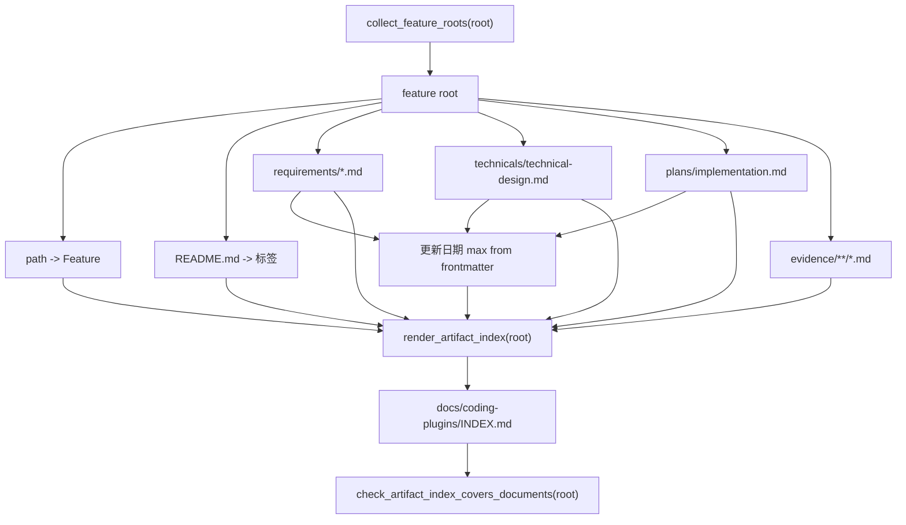

# Coding Plugins 产物总索引生成器技术设计

## 文档信息

| 字段 | 内容 |
| --- | --- |
| 状态 | 已批准 |
| Feature | artifact-index |
| 需求文档 | `docs/coding-plugins/features/artifact-index/requirements/feature.md` |
| 计划 | `docs/coding-plugins/features/artifact-index/plans/implementation.md` |
| TDD 证据 | `docs/coding-plugins/features/artifact-index/evidence/tdd-evidence.md` |

## 设计摘要

总索引由 `scripts/docs_index.py` 的确定性生成器生成，feature root 是唯一输入来源。生成器从路径推导 `Feature`，从 README 的中文 `文档信息` 表读取 `标签`，从规格、技术设计和计划 frontmatter 读取最大 `updated` 值，并把 spec、technical design、implementation plan、evidence 路径渲染成 Markdown 表格。`scripts/preflight.py` 通过导入 `docs_index` 保留 `--write-index` 和发布门禁入口；人工修改索引造成漂移时仍直接失败。

## 规格缺口审查

| 检查项 | 结论 |
| --- | --- |
| 未覆盖需求 | 无。 |
| 验收标准不清 | 无。 |
| 新增外部行为 | 无。 |
| 处理状态 | 通过，未发现需要回写 spec 的缺口。 |

## 规格到设计映射

| 规格 ID | 规格摘要 | 技术落点 | 关键决策 ID | 影响文件/符号 | 验证命令 | 证据 |
| --- | --- | --- | --- | --- | --- | --- |
| REQ-001 | 仓库必须提供 `docs/coding-plugins/INDEX.md` 作为规格、计划和证据的统一检索入口。 | `docs/coding-plugins/INDEX.md`：改为由生成器重写，内容和 feature-first 文件树完全一致 | TD-001 | `docs/coding-plugins/INDEX.md` | 单元测试 `test_artifact_index_requires_index_file`。 | `docs/coding-plugins/features/artifact-index/evidence/tdd-evidence.md` |
| REQ-002 | 总索引必须包含 `领域`、`能力`、`功能根目录`、`规格`、`技术设计`、`实现计划`、`证据`、`标签`、`更新日期` 列。 | `docs/coding-plugins/INDEX.md`：改为由生成器重写，内容和 feature-first 文件树完全一致 | TD-002 | `docs/coding-plugins/INDEX.md` | 单元测试 `test_artifact_index_requires_expected_headers`。 | `docs/coding-plugins/features/artifact-index/evidence/tdd-evidence.md` |
| REQ-003 | preflight 必须校验所有真实规格文件都出现在总索引中。 | `docs/coding-plugins/features/artifact-index/technicals/technical-design.md` 中的影响组件追踪 | TD-003 | `python3 -m unittest scripts/test_preflight.py` | 单元测试 `test_artifact_index_requires_spec_paths`。 | `docs/coding-plugins/features/artifact-index/evidence/tdd-evidence.md` |
| REQ-004 | preflight 必须校验所有计划文件都出现在总索引中。 | `docs/coding-plugins/features/artifact-index/technicals/technical-design.md` 中的影响组件追踪 | TD-004 | `python3 -m unittest scripts/test_preflight.py` | 单元测试 `test_artifact_index_requires_plan_paths`。 | `docs/coding-plugins/features/artifact-index/evidence/tdd-evidence.md` |
| REQ-005 | preflight 必须校验所有 TDD 证据 文件都出现在总索引中。 | `docs/coding-plugins/features/artifact-index/technicals/technical-design.md` 中的影响组件追踪 | TD-005 | `python3 -m unittest scripts/test_preflight.py` | 单元测试 `test_artifact_index_requires_evidence_paths`。 | `docs/coding-plugins/features/artifact-index/evidence/tdd-evidence.md` |
| REQ-006 | 仓库必须提供标准库实现的索引生成器，能根据 feature root、README metadata、spec、technical design、implementation plan 和 evidence 生成完整 `docs/coding-plugins/INDEX.md` 内容。 | `scripts/docs_index.py`：提供 `render_artifact_index()`、`write_artifact_index()`、README metadata 解析、路径单元格渲染和索引一致性校验 `scripts/preflight.py`：保留 `--write-index` CLI 和发布门禁调用，委托 `docs_index` 执行索引生成与校验 `scripts/test_docs_index.py`：覆盖生成器模块边界和 preflight 委托关系 `scripts/test_preflight.py`：保留旧调用方兼容测试，并确认 preflight 验证链路包含 `scripts/test_docs_index.py` | TD-005 | `scripts/docs_index.py` `scripts/preflight.py` `scripts/test_docs_index.py` `scripts/test_preflight.py` | 单元测试 `test_render_artifact_index_includes_feature_metadata_and_documents`。 | `docs/coding-plugins/features/artifact-index/evidence/tdd-evidence.md` |
| REQ-007 | preflight 必须校验当前 `docs/coding-plugins/INDEX.md` 与生成器输出完全一致，防止人工编辑造成漂移。 | `scripts/docs_index.py`：提供 `render_artifact_index()`、`write_artifact_index()`、README metadata 解析、路径单元格渲染和索引一致性校验 `scripts/preflight.py`：保留 `--write-index` CLI 和发布门禁调用，委托 `docs_index` 执行索引生成与校验 `scripts/test_docs_index.py`：覆盖生成器模块边界和 preflight 委托关系 `scripts/test_preflight.py`：保留旧调用方兼容测试，并确认 preflight 验证链路包含 `scripts/test_docs_index.py` | TD-005 | `scripts/docs_index.py` `scripts/preflight.py` `scripts/test_docs_index.py` `scripts/test_preflight.py` | 单元测试 `test_artifact_index_requires_generated_content_match`。 | `docs/coding-plugins/features/artifact-index/evidence/tdd-evidence.md` |

## 无需技术设计的规格

| 规格 ID | 原因 |
| --- | --- |
| 无 | 本 feature 的 MUST 规格均有 technical 落点。 |

## 关键决策

| 决策 ID | 决策 | 原因 | 取舍 |
| --- | --- | --- | --- |
| TD-001 | 生成器放在 `scripts/docs_index.py` | 文档索引是独立职责，拆出后避免 `preflight.py` 继续膨胀 | 需要通过 preflight 兼容 wrapper 保持旧调用方稳定 |
| TD-002 | README 只作为 tags 来源 | README 已经是人工可读 feature 摘要，适合维护检索标签 | README 缺少 `标签` 时只能输出 `-` |
| TD-003 | `更新日期` 只取 frontmatter 最大值 | ISO 日期字符串可稳定排序，不依赖 mtime 或 Git 历史 | evidence 没有 frontmatter 时不会影响更新时间 |
| TD-004 | 先做路径覆盖，再做完整内容比对 | 失败信息更具体，仍能保留旧测试和旧问题定位能力 | 校验流程多一步 |
| TD-005 | `--write-index` 复用 preflight 入口 | 维护者只需要记住一个命令 | 写入后仍会运行完整 preflight |

## 影响组件

| 组件 | 变更 | 相关规格 ID |
| --- | --- | --- |
| `scripts/docs_index.py` | 提供 `render_artifact_index()`、`write_artifact_index()`、README metadata 解析、路径单元格渲染和索引一致性校验 | REQ-006, REQ-007, REQ-008, AC-003 |
| `scripts/preflight.py` | 保留 `--write-index` CLI 和发布门禁调用，委托 `docs_index` 执行索引生成与校验 | REQ-006, REQ-007, REQ-008, AC-003 |
| `scripts/test_docs_index.py` | 覆盖生成器模块边界和 preflight 委托关系 | REQ-006, REQ-007, REQ-008, ERR-004, ERR-005 |
| `scripts/test_preflight.py` | 保留旧调用方兼容测试，并确认 preflight 验证链路包含 `scripts/test_docs_index.py` | REQ-006, REQ-007, REQ-008, ERR-004, ERR-005 |
| `docs/coding-plugins/INDEX.md` | 改为由生成器重写，内容和 feature-first 文件树完全一致 | REQ-001, REQ-002, AC-001, AC-002 |
| `docs/coding-plugins/features/artifact-index/*` | 记录规格、技术设计、计划和 TDD 证据 | AC-002, AC-003 |

## 数据流 / 控制流

## 接口和契约

- `docs_index.render_artifact_index(root: Path) -> str`：返回完整 Markdown 索引内容，末尾包含换行。
- `docs_index.write_artifact_index(root: Path) -> None`：把 `render_artifact_index()` 输出写入 `docs/coding-plugins/INDEX.md`。
- `python3 scripts/preflight.py --write-index`：先重写索引，再执行现有 preflight 静态检查和验证命令。
- `docs_index.check_artifact_index_covers_documents(root)`：仍校验必需表头和所有真实路径；路径覆盖通过后，继续要求索引文本与 `render_artifact_index(root)` 完全一致。
- `preflight.render_artifact_index`、`preflight.write_artifact_index` 和 `preflight.check_artifact_index_covers_documents` 保留为兼容入口。
- 多个同类文件按路径排序，并用 ` ` 连接；没有文件时输出 `-`。
- README 缺少 `标签` 行或文档缺少 `updated` frontmatter 时输出 `-`，不得推断不稳定值。（设计约束）

## 迁移 / 兼容性

现有 `docs/coding-plugins/INDEX.md` 会被生成器重写，但表头和主要规则保持兼容。旧的人工编辑方式仍可临时修改文件，但提交前 preflight 会要求重新运行 `python3 scripts/preflight.py --write-index`。不引入外部依赖，不影响 Codex 和 Claude manifest 加载。

## 测试策略

- RED: 在 `scripts/test_preflight.py` 中先写 `render_artifact_index`、排序、多文件、metadata fallback 和内容漂移测试，确认旧实现因缺少生成器或无法识别内容漂移失败。
- GREEN: 在 `scripts/docs_index.py` 中实现生成器和索引校验，在 `scripts/preflight.py` 中保留 CLI 委托，运行 `python3 -m unittest scripts/test_docs_index.py scripts/test_preflight.py`。
- REFACTOR: 保持路径覆盖测试不变，把完整内容比对作为覆盖校验的最后一步，并让 `preflight` 验证链路包含 `scripts/test_docs_index.py`。
- Final: 运行 `python3 scripts/preflight.py --write-index`、`python3 scripts/preflight.py`、`git diff --check` 和 Claude 插件严格校验。

## 风险和缓解

| 风险 | 缓解方案 |
| --- | --- |
| 生成器输出与历史手工索引格式不一致 | 用单元测试固定表头、路径格式和规则说明，并用 `--write-index` 一次性刷新 |
| README metadata 漏填导致 tags 变少 | 输出 `-` 而不是失败，避免阻塞文档迁移；需要强制 tags 时另加 metadata 规格 |
| 多 spec 或多 evidence 的显示顺序不稳定 | 所有文件列表按路径排序 |
| `docs_index.py` 和 `preflight.py` 职责再次混淆 | `scripts/test_docs_index.py` 固定模块边界，preflight 只负责 CLI 和发布门禁编排 |