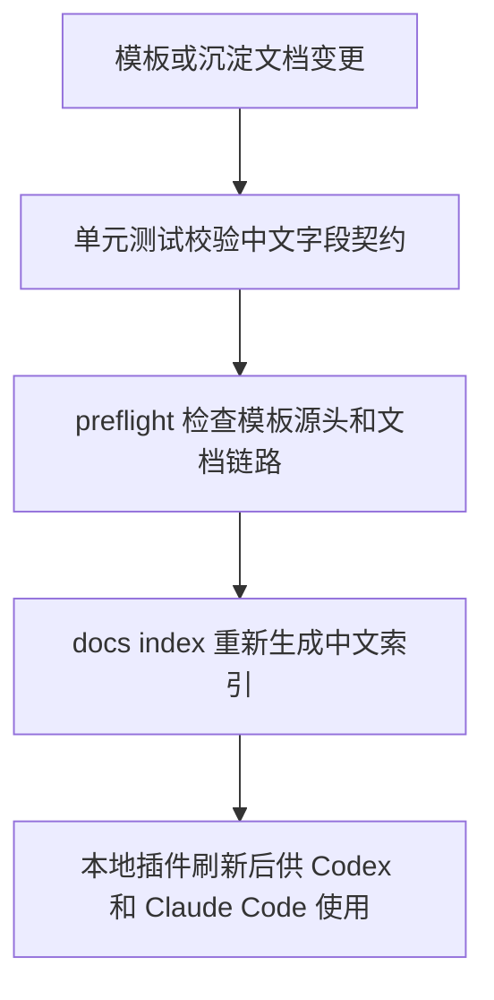

# 中文文档模板展示字段技术设计

## 文档信息

| 字段 | 内容 |
| --- | --- |
| 状态 | 已批准 |
| 生命周期 | approved |
| Feature | chinese-document-templates |
| 需求文档 | `docs/coding-plugins/features/chinese-document-templates/requirements/chinese-document-templates-PRD.md` |
| 计划 | `docs/coding-plugins/features/chinese-document-templates/plans/chinese-document-templates-IPD.md` |
| TDD 证据 | `docs/coding-plugins/features/chinese-document-templates/evidences/chinese-document-templates-TED.md` |
| 已实现提交 | [] |
| 验证方式 | `python3 scripts/preflight.py` |

## 设计摘要

本设计把“中文展示字段”收敛成校验器和模板的共同契约：TDD evidence、technical mapping、plan 模板、轻量例外和 docs 索引都使用中文标题与表头。机器可读 metadata key、路径、命令、测试名、Spec ID 和 TD ID 不进入中文化检查。preflight 增加模板源头门禁，并通过既有 validator 和 docs index 校验真实文档链路。

## 规格缺口审查

| 检查项 | 结论 |
| --- | --- |
| 未覆盖需求 | 无。 |
| 验收标准不清 | 无。 |
| 新增外部行为 | 无；本次只改变插件文档生成和校验契约。 |
| 处理状态 | 通过，未发现需要回写 spec 的缺口。 |

## 规格到设计映射

| 规格 ID | 规格摘要 | 技术落点 | 关键决策 ID | 影响文件/符号 | 验证命令 | 证据 |
| --- | --- | --- | --- | --- | --- | --- |
| REQ-001 | 模板章节、表头和字段标签使用中文。 | `scripts/preflight.py` 增加 plan 与 TDD 模板中文门禁；模板文件改中文。 | TD-001 | `scripts/preflight.py`、`skills/writing-plans/SKILL.md`、`skills/test-driven-development/templates/tdd-evidence.md`、`skills/writing-technicals/templates/technical-design-document.md` | `python3 -m unittest scripts/test_preflight.py` | `docs/coding-plugins/features/chinese-document-templates/evidences/chinese-document-templates-TED.md` |
| REQ-002 | TDD evidence 校验器接受中文字段并拒绝英文展示字段。 | `validate_tdd_evidence.py` 使用中文 heading 和字段常量；测试样例迁移中文。 | TD-002 | `skills/test-driven-development/scripts/validate_tdd_evidence.py`、`skills/test-driven-development/scripts/test_validate_tdd_evidence.py` | `python3 -m unittest skills/test-driven-development/scripts/test_validate_tdd_evidence.py` | `docs/coding-plugins/features/chinese-document-templates/evidences/chinese-document-templates-TED.md` |
| REQ-003 | Technical validator 使用中文映射表头。 | `validate_technicals.py` 的映射表契约改成 `规格 ID` 和 `证据`；测试和真实 technical 文档迁移。 | TD-003 | `skills/writing-technicals/scripts/validate_technicals.py`、`skills/writing-technicals/scripts/test_validate_technicals.py`、`docs/coding-plugins/features/*/technicals/*-TDD.md` | `python3 -m unittest skills/writing-technicals/scripts/test_validate_technicals.py` | `docs/coding-plugins/features/chinese-document-templates/evidences/chinese-document-templates-TED.md` |
| REQ-004 | 索引和轻量例外 README 表格使用中文表头。 | `docs_index.py` 生成中文索引表头；preflight 轻量例外表头改中文。 | TD-004 | `scripts/docs_index.py`、`scripts/preflight.py`、`scripts/test_docs_index.py`、`scripts/test_preflight.py` | `python3 -m unittest scripts/test_docs_index.py scripts/test_preflight.py` | `docs/coding-plugins/features/chinese-document-templates/evidences/chinese-document-templates-TED.md` |
| REQ-005 | 既有 feature-first 文档迁移中文展示字段。 | 迁移 `plans/<feature-name>-IPD.md`、`evidences/<feature-name>-TED.md`、`technicals/<feature-name>-TDD.md`、README 和索引中的展示字段。 | TD-005 | `docs/coding-plugins/features/**` | `python3 scripts/preflight.py --write-index`、`python3 scripts/preflight.py` | `docs/coding-plugins/features/chinese-document-templates/evidences/chinese-document-templates-TED.md` |
| REQ-006 | metadata key 和工程标识允许英文。 | preflight 只检查人工可读结构，不扫描 frontmatter key、代码块、路径、命令和 ID。 | TD-006 | `scripts/preflight.py`、`scripts/docs_index.py` | `python3 scripts/preflight.py` | `docs/coding-plugins/features/chinese-document-templates/evidences/chinese-document-templates-TED.md` |

## 无需技术设计的规格

| 规格 ID | 原因 |
| --- | --- |
| 无 | 全部 MUST 规格都有技术落点。 |

## 关键决策

| 决策 ID | 决策 | 原因 | 取舍 |
| --- | --- | --- | --- |
| TD-001 | 中文展示字段由 preflight 守住模板源头 | 模板是后续文档复制和生成的入口，源头门禁最能降低漂移 | 需要维护更具体的模板英文结构黑名单 |
| TD-002 | TDD evidence 字段直接切换为中文契约 | 用户明确要求展示字段中文，旧英文 evidence 字段不能继续作为标准 | 历史 evidence 需要一次性迁移 |
| TD-003 | Technical 映射表使用中文表头 | `Spec ID` 和 `Evidence` 是人工可读表头，不属于 metadata key | 需要同步 validator、测试和所有 technical 文档 |
| TD-004 | docs index 生成中文表头 | 总索引是沉淀文档的一部分，英文表头会成为后续复制来源 | 需要同步 docs index 单测和生成文件 |
| TD-005 | 批量迁移既有文档但不翻译工程标识 | 既有文档不迁移会让 preflight 无法证明全链路中文化 | 需要谨慎避免改坏路径、命令和 ID |
| TD-006 | 中文化检查只覆盖人工可读结构 | metadata key、路径、命令、代码符号和稳定 ID 必须保持可机读 | 需要让检查规则避开代码块和工程标识 |

## 影响组件

| 组件 | 变更 | 相关规格 ID |
| --- | --- | --- |
| `skills/test-driven-development/scripts/validate_tdd_evidence.py` | TDD evidence heading 与字段常量改中文，旧英文展示字段失败。 | REQ-002, ERR-002 |
| `skills/writing-technicals/scripts/validate_technicals.py` | technical 映射表头改为 `规格 ID` 和 `证据`。 | REQ-003, ERR-003 |
| `scripts/preflight.py` | 增加 plan、TDD evidence 模板中文门禁，轻量例外和计划技术设计来源使用中文展示字段。 | REQ-001, REQ-004, ERR-001, ERR-004 |
| `scripts/docs_index.py` | 生成中文总索引表头和中文说明。 | REQ-004 |
| `skills/*/templates` 和 `skills/*/SKILL.md` | 模板中的章节、表头和字段标签中文化。 | REQ-001, AC-001, AC-003 |
| `docs/coding-plugins/features/**` | 迁移既有沉淀文档中的英文展示字段。 | REQ-005 |

## 数据流 / 控制流

## 接口和契约

- 设计约束：`validate_tdd_evidence.py` 的字段契约为 `规格/缺陷/验收`、`RED 测试`、`RED 命令`、`RED 失败`、`GREEN 变更`、`GREEN 命令`、`REFACTOR 命令`、`最终验证`。
- 设计约束：TDD 例外字段契约为 `原因`、`用户批准`、`替代验证`、`风险`。
- 设计约束：technical 映射表契约为 `规格 ID`、`规格摘要`、`技术落点`、`关键决策 ID`、`影响文件/符号`、`验证命令`、`证据`。
- 设计约束：docs index 表头契约为 `领域`、`能力`、`功能根目录`、`规格`、`技术设计`、`实现计划`、`证据`、`标签`、`更新日期`。

## 迁移 / 兼容性

旧英文展示字段不再作为新标准保留。为了降低历史文档成本，本次一次性迁移现有 feature-first 文档；metadata key、路径、命令、代码符号、ID 和枚举值保持兼容。

## 测试策略

先写 RED 测试证明旧校验器不接受中文字段，再更新校验器和模板。最后运行 focused unit tests、`validate_spec.py --strict`、`validate_tdd_evidence.py --strict`、`validate_technicals.py --strict` 和全量 `python3 scripts/preflight.py`。

## 风险和缓解

| 风险 | 缓解方案 |
| --- | --- |
| 批量迁移误改路径或命令 | 只替换明确的展示标签，并通过 preflight、Spec ID 引用校验和文档索引校验兜底。 |
| 中文字段和旧英文字段并存造成歧义 | validator 和 preflight 以中文字段为唯一新契约，英文展示字段触发失败。 |
| 后续模板回退到英文 | preflight 增加 plan 和 TDD evidence 模板门禁。 |
