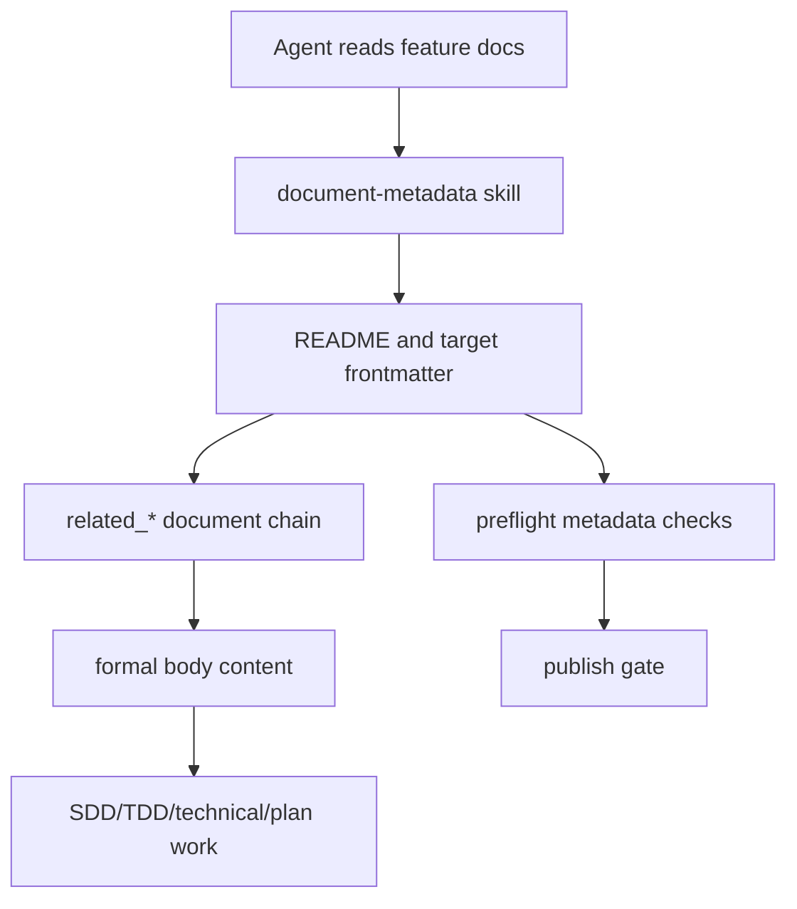

# 文档元数据规则和技能化技术设计

## 文档信息

| 字段 | 内容 |
| --- | --- |
| 状态 | 已批准 |
| Feature | document-metadata |
| 需求文档 | `docs/coding-plugins/features/document-metadata/requirements/document-metadata-PRD.md` |
| 计划 | `docs/coding-plugins/features/document-metadata/plans/document-metadata-IPD.md` |

## 设计摘要

保留 YAML frontmatter 的英文机器字段，避免破坏现有解析器和校验器。中文 `文档信息` 摘要表作为人工阅读入口，`document-metadata` skill 作为代理读写文档关系的操作入口。Plan 文档补齐 frontmatter，并由 preflight 校验 Plan metadata、路径一致性和中文摘要。

## 规格缺口审查

| 检查项 | 结论 |
| --- | --- |
| 未覆盖需求 | 无。 |
| 验收标准不清 | 无。 |
| 新增外部行为 | 无。 |
| 处理状态 | 通过，未发现需要回写 spec 的缺口。 |

## 规格到设计映射

| 规格 ID | 规格摘要 | 技术落点 | 关键决策 ID | 影响文件/符号 | 验证命令 | 证据 |
| --- | --- | --- | --- | --- | --- | --- |
| REQ-001 | Plan 文档必须包含 frontmatter，并声明 `title`、`status`、`feature`、`created`、`updated`。 | `scripts/preflight.py`：增加 Plan metadata 和中文文档信息校验 `scripts/test_preflight.py`：增加 RED/GREEN 单元测试 `docs/coding-plugins/features/**/plans/**-IPD.md`：回填现有计划 metadata 和中文摘要 | TD-001 | `scripts/preflight.py` `scripts/test_preflight.py` `docs/coding-plugins/features/**/plans/**-IPD.md` | 单元测试 `test_plan_metadata_check_rejects_missing_frontmatter`。 | `docs/coding-plugins/features/document-metadata/evidences/document-metadata-TED.md` |
| REQ-002 | Plan frontmatter 的 `feature` 必须与 `features/document-metadata/plans/<feature-name>-IPD.md` 这类 feature-first 分层路径一致。 | `scripts/preflight.py`：增加 Plan metadata 和中文文档信息校验 `scripts/test_preflight.py`：增加 RED/GREEN 单元测试 | TD-002 | `scripts/preflight.py` `scripts/test_preflight.py` | 单元测试 `test_plan_metadata_check_rejects_mismatched_path_metadata`。 | `docs/coding-plugins/features/document-metadata/evidences/document-metadata-TED.md` |
| REQ-003 | Plan 文档必须包含中文 `## 文档信息` 摘要表。 | `scripts/preflight.py`：增加 Plan metadata 和中文文档信息校验 `scripts/test_preflight.py`：增加 RED/GREEN 单元测试 `docs/coding-plugins/features/**/plans/**-IPD.md`：回填现有计划 metadata 和中文摘要 | TD-003 | `scripts/preflight.py` `scripts/test_preflight.py` `docs/coding-plugins/features/**/plans/**-IPD.md` | 单元测试 `test_document_info_check_rejects_missing_chinese_summary`。 | `docs/coding-plugins/features/document-metadata/evidences/document-metadata-TED.md` |
| REQ-004 | Technical Design 模板必须包含中文 `## 文档信息` 摘要表。 | `skills/writing-technicals/templates/technical-design-document.md`：技术设计模板增加 `文档信息` | TD-003 | `skills/writing-technicals/templates/technical-design-document.md` | 文档评审和 preflight。 | `docs/coding-plugins/features/document-metadata/evidences/document-metadata-TED.md` |
| REQ-005 | `writing-plans` 计划模板必须包含 frontmatter 和中文 `## 文档信息` 摘要表。 | `skills/writing-plans/SKILL.md`：计划模板增加 frontmatter 和 `文档信息` | TD-003 | `skills/writing-plans/SKILL.md` | 文档评审和 preflight。 | `docs/coding-plugins/features/document-metadata/evidences/document-metadata-TED.md` |
| REQ-006 | preflight 必须校验 Plan metadata、路径一致性和中文摘要。 | `scripts/preflight.py`：增加 Plan metadata 和中文文档信息校验 | TD-003 | `scripts/preflight.py` | `python3 scripts/preflight.py`。 | `docs/coding-plugins/features/document-metadata/evidences/document-metadata-TED.md` |
| REQ-007 | 插件必须提供 `document-metadata` skill，明确读取文档时先读 frontmatter metadata，再读正文。 | 新增 `skills/document-metadata/SKILL.md`，固化 metadata-first 读取顺序、字段职责和常见错误 | TD-004 | `skills/document-metadata/SKILL.md` `skills/document-metadata/agents/openai.yaml` `tests/behavior/test_routing.py` | `python3 -m unittest tests.behavior.test_routing` | `docs/coding-plugins/features/document-metadata/evidences/document-metadata-TED.md` |
| REQ-008 | 插件必须提供 `document-metadata.md` 模板，覆盖 README、Spec、Technical、Plan、Evidence 和 Archived evidence 的 metadata 关系。 | 新增 `skills/document-metadata/templates/document-metadata.md`，提供通用和分类型 frontmatter 块 | TD-005 | `skills/document-metadata/templates/document-metadata.md` | 文档评审和 preflight。 | `docs/coding-plugins/features/document-metadata/evidences/document-metadata-TED.md` |
| REQ-009 | 入口技能和 SDD/TDD/Technical/Plan 技能必须把文档关系读取导向 `document-metadata`。 | 更新 `using-coding-plugins`、SDD、TDD、technical、plan、README、workflow-chain 和 document-contract 引用 | TD-006 | `skills/using-coding-plugins/SKILL.md` `skills/spec-driven-development/SKILL.md` `skills/test-driven-development/SKILL.md` `skills/writing-technicals/SKILL.md` `skills/writing-plans/SKILL.md` | `python3 -m unittest tests.behavior.test_routing` `rg "document-metadata" skills docs README.md` | `docs/coding-plugins/features/document-metadata/evidences/document-metadata-TED.md` |
| REQ-010 | preflight 必须按 metadata 关系校验文档同步新鲜度。 | `scripts/preflight.py`：按 PRD、TDD、TID、TCD、IPD、TED 依赖图比较 `updated`；`scripts/test_preflight.py`：覆盖 PRD 到 TDD、TCD 到 IPD 和正常同步场景 | TD-007 | `scripts/preflight.py` `scripts/test_preflight.py` `skills/document-metadata/SKILL.md` | 单元测试 `test_document_sync_freshness_rejects_stale_downstream_doc`。 | `docs/coding-plugins/features/document-metadata/evidences/document-metadata-TED.md` |

## 无需技术设计的规格

| 规格 ID | 原因 |
| --- | --- |
| 无 | 本 feature 的 MUST 规格均有 technical 落点。 |

## 关键决策

| 决策 ID | 决策 | 原因 | 取舍 |
| --- | --- | --- | --- |
| TD-001 | frontmatter key 保持英文 | 现有 preflight 和规格校验器依赖稳定 key | 中文展示通过正文表格提供 |
| TD-002 | Plan 增加 frontmatter | Plan 是执行入口，也需要可追踪状态和关联文档 | 历史 plan 需要回填 metadata |
| TD-003 | preflight 校验中文摘要 | 保证中文展示不是可选装饰 | 需要维护摘要表字段 |
| TD-004 | 新增 `document-metadata` skill | 单靠文档契约不容易触发代理读取顺序，skill 能进入任务路由 | 多一个技能入口需要维护展示 metadata 和 Claude namespace |
| TD-005 | `document-metadata.md` 模板放在 skill 内 | 模板和操作规则同域维护，避免再散落在 spec 模板中 | 具体 spec/technical/plan 模板仍保留各自最小模板 |
| TD-006 | 现有主链路技能引用 `document-metadata` | 让 SDD、TDD、technical 和 plan 在读写文档前显式走 metadata 规则 | 需要避免重复复制完整规则 |
| TD-007 | 用 `updated` 做同步新鲜度门禁 | 不引入额外数据库或状态文件，直接复用已有 metadata 生命周期字段 | 同一天内的多次变更只按日期粒度判断，仍需要人工评审正文影响 |

## 影响组件

| 组件 | 变更 | 相关规格 ID |
| --- | --- | --- |
| `scripts/preflight.py` | 增加 Plan metadata 和中文文档信息校验 | REQ-001, REQ-002, REQ-003, REQ-006 |
| `scripts/test_preflight.py` | 增加 RED/GREEN 单元测试 | REQ-001, REQ-002, REQ-003 |
| `skills/writing-plans/SKILL.md` | 计划模板增加 frontmatter 和 `文档信息` | REQ-005, AC-001 |
| `skills/writing-technicals/templates/technical-design-document.md` | 技术设计模板增加 `文档信息` | REQ-004 |
| `docs/coding-plugins/features/**/plans/**-IPD.md` | 回填现有计划 metadata 和中文摘要 | REQ-001, REQ-003 |
| `skills/document-metadata/SKILL.md` | 新增 metadata-first 操作技能 | REQ-007, AC-003 |
| `skills/document-metadata/templates/document-metadata.md` | 新增通用 metadata 模板 | REQ-008 |
| `skills/using-coding-plugins/references/claude-tools.md` | 增加 Claude namespace 显式技能入口 | REQ-007 |
| `README.md` / `docs/workflow-chain.md` / `docs/coding-plugins/document-contract.md` | 将文档关系读取入口指向 `document-metadata` | REQ-009 |
| `scripts/preflight.py` | 增加文档同步新鲜度校验 | REQ-010 |
| `scripts/test_preflight.py` | 增加过期下游文档和正常同步场景单元测试 | REQ-010 |

## 数据流 / 控制流

## 接口和契约

- Plan frontmatter must include `title`、`status`、`feature`、`created`、`updated`。
- Plan path must remain `docs/coding-plugins/features/<feature-name>/plans/<feature-name>-IPD.md`。
- Plan body must include `## 文档信息` and at least `状态`、`Feature` rows.
- `document-metadata` skill must include `agents/openai.yaml`.
- `document-metadata.md` template must keep machine key names English and show document relations through `related_*`.
- Frontmatter key names remain English.
- Document sync freshness follows `PRD -> TDD -> TID -> TCD -> IPD -> TED`; downstream `updated` must not be older than upstream `updated`.

## 迁移 / 兼容性

Existing Plan documents are backfilled. Spec and Technical templates get Chinese summaries for new documents, but existing historical specs are not blocked if they do not yet contain `文档信息`.

`document-metadata` skill is additive: existing documents keep their current paths and frontmatter fields. Future agents use the skill and template when reading or updating document relationships.

## 测试策略

- RED/GREEN: `python3 -m unittest scripts/test_preflight.py`
- Behavior: `python3 -m unittest tests.behavior.test_routing`
- Final: `python3 scripts/preflight.py`
- Evidence: `docs/coding-plugins/features/document-metadata/evidences/document-metadata-TED.md`

## 风险和缓解

| 风险 | 缓解方案 |
| --- | --- |
| 中文摘要和 frontmatter 内容漂移 | preflight 校验必备字段和路径一致性 |
| 中文 key 破坏脚本 | 只中文化展示层，不改机器 key |
