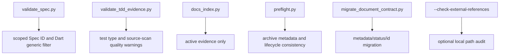

# 下游项目兼容性和证据生命周期技术设计

## 文档信息

| 字段 | 内容 |
| --- | --- |
| 状态 | 已批准 |
| 生命周期 | implemented |
| Feature | downstream-compatibility |
| 规格 | `docs/coding-plugins/features/downstream-compatibility/specs/maintenance.md` |
| 计划 | `docs/coding-plugins/features/downstream-compatibility/plans/implementation.md` |
| TDD 证据 | `docs/coding-plugins/features/downstream-compatibility/evidence/tdd-evidence.md` |
| 验证方式 | `python3 scripts/preflight.py` |

## 设计摘要

本设计在现有 validator 和 preflight 架构内增加兼容层，不引入第三方解析库。Spec ID 正则扩展到带作用域形式，placeholder 检测改为跳过 Dart 泛型上下文，TDD evidence 增加可选测试类型字段。Evidence 文件分成 active 与 archive 两类，默认索引和 strict TDD 校验只处理 active evidence；迁移脚本只做机械 metadata/status 修复；跨仓库引用通过显式 `--check-external-references` 审计。

## 规格缺口审查

| 检查项 | 结论 |
| --- | --- |
| 未覆盖需求 | 无。 |
| 验收标准不清 | 无。 |
| 新增外部行为 | 无；默认 preflight 仍不访问网络，也不检查外部绝对路径。 |
| 处理状态 | 通过，所有维护需求都有技术落点。 |

## 规格到设计映射

| 规格 ID | 规格摘要 | 技术落点 | 关键决策 ID | 影响文件/符号 | 验证命令 | 证据 |
| --- | --- | --- | --- | --- | --- | --- |
| NFR-001 | 支持 scoped Spec ID。 | 扩展 `SPEC_ID_RE`。 | TD-001 | `validate_spec.py`、`validate_tdd_evidence.py`、`preflight.py` | `python3 -m unittest skills/spec-driven-development/scripts/test_validate_spec.py skills/test-driven-development/scripts/test_validate_tdd_evidence.py` | `docs/coding-plugins/features/downstream-compatibility/evidence/tdd-evidence.md` |
| NFR-002 | Dart 泛型不误报 placeholder。 | 新增 placeholder match 过滤。 | TD-002 | `validate_spec.py` | `python3 -m unittest skills/spec-driven-development/scripts/test_validate_spec.py` | 同上 |
| NFR-003 | 兼容完成状态别名。 | 扩展 validator status 集合。 | TD-003 | `validate_spec.py` | `python3 -m unittest skills/spec-driven-development/scripts/test_validate_spec.py` | 同上 |
| NFR-004 | 支持测试类型字段。 | TDD validator 解析 `测试类型`。 | TD-004 | `validate_tdd_evidence.py`、TDD 模板和技能文档 | `python3 -m unittest skills/test-driven-development/scripts/test_validate_tdd_evidence.py` | 同上 |
| NFR-005 | source-scan 不作为用户行为严格证据。 | source-scan + 行为来源触发 warning，strict 下失败。 | TD-004 | `validate_tdd_evidence.py` | `python3 -m unittest skills/test-driven-development/scripts/test_validate_tdd_evidence.py` | 同上 |
| NFR-006 | active/archive evidence 分离。 | `feature_evidence_files` 只返回 active evidence，新增 archive collector。 | TD-005 | `docs_index.py`、`preflight.py` | `python3 -m unittest scripts/test_preflight.py scripts/test_docs_index.py` | 同上 |
| NFR-007 | archive metadata 校验。 | 新增 `check_archived_evidence_metadata`。 | TD-005 | `preflight.py` | `python3 -m unittest scripts/test_preflight.py` | 同上 |
| NFR-008 | 提供迁移脚本。 | 新增 `migrate_document_contract.py`。 | TD-006 | `scripts/migrate_document_contract.py` | `python3 -m unittest scripts/test_document_contract_migration.py` | 同上 |
| NFR-009 | 完成后状态收敛。 | 新增 `check_lifecycle_state_consistency`。 | TD-007 | `preflight.py` | `python3 -m unittest scripts/test_preflight.py` | 同上 |
| NFR-010 | 跨仓库引用显式检查。 | 新增 `external_references` 检查和 CLI 参数。 | TD-008 | `preflight.py`、`document-contract.md` | `python3 -m unittest scripts/test_preflight.py` | 同上 |

## 无需技术设计的规格

| 规格 ID | 原因 |
| --- | --- |
| 无 | 本 feature 的 MUST 规格均有技术落点。 |

## 关键决策

| 决策 ID | 决策 | 原因 | 取舍 |
| --- | --- | --- | --- |
| TD-001 | Spec ID 正则支持作用域段 | 下游项目会在 `REQ` 后加入能力上下文表达来源 | 更宽松的 ID 需要测试防止误匹配 |
| TD-002 | placeholder 过滤 Dart 泛型上下文 | Dart 文档大量使用 `<T>` 和 `List<Foo>` | 仍保留普通 `<area>` 占位符检查 |
| TD-003 | 状态别名只做兼容，不改变推荐值 | 避免旧项目文档在新版 validator 下失效 | 推荐状态仍使用 `已覆盖` |
| TD-004 | TDD evidence 增加测试类型 | 区分行为测试、契约测试、架构扫描和源码扫描 | 旧 evidence 不强制补字段 |
| TD-005 | active evidence 与 archive 分离 | 防止历史日志污染当前契约和 strict 校验 | 主索引不展示 archive |
| TD-006 | 迁移脚本只做机械修复 | 避免脚本猜测设计或计划内容 | 复杂文档仍需人工维护 |
| TD-007 | 状态收敛只检查明确完成证据 | 避免误报历史草稿 | 不能覆盖所有语义漂移 |
| TD-008 | 外部引用检查显式开启 | 跨仓库路径常因机器差异变化 | 默认 preflight 不发现外部路径损坏 |

## 影响组件

| 组件 | 变更 | 相关规格 ID |
| --- | --- | --- |
| `skills/spec-driven-development/scripts/validate_spec.py` | scoped Spec ID、Dart 泛型 placeholder 过滤、状态别名 | NFR-001, NFR-002, NFR-003 |
| `skills/test-driven-development/scripts/validate_tdd_evidence.py` | scoped Spec ID、测试类型和 source-scan warning | NFR-001, NFR-004, NFR-005 |
| `scripts/docs_index.py` | active evidence 与 archive evidence 收集分离 | NFR-006 |
| `scripts/preflight.py` | archive metadata、状态收敛、外部引用显式检查 | NFR-006, NFR-007, NFR-009, NFR-010 |
| `scripts/migrate_document_contract.py` | 迁移旧 metadata 和 related Spec ID | NFR-008 |
| `skills/test-driven-development/templates/tdd-evidence.md` | 增加测试类型字段 | NFR-004 |
| `docs/coding-plugins/document-contract.md` | 记录 archive、external references 和迁移脚本规则 | NFR-007, NFR-008, NFR-010 |

## 数据流 / 控制流

## 接口和契约

- 设计约束：Spec ID 格式为 `REQ-001` 或 `REQ-<SCOPE>-001`，前缀仍限制在既有 ID 类型集合。
- 设计约束：TDD evidence 的 `测试类型` 可选；存在时只允许 `behavior`、`contract`、`architecture`、`source-scan`、`config`。
- 设计约束：active evidence 只使用 `evidence/tdd-evidence.md`；archive 位于 `evidence/archive/*.md`。
- 设计约束：`external_references` 只在显式 `--check-external-references` 下校验。
- 设计约束：`migrate_document_contract.py` 不生成 spec、technical 或 plan。

## 迁移 / 兼容性

旧文档可以先运行 `python3 scripts/migrate_document_contract.py --dry-run` 评估，再运行脚本写入机械迁移。旧 evidence 不强制补 `测试类型`。旧 archive 文件要补齐 historical metadata 后才通过 preflight。跨仓库引用从 `related_*` 迁移到 `external_references`，避免当前仓库关系源混入本机绝对路径。

## 测试策略

- RED/GREEN validator: `python3 -m unittest skills/spec-driven-development/scripts/test_validate_spec.py skills/test-driven-development/scripts/test_validate_tdd_evidence.py`
- RED/GREEN preflight: `python3 -m unittest scripts/test_preflight.py scripts/test_docs_index.py scripts/test_document_contract_migration.py`
- Final: `python3 scripts/preflight.py --write-index` and `python3 scripts/preflight.py`
- Evidence: `docs/coding-plugins/features/downstream-compatibility/evidence/tdd-evidence.md`

## 风险和缓解

| 风险 | 缓解方案 |
| --- | --- |
| Spec ID 规则过宽导致误匹配 | 仍限定前缀集合，并用 validator 单测覆盖 |
| archive 被遗漏在主索引 | `docs_index.feature_evidence_files` 只返回 active evidence |
| 状态收敛误报历史文档 | 只在 completed evidence 明确包含最终验证通过时检查 `计划中` |
| 外部路径影响 CI | 默认 preflight 不启用外部引用检查 |
