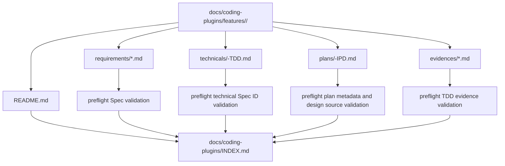

# Feature-first 文档结构迁移技术设计

## 文档信息

| 字段 | 内容 |
| --- | --- |
| 状态 | 已批准 |
| Feature | feature-first-docs |
| 需求文档 | `docs/coding-plugins/features/feature-first-docs/requirements/feature-first-docs-PRD.md` |
| 计划 | `docs/coding-plugins/features/feature-first-docs/plans/feature-first-docs-IPD.md` |

## 设计摘要

文档结构从产物类型优先和二级归属改为 feature-first。`docs/coding-plugins/features/<feature-name>/` 成为 feature 的唯一活跃文档根，需求文档放入 `requirements/` 子目录，技术设计放入 `technicals/` 子目录，计划放入 `plans/` 子目录，TDD 证据放入 `evidences/` 子目录。preflight 通过统一的 feature root collector 收集文档，并拒绝旧四类目录和 feature root 下裸露技术/计划文件中的活跃文档。

## 规格缺口审查

| 检查项 | 结论 |
| --- | --- |
| 未覆盖需求 | 无。 |
| 验收标准不清 | 无。 |
| 新增外部行为 | 无。 |
| 处理状态 | 通过，未发现需要回写 spec 的缺口。 |

## 规格到设计映射

| 规格 ID | 规格摘要 | 技术落点 | 关键决策 ID | 影响文件/符号 | 验证命令 | 证据 |
| --- | --- | --- | --- | --- | --- | --- |
| NFR-001 | 新文档根必须是 `docs/coding-plugins/features/{feature}/`。 | `scripts/preflight.py`：改为扫描 `features/<feature-name>`，拒绝旧 docs root 和 flat feature-root 技术/计划文件，校验 README、metadata 和索引 `scripts/test_preflight.py`：更新 RED/GREEN 单元测试，覆盖新路径和旧路径拒绝 | TD-001 | `scripts/preflight.py` `scripts/test_preflight.py` | 单元测试 `test_collect_spec_files_uses_feature_first_path`。 | `docs/coding-plugins/features/feature-first-docs/evidences/feature-first-docs-TED.md` |
| NFR-002 | 规格必须保存到 `docs/coding-plugins/features/{feature}/requirements/{spec-kind}.md`。 | `docs/coding-plugins/features/feature-first-docs/technicals/feature-first-docs-TDD.md` 中的影响组件追踪 | TD-002 | `python3 -m unittest scripts/test_preflight.py` | 单元测试和 `python3 scripts/preflight.py`。 | `docs/coding-plugins/features/feature-first-docs/evidences/feature-first-docs-TED.md` |
| NFR-003 | 技术设计必须保存到 `docs/coding-plugins/features/{feature}/technicals/{feature}-TDD.md`。 | `docs/coding-plugins/features/feature-first-docs/technicals/feature-first-docs-TDD.md` 中的影响组件追踪 | TD-003 | `python3 -m unittest scripts/test_preflight.py` | 单元测试 `test_collect_technical_design_files_uses_feature_first_technical_subdir`。 | `docs/coding-plugins/features/feature-first-docs/evidences/feature-first-docs-TED.md` |
| NFR-004 | 实现计划必须保存到 `docs/coding-plugins/features/{feature}/plans/{feature}-IPD.md`。 | `docs/coding-plugins/features/feature-first-docs/technicals/feature-first-docs-TDD.md` 中的影响组件追踪 | TD-004 | `python3 -m unittest scripts/test_preflight.py` | 单元测试 `test_collect_plan_files_uses_feature_first_plans_subdir`。 | `docs/coding-plugins/features/feature-first-docs/evidences/feature-first-docs-TED.md` |
| NFR-005 | TDD 证据 必须保存到 `docs/coding-plugins/features/{feature}/evidences/{feature}-TED.md`。 | `docs/coding-plugins/features/feature-first-docs/technicals/feature-first-docs-TDD.md` 中的影响组件追踪 | TD-004 | `python3 -m unittest scripts/test_preflight.py` | 单元测试 `test_collect_tdd_evidence_files_uses_feature_first_path`。 | `docs/coding-plugins/features/feature-first-docs/evidences/feature-first-docs-TED.md` |
| NFR-006 | 每个 feature root 必须包含 `README.md` 作为该 feature 的人工入口。 | `scripts/test_preflight.py`：更新 RED/GREEN 单元测试，覆盖新路径和旧路径拒绝 | TD-004 | `scripts/test_preflight.py` | 单元测试 `test_feature_roots_require_readme`。 | `docs/coding-plugins/features/feature-first-docs/evidences/feature-first-docs-TED.md` |
| NFR-007 | `docs/coding-plugins/INDEX.md` 必须覆盖每个 feature root 和每个真实文档路径。 | `scripts/preflight.py`：改为扫描 `features/<feature-name>`，拒绝旧 docs root 和 flat feature-root 技术/计划文件，校验 README、metadata 和索引 | TD-004 | `scripts/preflight.py` | 单元测试 `test_artifact_index_requires_feature_root_paths` 和 preflight。 | `docs/coding-plugins/features/feature-first-docs/evidences/feature-first-docs-TED.md` |
| NFR-008 | 活跃文档、skill、模板、测试和 README 中不得继续使用旧四类目录作为默认路径。 | `skills/*/SKILL.md` 和模板：更新默认落地路径和示例路径 | TD-004 | `skills/*/SKILL.md` 和模板 | 旧路径扫描命令必须无活跃命中。 | `docs/coding-plugins/features/feature-first-docs/evidences/feature-first-docs-TED.md` |
| NFR-009 | feature root 下不得裸露 `technical-design-document.md` 或 `implementation.md`；这两个产物必须分别位于 `technicals/` 和 `plans/` 子目录。 | `docs/coding-plugins/features/feature-first-docs/technicals/feature-first-docs-TDD.md` 中的影响组件追踪 | TD-004 | `python3 -m unittest scripts/test_preflight.py` | 单元测试 `test_flat_feature_root_technical_and_plan_files_are_rejected`。 | `docs/coding-plugins/features/feature-first-docs/evidences/feature-first-docs-TED.md` |
| NFR-010 | feature metadata 必须使用 `feature` 表示归属，不得继续要求 `feature`。 | `scripts/preflight.py`：README、plan、evidence、archive metadata required fields 改为 `feature`，文档路径校验从 feature root 名称派生；`scripts/docs_index.py`：总索引只输出 `Feature` 列 | TD-005 | `scripts/preflight.py` `scripts/docs_index.py` `scripts/test_preflight.py` | `python3 -m unittest scripts/test_preflight.py scripts/test_docs_index.py` | `docs/coding-plugins/features/feature-first-docs/evidences/feature-first-docs-TED.md` |
| NFR-011 | `docs/coding-plugins/INDEX.md` 是唯一生成式索引；feature 目录内不得新增局部 `INDEX.md`。 | `scripts/docs_index.py`：继续只写全局 `docs/coding-plugins/INDEX.md`；验证用 find 命令确认 feature 内无局部 INDEX | TD-006 | `scripts/docs_index.py` `docs/coding-plugins/INDEX.md` | `find docs/coding-plugins/features -name INDEX.md -print` | `docs/coding-plugins/features/feature-first-docs/evidences/feature-first-docs-TED.md` |
| NFR-012 | 本次迁移不得新增 `contract/current.md` 或 `contract/ai-ref.md`。 | 不创建 contract 目录或模板；验证用 find 命令确认 feature 内无 contract 产物 | TD-006 | `docs/coding-plugins/features` | `find docs/coding-plugins/features -path '*/contract/*' -print` | `docs/coding-plugins/features/feature-first-docs/evidences/feature-first-docs-TED.md` |

## 无需技术设计的规格

| 规格 ID | 原因 |
| --- | --- |
| 无 | 本 feature 的 MUST 规格均有 technical 落点。 |

## 关键决策

| 决策 ID | 决策 | 原因 | 取舍 |
| --- | --- | --- | --- |
| TD-001 | 不保留旧路径兼容层 | 当前未生产落地，两套路径会长期增加模板和 preflight 成本 | 需要一次性更新所有引用和历史文档路径 |
| TD-002 | 每个 feature root 必须有 README | 人工检索入口集中，避免上下文继续分散 | 每个 feature 多一个短文档 |
| TD-003 | 只保留 `docs/coding-plugins/INDEX.md` | feature-first 后总索引可直接覆盖完整链路 | 删除旧的分类索引会改变旧工作流 |
| TD-004 | preflight 用 feature root 派生 feature | 避免每个产物类型各自维护路径推导 | collector 逻辑比旧目录扫描稍复杂 |
| TD-005 | metadata 归属字段统一为 `feature` | 文档归属不再需要二级路径，单一字段更贴近目录模型 | 需要同步 validator、模板和历史文档 frontmatter |
| TD-006 | 不生成局部索引和 contract 模板 | 用户已明确本轮不需要这些产物，避免增加读者入口和模板复杂度 | 当前仍依赖 README 与全局 INDEX 承担总览和检索 |

## 影响组件

| 组件 | 变更 | 相关规格 ID |
| --- | --- | --- |
| `scripts/preflight.py` | 改为扫描 `features/<feature-name>`，拒绝旧 docs root 和 flat feature-root 技术/计划文件，校验 README、metadata 和索引 | NFR-001, NFR-007, ERR-001 |
| `scripts/test_preflight.py` | 更新 RED/GREEN 单元测试，覆盖新路径和旧路径拒绝 | NFR-001, NFR-006, ERR-001 |
| `docs/coding-plugins/**` | 将现有文档迁移到 feature-first 结构，重建总索引 | MIG-001, MIG-002 |
| `skills/*/SKILL.md` 和模板 | 更新默认落地路径和示例路径 | NFR-008, MIG-003 |
| `README.md`, `docs/installation.md`, `docs/workflow-chain.md` | 更新用户可见路径说明和链路图文字 | MIG-003 |
| `scripts/preflight.py`, `scripts/docs_index.py` | 使用 `feature` metadata 和单级 feature root 生成与校验文档链路 | NFR-010, NFR-011, NFR-012 |

## 数据流 / 控制流

## 接口和契约

- Feature root: `docs/coding-plugins/features/<feature-name>/`
- Feature README: `docs/coding-plugins/features/<feature-name>/README.md`
- Spec files: `docs/coding-plugins/features/<feature-name>/requirements/<spec-kind>.md`
- Technical design: `docs/coding-plugins/features/<feature-name>/technicals/<feature-name>-TDD.md`
- Implementation plan: `docs/coding-plugins/features/<feature-name>/plans/<feature-name>-IPD.md`
- Evidence files: `docs/coding-plugins/features/<feature-name>/evidences/<feature-name>-TED.md`
- Frontmatter `feature` must match feature root path.
- `docs/coding-plugins/INDEX.md` must reference every feature root and every collected document path.
- Feature root 内不生成局部 `INDEX.md`。
- 本次迁移不新增 `contract/current.md` 或 `contract/ai-ref.md`。

## 迁移 / 兼容性

旧四类产物目录不再是活跃路径。迁移后 preflight 应在发现旧根目录下仍有 Markdown 文件时失败。`RELEASE-NOTES.md` 中的历史版本记录可以保留旧路径文字；活跃 README、docs、skills、scripts 和 tests 不应继续使用旧路径作为默认路径。

## 测试策略

- RED: 更新 `scripts/test_preflight.py` 中 collector、legacy path、feature README、index coverage 和 path metadata 测试，先确认旧实现失败。
- GREEN: 改造 `scripts/preflight.py` 的 collector 和检查函数，让 feature-first 路径通过。
- Migration verification: 迁移现有文档后运行 `python3 scripts/preflight.py`。
- Residual path verification: 运行 `rg -n "docs/coding-plugins/(specs|technical|plans|evidence)" README.md docs skills scripts tests`，确认只剩允许的历史或迁移说明。
- Plugin validation: 运行 `claude plugin validate /Users/vincen/workspace/plugins/coding-plugins --strict`。

## 风险和缓解

| 风险 | 缓解方案 |
| --- | --- |
| 旧路径引用残留导致未来代理继续生成旧结构 | 使用 `rg` 和 preflight legacy root 检查阻断 |
| 移动文档后 Spec ID 关联丢失 | 根据 feature root 的 feature 查找同根 specs，并用既有 Spec ID 校验 |
| 总索引漏掉迁移文件 | preflight 校验 `docs/coding-plugins/INDEX.md` 覆盖所有 collected documents |
| 批量替换误改 release 历史 | release notes 允许保留历史文本；活跃文档单独扫描 |
