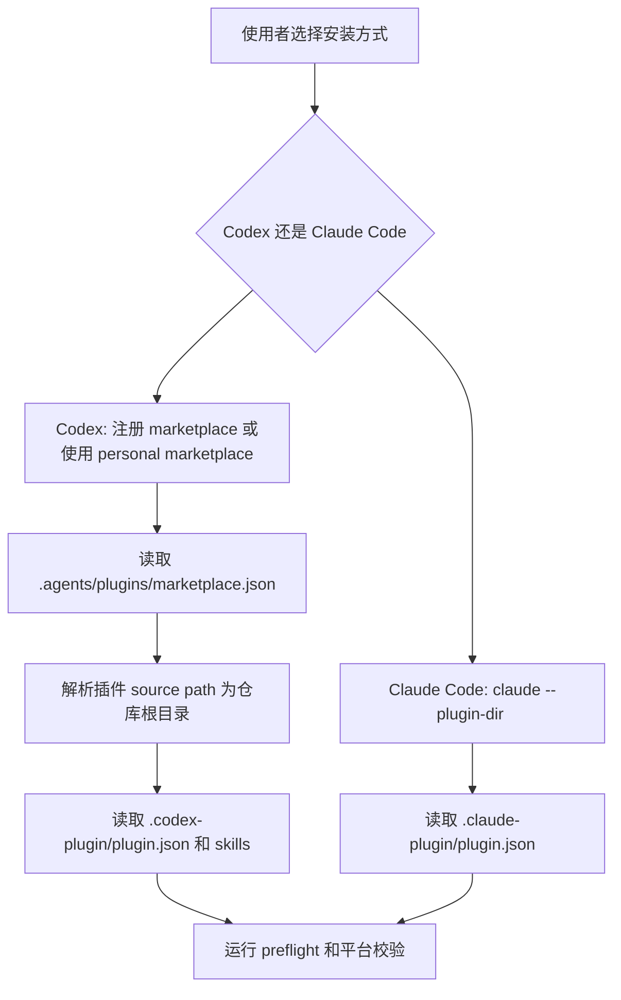

# 插件 marketplace 安装入口技术设计

## 文档信息

| 字段 | 内容 |
| --- | --- |
| 状态 | 已批准 |
| Feature | marketplace |
| 规格 | `docs/coding-plugins/features/marketplace/specs/feature.md` |
| TDD 证据 | `docs/coding-plugins/features/marketplace/evidence/tdd-evidence.md` |

## 设计摘要

marketplace 能力由仓库内 `.agents/plugins/marketplace.json`、Codex manifest、Claude manifest 和安装文档共同组成。仓库采用单插件布局，所以 marketplace source path 固定为 `.`，避免解析到不存在的嵌套插件目录。Codex 使用 marketplace 安装，Claude Code 使用 `claude --plugin-dir` 直接加载插件目录，两条安装链路在文档中并列维护但不互相替代。

## 规格缺口审查

| 检查项 | 结论 |
| --- | --- |
| 未覆盖需求 | 无。 |
| 验收标准不清 | 无。 |
| 新增外部行为 | 无。 |
| 处理状态 | 通过，未发现需要回写 spec 的缺口。 |

## 规格到设计映射

| 规格 ID | 规格摘要 | 技术落点 | 关键决策 ID | 影响文件/符号 | 验证命令 | 证据 |
| --- | --- | --- | --- | --- | --- | --- |
| REQ-001 | 仓库必须包含 Codex 可读取的 marketplace 文件，marketplace 名称为 `coding-plugins`。 | `.agents/plugins/marketplace.json`：声明 marketplace 名称、插件名称、source path、安装策略和分类 | TD-001 | `.agents/plugins/marketplace.json` | `codex plugin marketplace add /Users/vincen/workspace/plugins/coding-plugins` 可注册该 marketplace。 | `docs/coding-plugins/features/marketplace/evidence/tdd-evidence.md` |
| REQ-002 | marketplace 中必须暴露名为 `coding-plugins` 的插件，并指向当前单插件仓库根目录。 | `.agents/plugins/marketplace.json`：声明 marketplace 名称、插件名称、source path、安装策略和分类 | TD-002 | `.agents/plugins/marketplace.json` | 检查 `.agents/plugins/marketplace.json` 中 plugin name 和 source path。 | `docs/coding-plugins/features/marketplace/evidence/tdd-evidence.md` |
| REQ-003 | README 必须包含安装入口，并链接到完整安装说明。 | `README.md`：提供入口级安装说明并链接完整文档 | TD-003 | `README.md` | 人工评审 README 安装章节。 | `docs/coding-plugins/features/marketplace/evidence/tdd-evidence.md` |
| REQ-004 | 完整安装说明必须覆盖 GitHub 安装、本地安装、个人 marketplace 安装、Claude Code 加载和发布前检查。 | `docs/installation.md`：覆盖 GitHub、本地、个人 marketplace、Claude Code 和发布前检查 | TD-004 | `docs/installation.md` | 人工评审 `docs/installation.md`。 | `docs/coding-plugins/features/marketplace/evidence/tdd-evidence.md` |
| REQ-005 | Codex 与 Claude manifest 版本必须保持一致。 | `.codex-plugin/plugin.json`：提供 Codex 插件 manifest、展示元数据、技能目录和 hook 配置 `.claude-plugin/plugin.json`：提供 Claude Code 插件 manifest、版本和仓库元数据 | TD-004 | `.codex-plugin/plugin.json` `.claude-plugin/plugin.json` | `python3 scripts/preflight.py`。 | `docs/coding-plugins/features/marketplace/evidence/tdd-evidence.md` |

## 无需技术设计的规格

| 规格 ID | 原因 |
| --- | --- |
| 无 | 本 feature 的 MUST 规格均有 technical 落点。 |

## 关键决策

| 决策 ID | 决策 | 原因 | 取舍 |
| --- | --- | --- | --- |
| TD-001 | marketplace source path 使用 `.` | 当前仓库根目录就是插件根目录，覆盖 REQ-001、REQ-002、ERR-001 | 不支持同仓多插件目录布局 |
| TD-002 | Codex 和 Claude Code 安装说明分开写 | 两个平台加载机制不同，覆盖 REQ-003、REQ-004、ERR-003、AC-004 | 文档需要同时维护两套命令 |
| TD-003 | 个人 marketplace 使用本机路径说明 | 覆盖本机安装和 `coding-plugins@personal` 使用场景，覆盖 REQ-006、ERR-002、AC-003 | 路径是用户机器约定，公开用户需要按文档替换 |
| TD-004 | 发布前检查统一引用 preflight | marketplace 安装前复用同一仓库质量门禁，覆盖 REQ-005、AC-005 | Codex marketplace 注册本身仍需人工执行 |

## 影响组件

| 组件 | 变更 | 相关规格 ID |
| --- | --- | --- |
| `.agents/plugins/marketplace.json` | 声明 marketplace 名称、插件名称、source path、安装策略和分类 | REQ-001, REQ-002, ERR-001, AC-001 |
| `.codex-plugin/plugin.json` | 提供 Codex 插件 manifest、展示元数据、技能目录和 hook 配置 | REQ-005, AC-005 |
| `.claude-plugin/plugin.json` | 提供 Claude Code 插件 manifest、版本和仓库元数据 | REQ-005, ERR-003, AC-004 |
| `README.md` | 提供入口级安装说明并链接完整文档 | REQ-003 |
| `docs/installation.md` | 覆盖 GitHub、本地、个人 marketplace、Claude Code 和发布前检查 | REQ-004, REQ-006, ERR-002, ERR-003, AC-002, AC-003, AC-004, AC-005 |

## 数据流 / 控制流

## 接口和契约

`.agents/plugins/marketplace.json` 必须保持以下契约：（设计约束）

| 字段 | 契约 |
| --- | --- |
| `name` | marketplace 名称为 `coding-plugins` |
| `plugins[].name` | 插件名称为 `coding-plugins` |
| `plugins[].source.source` | 本地 source 使用 `local` |
| `plugins[].source.path` | 单插件仓库使用 `.` |
| `plugins[].policy.installation` | 安装策略为 `AVAILABLE` |

安装命令契约：

| 平台 | 命令 |
| --- | --- |
| Codex local marketplace | `codex plugin marketplace add /Users/vincen/workspace/plugins/coding-plugins` |
| Codex personal marketplace | `codex plugin add coding-plugins@personal` |
| Claude Code | `claude --plugin-dir /Users/vincen/workspace/plugins/coding-plugins` |

## 迁移 / 兼容性

该设计不改变现有 skill 路由、hook 行为或 Claude Code 命名空间。公开用户从 GitHub clone 仓库后，可以使用仓库内 marketplace；本机用户继续使用 personal marketplace 缓存路径。若未来改为多插件仓库，需要新增 marketplace 规格并调整 source path，不在当前能力中隐式兼容。

## 测试策略

| 规格 ID | 测试策略 |
| --- | --- |
| REQ-001, REQ-002, ERR-001, AC-001 | 人工和 preflight 文件检查 `.agents/plugins/marketplace.json` |
| REQ-003, REQ-004, ERR-002, ERR-003, AC-002, AC-004 | 文档评审 `README.md` 和 `docs/installation.md` |
| REQ-005, AC-005 | `python3 scripts/preflight.py`、`claude plugin validate /Users/vincen/workspace/plugins/coding-plugins --strict` |
| REQ-006, AC-003 | `codex plugin add coding-plugins@personal` |

TDD 证据 记录在 `docs/coding-plugins/features/marketplace/evidence/tdd-evidence.md`。本轮为历史文档回填，不改变运行时行为，因此使用 TDD 例外记录 记录替代验证。

## 风险和缓解

| 风险 | 缓解方案 |
| --- | --- |
| source path 被误改为嵌套路径 | marketplace spec 和 installation 文档明确单插件布局使用 `.` |
| Claude Code 用户误用 Codex marketplace | 安装文档单独说明 `claude --plugin-dir` 和 `/coding-plugins:*` 命名空间 |
| 个人 marketplace 路径和公开仓库路径混淆 | README 和 installation 分别描述本机 personal 与仓库 marketplace |
| 版本不一致导致平台加载差异 | preflight 校验 Codex 和 Claude manifest 版本一致 |