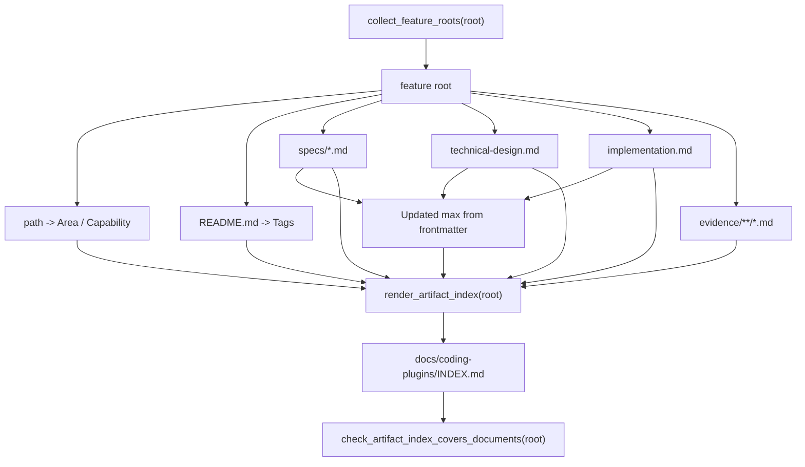

# Coding Plugins 产物总索引生成器技术设计

## 文档信息

| 字段 | 内容 |
| --- | --- |
| 状态 | 已批准 |
| 领域 | plugin |
| 能力 | artifact-index |
| 规格 | `docs/coding-plugins/features/plugin/artifact-index/specs/feature.md` |
| 计划 | `docs/coding-plugins/features/plugin/artifact-index/implementation.md` |
| TDD Evidence | `docs/coding-plugins/features/plugin/artifact-index/evidence/tdd-evidence.md` |

## Design Summary

总索引由 `scripts/preflight.py` 内部的确定性生成器生成，feature root 是唯一输入来源。生成器从路径推导 `Area` 和 `Capability`，从 README 的中文 `文档信息` 表读取 `Tags`，从规格、技术设计和计划 frontmatter 读取最大 `updated` 值，并把 spec、technical design、implementation plan、evidence 路径渲染成 Markdown 表格。preflight 继续保留路径覆盖校验，同时新增“当前索引必须等于生成器输出”的一致性校验，人工修改造成漂移时直接失败。

## Key Decisions

| Decision | Rationale | Tradeoff |
| --- | --- | --- |
| 生成器放在 `scripts/preflight.py` | 复用既有 feature root collector，避免新增脚本入口和重复路径逻辑 | `preflight.py` 文件继续变长 |
| README 只作为 tags 来源 | README 已经是人工可读 feature 摘要，适合维护检索标签 | README 缺少 `标签` 时只能输出 `-` |
| `Updated` 只取 frontmatter 最大值 | ISO 日期字符串可稳定排序，不依赖 mtime 或 Git 历史 | evidence 没有 frontmatter 时不会影响更新时间 |
| 先做路径覆盖，再做完整内容比对 | 失败信息更具体，仍能保留旧测试和旧问题定位能力 | 校验流程多一步 |
| `--write-index` 复用 preflight 入口 | 维护者只需要记住一个命令 | 写入后仍会运行完整 preflight |

## Affected Components

| Component | Change | Related Spec IDs |
| --- | --- | --- |
| `scripts/preflight.py` | 新增 `render_artifact_index()`、`write_artifact_index()`、README metadata 解析、路径单元格渲染和 `--write-index` 参数 | REQ-006, REQ-007, REQ-008, AC-003 |
| `scripts/test_preflight.py` | 增加生成器、排序、多文件、缺失 metadata 和漂移校验测试 | REQ-006, REQ-007, REQ-008, ERR-004, ERR-005 |
| `docs/coding-plugins/INDEX.md` | 改为由生成器重写，内容和 feature-first 文件树完全一致 | REQ-001, REQ-002, AC-001, AC-002 |
| `docs/coding-plugins/features/plugin/artifact-index/*` | 记录规格、技术设计、计划和 TDD Evidence | AC-002, AC-003 |

## Data Flow / Control Flow

## Interfaces and Contracts

- `render_artifact_index(root: Path) -> str`：返回完整 Markdown 索引内容，末尾包含换行。
- `write_artifact_index(root: Path) -> None`：把 `render_artifact_index()` 输出写入 `docs/coding-plugins/INDEX.md`。
- `python3 scripts/preflight.py --write-index`：先重写索引，再执行现有 preflight 静态检查和验证命令。
- `check_artifact_index_covers_documents(root)`：仍校验必需表头和所有真实路径；路径覆盖通过后，继续要求索引文本与 `render_artifact_index(root)` 完全一致。
- 多个同类文件按路径排序，并用 ` ` 连接；没有文件时输出 `-`。
- README 缺少 `标签` 行或文档缺少 `updated` frontmatter 时输出 `-`，不得推断不稳定值。

## Migration / Compatibility

现有 `docs/coding-plugins/INDEX.md` 会被生成器重写，但表头和主要规则保持兼容。旧的人工编辑方式仍可临时修改文件，但提交前 preflight 会要求重新运行 `python3 scripts/preflight.py --write-index`。不引入外部依赖，不影响 Codex 和 Claude manifest 加载。

## Test Strategy

- RED: 在 `scripts/test_preflight.py` 中先写 `render_artifact_index`、排序、多文件、metadata fallback 和内容漂移测试，确认旧实现因缺少生成器或无法识别内容漂移失败。
- GREEN: 在 `scripts/preflight.py` 中实现生成器和 `--write-index`，运行 `python3 -m unittest scripts/test_preflight.py`。
- REFACTOR: 保持路径覆盖测试不变，把完整内容比对作为覆盖校验的最后一步。
- Final: 运行 `python3 scripts/preflight.py --write-index`、`python3 scripts/preflight.py`、`git diff --check` 和 Claude 插件严格校验。

## Risks and Mitigations

| Risk | Mitigation |
| --- | --- |
| 生成器输出与历史手工索引格式不一致 | 用单元测试固定表头、路径格式和规则说明，并用 `--write-index` 一次性刷新 |
| README metadata 漏填导致 tags 变少 | 输出 `-` 而不是失败，避免阻塞文档迁移；需要强制 tags 时另加 metadata 规格 |
| 多 spec 或多 evidence 的显示顺序不稳定 | 所有文件列表按路径排序 |
| `preflight.py` 继续变大 | 先保持标准库单文件实现；后续如果脚本继续膨胀，再拆到 `scripts/docs_index.py` 并保留 preflight 调用 |
