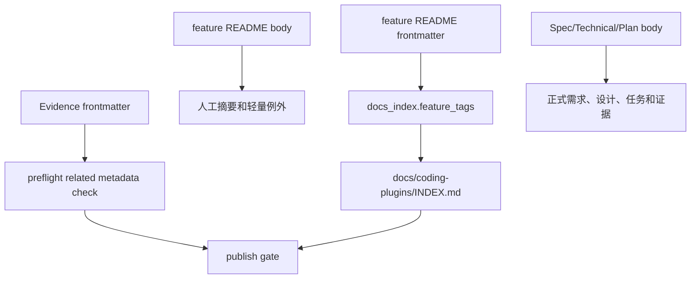

# 文档契约和 metadata-first 读取规则技术设计

## 文档信息

| 字段 | 内容 |
| --- | --- |
| 状态 | 已批准 |
| 生命周期 | implemented |
| 领域 | plugin |
| 能力 | document-contract |
| 规格 | `docs/coding-plugins/features/plugin/document-contract/specs/feature.md` |
| 计划 | `docs/coding-plugins/features/plugin/document-contract/plans/implementation.md` |
| TDD 证据 | `docs/coding-plugins/features/plugin/document-contract/evidence/tdd-evidence.md` |
| 验证方式 | `python3 scripts/preflight.py` |

## 设计摘要

本设计把文档关系收敛到 frontmatter，并让 `docs_index.py` 只消费 README frontmatter 的 `tags`。`preflight.py` 增加 README metadata 契约和 Evidence metadata 契约。历史 README 和 Evidence 做一次迁移，`docs/coding-plugins/document-contract.md` 记录后续读取顺序和正文边界。

## 规格缺口审查

| 检查项 | 结论 |
| --- | --- |
| 未覆盖需求 | 无。 |
| 验收标准不清 | 无。 |
| 新增外部行为 | 无。 |
| 处理状态 | 通过，所有要求都有技术落点。 |

## 规格到设计映射

| 规格 ID | 规格摘要 | 技术落点 | 关键决策 ID | 影响文件/符号 | 验证命令 | 证据 |
| --- | --- | --- | --- | --- | --- | --- |
| REQ-001 | 索引标签来源切换为 README frontmatter `tags`。 | `scripts/docs_index.py::frontmatter_list_values` 和 `feature_tags`；`scripts/test_docs_index.py::test_docs_index_uses_readme_frontmatter_tags_not_body_table` | TD-001 | `scripts/docs_index.py` `scripts/test_docs_index.py` | `python3 -m unittest scripts/test_docs_index.py` | `docs/coding-plugins/features/plugin/document-contract/evidence/tdd-evidence.md` |
| REQ-002 | README 声明必需 metadata 字段。 | `scripts/preflight.py::check_feature_readme_metadata_contract` 校验字段和路径一致性 | TD-002 | `scripts/preflight.py` `scripts/test_preflight.py` | `python3 -m unittest scripts/test_preflight.py` | `docs/coding-plugins/features/plugin/document-contract/evidence/tdd-evidence.md` |
| REQ-003 | README 不维护手写链路章节。 | `scripts/preflight.py::check_feature_readme_metadata_contract` 拒绝 `产物链路` 和 `文档链路` 章节 | TD-003 | `scripts/preflight.py` `scripts/test_preflight.py` `docs/coding-plugins/features/plugin/*/README.md` | `python3 -m unittest scripts/test_preflight.py` | `docs/coding-plugins/features/plugin/document-contract/evidence/tdd-evidence.md` |
| REQ-004 | Evidence 声明基础 metadata 字段。 | `scripts/preflight.py::check_evidence_metadata` 校验必填字段和路径一致性 | TD-004 | `scripts/preflight.py` `scripts/test_preflight.py` `docs/coding-plugins/features/plugin/*/evidence/tdd-evidence.md` | `python3 -m unittest scripts/test_preflight.py` | `docs/coding-plugins/features/plugin/document-contract/evidence/tdd-evidence.md` |
| REQ-005 | Evidence 声明存在的相关 spec、technical 和 plan。 | `scripts/preflight.py::check_evidence_metadata` 按 feature root 比对 `related_specs`、`related_technical`、`related_plans` | TD-004 | `scripts/preflight.py` `docs/coding-plugins/features/plugin/*/evidence/tdd-evidence.md` | `python3 scripts/preflight.py` | `docs/coding-plugins/features/plugin/document-contract/evidence/tdd-evidence.md` |
| REQ-006 | 文档契约说明 metadata 是关系源。 | 新增 `docs/coding-plugins/document-contract.md`，并在 README、workflow 和技能入口引用 | TD-005 | `docs/coding-plugins/document-contract.md` `README.md` `docs/workflow-chain.md` `skills/*/SKILL.md` | `python3 scripts/preflight.py` | `docs/coding-plugins/features/plugin/document-contract/evidence/tdd-evidence.md` |

## 无需技术设计的规格

| 规格 ID | 原因 |
| --- | --- |
| 无 | 本 capability 的 MUST 规格均有技术落点。 |

## 关键决策

| 决策 ID | 决策 | 原因 | 取舍 |
| --- | --- | --- | --- |
| TD-001 | 索引只读取 README frontmatter tags | 避免正文表格和索引关系漂移 | 历史 README 需要迁移 tags |
| TD-002 | README metadata 契约进入 preflight | README 是 feature root 的人工入口，缺少 metadata 会降低检索稳定性 | 新增文档要多写 frontmatter |
| TD-003 | README 禁止手写链路章节 | 链路关系由 frontmatter 和生成索引维护 | README 只保留摘要和轻量例外追踪 |
| TD-004 | Evidence 加入 metadata 和 related 校验 | Evidence 是验证源，也需要能反向追踪 spec、plan 和 technical | 历史 evidence 需要补齐 frontmatter |
| TD-005 | 独立文档契约说明读取顺序 | 让 Codex 和 Claude Code 后续执行时有统一规则 | 需要在 skill 入口中重复强调 |

## 影响组件

| 组件 | 变更 | 相关规格 ID |
| --- | --- | --- |
| `scripts/docs_index.py` | 新增 frontmatter list 解析，索引标签改从 README `tags` 读取 | REQ-001 |
| `scripts/preflight.py` | 新增 README metadata 和 Evidence metadata 校验并接入静态检查 | REQ-002, REQ-003, REQ-004, REQ-005 |
| `scripts/test_docs_index.py` | 固定索引不再读取正文标签表 | REQ-001, AC-001 |
| `scripts/test_preflight.py` | 覆盖 README 和 Evidence metadata 失败场景 | REQ-002, REQ-003, REQ-004 |
| `docs/coding-plugins/document-contract.md` | 记录 metadata-first 读取规则和正文边界 | REQ-006 |
| `docs/coding-plugins/features/plugin/*` | 迁移 README 和 Evidence metadata | REQ-002, REQ-003, REQ-004, REQ-005 |
| `skills/*/SKILL.md` | 在 SDD、Technical、Plan、TDD 入口补充 metadata-first 规则 | REQ-006 |

## 数据流 / 控制流

## 接口和契约

- 设计约束：README frontmatter 字段集合由 `FEATURE_README_METADATA_REQUIRED_FIELDS` 和 `tags` 列表定义。
- 设计约束：Evidence frontmatter 字段集合由 `EVIDENCE_METADATA_REQUIRED_FIELDS` 和 `related_*` 列表定义。
- 设计约束：`docs/coding-plugins/INDEX.md` 继续由 `docs_index.render_artifact_index` 生成。
- 设计约束：README 正文保留 `文档信息` 和 `轻量例外`，不作为机器关系源。

## 迁移 / 兼容性

历史 README 补齐 frontmatter，删除手写链路章节，并保留人工摘要。历史 Evidence 追加 frontmatter 和 related 路径。Spec、Technical 和 Plan 中用于执行、设计或验证的路径引用继续保留。

## 测试策略

- RED/GREEN: `python3 -m unittest scripts/test_docs_index.py scripts/test_preflight.py`
- Index refresh: `python3 scripts/preflight.py --write-index`
- Final: `python3 scripts/preflight.py`
- Evidence: `docs/coding-plugins/features/plugin/document-contract/evidence/tdd-evidence.md`

## 风险和缓解

| 风险 | 缓解方案 |
| --- | --- |
| 正文摘要和 metadata 漂移 | preflight 校验路径和必填字段；冲突时以 frontmatter 为准 |
| 历史文档迁移遗漏 | Evidence 和 README metadata 校验接入完整 preflight |
| 代理继续写手工链路表 | 技能入口和 `document-contract.md` 明确索引型链路表的边界 |
