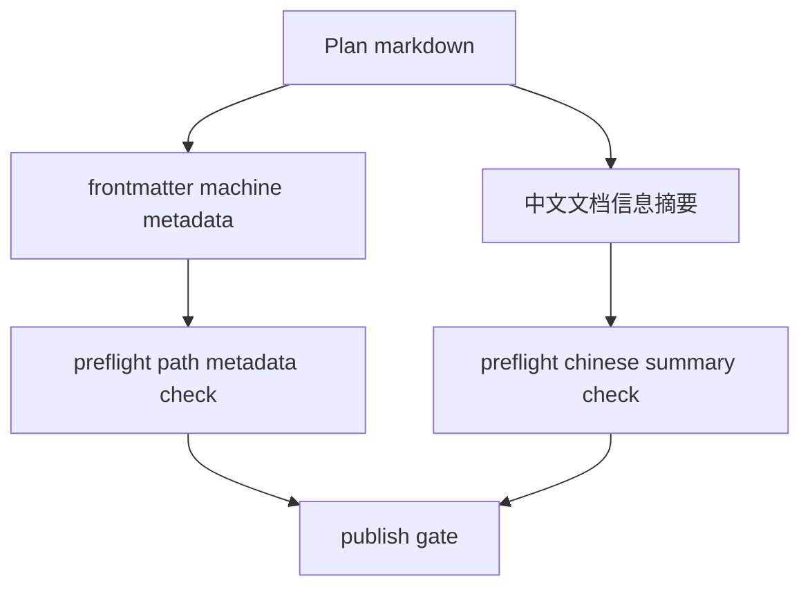

# 文档元数据中文展示优化技术设计

## 文档信息

| 字段 | 内容 |
| --- | --- |
| 状态 | 已批准 |
| 领域 | plugin |
| 能力 | document-metadata |
| 规格 | `docs/coding-plugins/features/plugin/document-metadata/specs/feature.md` |
| 计划 | `docs/coding-plugins/features/plugin/document-metadata/implementation.md` |

## Design Summary

保留 YAML frontmatter 的英文机器字段，避免破坏现有解析器和校验器。新增中文 `文档信息` 摘要表，作为人工阅读入口。Plan 文档补齐 frontmatter，并由 preflight 校验 Plan metadata、路径一致性和中文摘要。

## Key Decisions

| Decision | Rationale | Tradeoff |
| --- | --- | --- |
| frontmatter key 保持英文 | 现有 preflight 和规格校验器依赖稳定 key | 中文展示通过正文表格提供 |
| Plan 增加 frontmatter | Plan 是执行入口，也需要可追踪状态和关联文档 | 历史 plan 需要回填 metadata |
| preflight 校验中文摘要 | 保证中文展示不是可选装饰 | 需要维护摘要表字段 |

## Affected Components

| Component | Change | Related Spec IDs |
| --- | --- | --- |
| `scripts/preflight.py` | 增加 Plan metadata 和中文文档信息校验 | REQ-001, REQ-002, REQ-003, REQ-006 |
| `scripts/test_preflight.py` | 增加 RED/GREEN 单元测试 | REQ-001, REQ-002, REQ-003 |
| `skills/writing-plans/SKILL.md` | 计划模板增加 frontmatter 和 `文档信息` | REQ-005, AC-001 |
| `skills/writing-technical-design/templates/technical-design.md` | 技术设计模板增加 `文档信息` | REQ-004 |
| `docs/coding-plugins/features/**/implementation.md` | 回填现有计划 metadata 和中文摘要 | REQ-001, REQ-003 |

## Data Flow / Control Flow

## Interfaces and Contracts

- Plan frontmatter must include `title`、`status`、`area`、`capability`、`created`、`updated`。
- Plan path must remain `docs/coding-plugins/features/<area>/<capability>/implementation.md`。
- Plan body must include `## 文档信息` and at least `状态`、`领域`、`能力` rows.
- Frontmatter key names remain English.

## Migration / Compatibility

Existing Plan documents are backfilled. Spec and Technical templates get Chinese summaries for new documents, but existing historical specs are not blocked if they do not yet contain `文档信息`.

## Test Strategy

- RED/GREEN: `python3 -m unittest scripts/test_preflight.py`
- Final: `python3 scripts/preflight.py`
- Evidence: `docs/coding-plugins/features/plugin/document-metadata/evidence/tdd-evidence.md`

## Risks and Mitigations

| Risk | Mitigation |
| --- | --- |
| 中文摘要和 frontmatter 内容漂移 | preflight 校验必备字段和路径一致性 |
| 中文 key 破坏脚本 | 只中文化展示层，不改机器 key |
