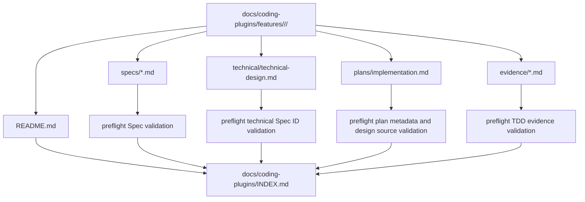

# Feature-first 文档结构迁移技术设计

## 文档信息

| 字段 | 内容 |
| --- | --- |
| 状态 | 已批准 |
| 领域 | plugin |
| 能力 | feature-first-docs |
| 规格 | `docs/coding-plugins/features/plugin/feature-first-docs/specs/maintenance.md` |
| 计划 | `docs/coding-plugins/features/plugin/feature-first-docs/plans/implementation.md` |

## 设计摘要

文档结构从产物类型优先改为 feature-first。`docs/coding-plugins/features/<area>/<capability>/` 成为 capability 的唯一活跃文档根，规格放入 `specs/` 子目录，技术设计放入 `technical/` 子目录，计划放入 `plans/` 子目录，TDD Evidence 放入 `evidence/` 子目录。preflight 通过统一的 feature root collector 收集文档，并拒绝旧四类目录和 feature root 下裸露技术/计划文件中的活跃文档。

## 规格缺口审查

| 检查项 | 结论 |
| --- | --- |
| 未覆盖需求 | 无。 |
| 验收标准不清 | 无。 |
| 新增外部行为 | 无。 |
| 处理状态 | 通过，未发现需要回写 spec 的缺口。 |

## 规格到设计映射

| Spec ID | 技术落点 | 设计决策 | 测试策略 |
| --- | --- | --- | --- |
| NFR-001 | 见本设计的 `影响组件`、`接口和契约` 与 `测试策略` 章节 | 按本 technical 的关键决策落地该规格 | 见 `## 测试策略` 和对应计划追踪 |
| NFR-002 | 见本设计的 `影响组件`、`接口和契约` 与 `测试策略` 章节 | 按本 technical 的关键决策落地该规格 | 见 `## 测试策略` 和对应计划追踪 |
| NFR-003 | 见本设计的 `影响组件`、`接口和契约` 与 `测试策略` 章节 | 按本 technical 的关键决策落地该规格 | 见 `## 测试策略` 和对应计划追踪 |
| NFR-004 | 见本设计的 `影响组件`、`接口和契约` 与 `测试策略` 章节 | 按本 technical 的关键决策落地该规格 | 见 `## 测试策略` 和对应计划追踪 |
| NFR-005 | 见本设计的 `影响组件`、`接口和契约` 与 `测试策略` 章节 | 按本 technical 的关键决策落地该规格 | 见 `## 测试策略` 和对应计划追踪 |
| NFR-006 | 见本设计的 `影响组件`、`接口和契约` 与 `测试策略` 章节 | 按本 technical 的关键决策落地该规格 | 见 `## 测试策略` 和对应计划追踪 |
| NFR-007 | 见本设计的 `影响组件`、`接口和契约` 与 `测试策略` 章节 | 按本 technical 的关键决策落地该规格 | 见 `## 测试策略` 和对应计划追踪 |
| NFR-008 | 见本设计的 `影响组件`、`接口和契约` 与 `测试策略` 章节 | 按本 technical 的关键决策落地该规格 | 见 `## 测试策略` 和对应计划追踪 |
| NFR-009 | 见本设计的 `影响组件`、`接口和契约` 与 `测试策略` 章节 | 按本 technical 的关键决策落地该规格 | 见 `## 测试策略` 和对应计划追踪 |

## 无需技术设计的规格

| Spec ID | 原因 |
| --- | --- |
| 无 | 本 capability 的 MUST 规格均有 technical 落点。 |

## 关键决策

| 决策 | 原因 | 取舍 |
| --- | --- | --- |
| 不保留旧路径兼容层 | 当前未生产落地，两套路径会长期增加模板和 preflight 成本 | 需要一次性更新所有引用和历史文档路径 |
| 每个 feature root 必须有 README | 人工检索入口集中，避免上下文继续分散 | 每个 capability 多一个短文档 |
| 只保留 `docs/coding-plugins/INDEX.md` | feature-first 后总索引可直接覆盖完整链路 | 删除旧的分类索引会改变旧工作流 |
| preflight 用 feature root 派生 area/capability | 避免每个产物类型各自维护路径推导 | collector 逻辑比旧目录扫描稍复杂 |

## 影响组件

| 组件 | 变更 | 相关 Spec ID |
| --- | --- | --- |
| `scripts/preflight.py` | 改为扫描 `features/<area>/<capability>`，拒绝旧 docs root 和 flat feature-root 技术/计划文件，校验 README、metadata 和索引 | NFR-001, NFR-007, ERR-001 |
| `scripts/test_preflight.py` | 更新 RED/GREEN 单元测试，覆盖新路径和旧路径拒绝 | NFR-001, NFR-006, ERR-001 |
| `docs/coding-plugins/**` | 将现有文档迁移到 feature-first 结构，重建总索引 | MIG-001, MIG-002 |
| `skills/*/SKILL.md` 和模板 | 更新默认落地路径和示例路径 | NFR-008, MIG-003 |
| `README.md`, `docs/installation.md`, `docs/workflow-chain.md` | 更新用户可见路径说明和链路图文字 | MIG-003 |

## 数据流 / 控制流

## 接口和契约

- Feature root: `docs/coding-plugins/features/<area>/<capability>/`
- Feature README: `docs/coding-plugins/features/<area>/<capability>/README.md`
- Spec files: `docs/coding-plugins/features/<area>/<capability>/specs/<spec-kind>.md`
- Technical design: `docs/coding-plugins/features/<area>/<capability>/technical/technical-design.md`
- Implementation plan: `docs/coding-plugins/features/<area>/<capability>/plans/implementation.md`
- Evidence files: `docs/coding-plugins/features/<area>/<capability>/evidence/tdd-evidence.md`
- Frontmatter `area` and `capability` must match feature root path.
- `docs/coding-plugins/INDEX.md` must reference every feature root and every collected document path.

## 迁移 / 兼容性

旧四类产物目录不再是活跃路径。迁移后 preflight 应在发现旧根目录下仍有 Markdown 文件时失败。`RELEASE-NOTES.md` 中的历史版本记录可以保留旧路径文字；活跃 README、docs、skills、scripts 和 tests 不应继续使用旧路径作为默认路径。

## 测试策略

- RED: 更新 `scripts/test_preflight.py` 中 collector、legacy path、feature README、index coverage 和 path metadata 测试，先确认旧实现失败。
- GREEN: 改造 `scripts/preflight.py` 的 collector 和检查函数，让 feature-first 路径通过。
- Migration verification: 迁移现有文档后运行 `python3 scripts/preflight.py`。
- Residual path verification: 运行 `rg -n "docs/coding-plugins/(specs|technical|plans|evidence)" README.md docs skills scripts tests`，确认只剩允许的历史或迁移说明。
- Plugin validation: 运行 `claude plugin validate /Users/vincen/workspace/plugins/coding-plugins --strict`。

## 风险和缓解

| 风险 | 缓解方案 |
| --- | --- |
| 旧路径引用残留导致未来代理继续生成旧结构 | 使用 `rg` 和 preflight legacy root 检查阻断 |
| 移动文档后 Spec ID 关联丢失 | 根据 feature root 的 area/capability 查找同根 specs，并用既有 Spec ID 校验 |
| 总索引漏掉迁移文件 | preflight 校验 `docs/coding-plugins/INDEX.md` 覆盖所有 collected documents |
| 批量替换误改 release 历史 | release notes 允许保留历史文本；活跃文档单独扫描 |
