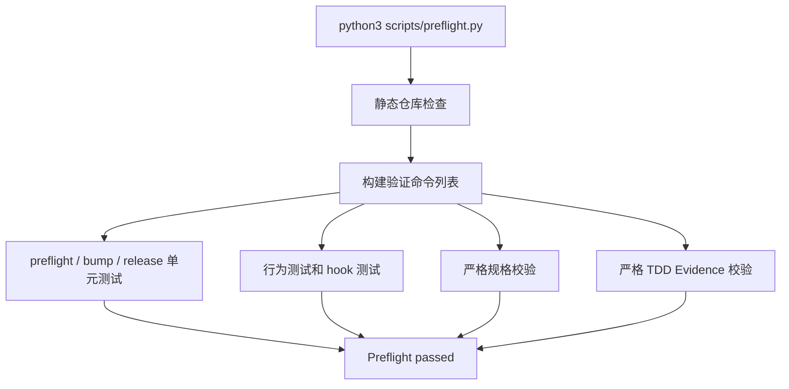

# 插件发布前检查技术设计

## 文档信息

| 字段 | 内容 |
| --- | --- |
| 状态 | 已批准 |
| 领域 | plugin |
| 能力 | preflight |
| 规格 | `docs/coding-plugins/features/plugin/preflight/specs/feature.md` |
| TDD Evidence | `docs/coding-plugins/features/plugin/preflight/evidence/tdd-evidence.md` |

## 设计摘要

preflight 是插件仓库的本地发布门禁，入口固定为 `python3 scripts/preflight.py`。它先运行静态结构检查，再调度单元测试、行为测试、hook 测试、严格规格校验和严格 TDD Evidence 校验。文档索引生成和一致性校验独立封装到 `scripts/docs_index.py`，manifest 文件、版本、资源和 hook 配置检查独立封装到 `scripts/manifest_checks.py`，避免发布门禁脚本继续承担所有静态检查细节。GitHub Actions 的 `ci` workflow 复用同一命令，确保本地和远程门禁一致。

## 规格缺口审查

| 检查项 | 结论 |
| --- | --- |
| 未覆盖需求 | 无。 |
| 验收标准不清 | 无。 |
| 新增外部行为 | 无。 |
| 处理状态 | 通过，未发现需要回写 spec 的缺口。 |

## 规格到设计映射

| Spec ID | 规格摘要 | 技术落点 | 关键决策 ID | 影响文件/符号 | 验证命令 | Evidence |
| --- | --- | --- | --- | --- | --- | --- |
| REQ-001 | preflight 命令运行 SDD 校验器、TDD Evidence 校验器和 preflight 逻辑的仓库单测。 | `scripts/preflight.py`：提供静态检查、索引生成、验证命令构建和主入口 `scripts/test_preflight.py`：覆盖 manifest、旧入口残留、索引、metadata、release 和命令构建规则 | TD-001 | `scripts/preflight.py` `scripts/test_preflight.py` | 追踪矩阵中的单测命令。 | `docs/coding-plugins/features/plugin/preflight/evidence/tdd-evidence.md` |
| REQ-002 | preflight 命令校验 `docs/coding-plugins/features/**/specs/*.md` 下的真实规格文档。 | `scripts/preflight.py`：提供静态检查、索引生成、验证命令构建和主入口 | TD-002 | `scripts/preflight.py` | 追踪矩阵中的 strict 规格校验命令。 | `docs/coding-plugins/features/plugin/preflight/evidence/tdd-evidence.md` |
| REQ-003 | preflight 命令拒绝 Codex 和 Claude 插件 manifest 版本不一致的仓库状态。 | `scripts/preflight.py`：提供静态检查、索引生成、验证命令构建和主入口 `scripts/manifest_checks.py`：提供 manifest 版本、必需文件、Codex hook 和 manifest asset 路径检查 `scripts/test_preflight.py`：覆盖 manifest、旧入口残留、索引、metadata、release 和命令构建规则 | TD-003 | `scripts/preflight.py` `scripts/manifest_checks.py` `scripts/test_preflight.py` | 单测 `test_manifest_version_check_rejects_mismatched_versions`。 | `docs/coding-plugins/features/plugin/preflight/evidence/tdd-evidence.md` |
| REQ-004 | preflight 命令拒绝 Git 内部目录之外仍引用已移除旧入口的仓库状态。 | `scripts/preflight.py`：提供静态检查、索引生成、验证命令构建和主入口 `scripts/test_preflight.py`：覆盖 manifest、旧入口残留、索引、metadata、release 和命令构建规则 | TD-004 | `scripts/preflight.py` `scripts/test_preflight.py` | 单测 `test_removed_entry_scan_ignores_git_and_detects_active_references`。 | `docs/coding-plugins/features/plugin/preflight/evidence/tdd-evidence.md` |
| REQ-005 | GitHub Actions 在 push 到 `main` 和面向 `main` 的 pull request 中运行同一个 preflight 命令。 | `.github/workflows/ci.yml`：push 和 pull request 时运行 `python3 scripts/preflight.py` | TD-005 | `.github/workflows/ci.yml` | 追踪矩阵中的 workflow 文件检查和命令执行。 | `docs/coding-plugins/features/plugin/preflight/evidence/tdd-evidence.md` |
| REQ-006 | preflight 命令运行 Codex SessionStart hook 测试，防止入口注入链路发布时失效。 | `scripts/preflight.py`：提供静态检查、索引生成、验证命令构建和主入口 `scripts/test_preflight.py`：覆盖 manifest、旧入口残留、索引、metadata、release 和命令构建规则 `tests/hooks/test-session-start.sh`：验证 Codex SessionStart hook 配置和 wrapper 行为 | TD-006 | `scripts/preflight.py` `scripts/test_preflight.py` `tests/hooks/test-session-start.sh` | 单测 `test_build_commands_include_core_validation_steps` 和 hook 测试命令。 | `docs/coding-plugins/features/plugin/preflight/evidence/tdd-evidence.md` |
| REQ-007 | preflight 命令校验 `docs/coding-plugins/INDEX.md` 覆盖所有真实 spec、plan 和 TDD Evidence 文件。 | `scripts/preflight.py`：提供静态检查、索引生成、验证命令构建和主入口 `scripts/docs_index.py`：提供 feature root 收集、索引渲染、`--write-index` 写入和索引内容一致性校验 `scripts/test_preflight.py`：覆盖 manifest、旧入口残留、索引、metadata、release 和命令构建规则 `docs/coding-plugins/INDEX.md`：由 `--write-index` 生成并由 preflight 校验一致性 | TD-006 | `scripts/preflight.py` `scripts/docs_index.py` `scripts/test_preflight.py` `docs/coding-plugins/INDEX.md` | 单测 `test_artifact_index_requires_spec_paths`、`test_artifact_index_requires_plan_paths` 和 `test_artifact_index_requires_evidence_paths`。 | `docs/coding-plugins/features/plugin/preflight/evidence/tdd-evidence.md` |
| REQ-008 | 文档索引生成、写入和内容一致性校验必须封装在 `scripts/docs_index.py`，`scripts/preflight.py` 只保留 CLI 和发布门禁编排。 | `scripts/docs_index.py`：提供 feature root 收集、索引渲染、`--write-index` 写入和索引内容一致性校验 `scripts/test_docs_index.py`：覆盖 docs index 模块边界，确保索引职责不回流到 preflight | TD-006 | `scripts/docs_index.py` `scripts/test_docs_index.py` | 单测 `test_docs_index_module_exposes_index_contract` 和 `test_preflight_delegates_artifact_index_checks_to_docs_index`。 | `docs/coding-plugins/features/plugin/preflight/evidence/tdd-evidence.md` |
| REQ-009 | manifest 相关检查必须封装在 `scripts/manifest_checks.py`，`scripts/preflight.py` 只保留错误转换、CLI 和发布门禁编排。 | `scripts/manifest_checks.py`：提供 manifest 版本、必需文件、Codex hook 和 manifest asset 路径检查 `scripts/test_manifest_checks.py`：覆盖 manifest checks 模块边界，确保 manifest 职责不回流到 preflight | TD-006 | `scripts/manifest_checks.py` `scripts/test_manifest_checks.py` | 单测 `test_manifest_checks_module_exposes_manifest_contract` 和 `test_preflight_converts_manifest_check_errors`。 | `docs/coding-plugins/features/plugin/preflight/evidence/tdd-evidence.md` |

## 无需技术设计的规格

| Spec ID | 原因 |
| --- | --- |
| 无 | 本 capability 的 MUST 规格均有 technical 落点。 |

## 关键决策

| 决策 ID | 决策 | 原因 | 取舍 |
| --- | --- | --- | --- |
| TD-001 | 单入口 `scripts/preflight.py` | 维护者和 CI 使用同一命令，覆盖 REQ-001、REQ-005、AC-001、AC-002 | 脚本职责较多，后续可能需要拆模块 |
| TD-002 | 独立 `scripts/docs_index.py` | 文档索引渲染、写入和漂移校验是独立职责，拆出后降低 `preflight.py` 膨胀风险 | 需要保留 preflight 的兼容 wrapper，避免现有测试和调用方断裂 |
| TD-003 | 独立 `scripts/manifest_checks.py` | manifest 结构、版本、资源和 Codex hook 配置是独立职责，拆出后便于后续扩展 release 和 marketplace 检查 | 需要通过 preflight wrapper 将模块错误转换为 `PreflightError` |
| TD-004 | 静态检查先于命令调度 | 快速发现 manifest、文档路径、索引和残留入口问题 | 部分规则需要持续维护白名单 |
| TD-005 | 严格校验真实规格和 Evidence | 覆盖 REQ-002、REQ-007，防止示例文档和真实文档标准不一致 | 新增文档时需要同步 metadata 和索引 |
| TD-006 | hook 和行为测试纳入 preflight | 覆盖 REQ-006，避免入口注入和路由测试在发布时被漏跑 | 增加 preflight 执行时间 |

## 影响组件

| 组件 | 变更 | 相关 Spec ID |
| --- | --- | --- |
| `scripts/preflight.py` | 提供静态检查、索引生成、验证命令构建和主入口 | REQ-001, REQ-002, REQ-003, REQ-004, REQ-006, REQ-007, ERR-001, ERR-002, ERR-003, AC-001 |
| `scripts/docs_index.py` | 提供 feature root 收集、索引渲染、`--write-index` 写入和索引内容一致性校验 | REQ-007, REQ-008 |
| `scripts/manifest_checks.py` | 提供 manifest 版本、必需文件、Codex hook 和 manifest asset 路径检查 | REQ-003, REQ-009, ERR-003 |
| `scripts/test_preflight.py` | 覆盖 manifest、旧入口残留、索引、metadata、release 和命令构建规则 | REQ-001, REQ-003, REQ-004, REQ-006, REQ-007, ERR-001, ERR-002, ERR-003 |
| `scripts/test_docs_index.py` | 覆盖 docs index 模块边界，确保索引职责不回流到 preflight | REQ-008 |
| `scripts/test_manifest_checks.py` | 覆盖 manifest checks 模块边界，确保 manifest 职责不回流到 preflight | REQ-009 |
| `.github/workflows/ci.yml` | push 和 pull request 时运行 `python3 scripts/preflight.py` | REQ-005, AC-002 |
| `tests/hooks/test-session-start.sh` | 验证 Codex SessionStart hook 配置和 wrapper 行为 | REQ-006 |
| `docs/coding-plugins/INDEX.md` | 由 `--write-index` 生成并由 preflight 校验一致性 | REQ-007 |

## 数据流 / 控制流

## 接口和契约

CLI 契约：

| 命令 | 行为 |
| --- | --- |
| `python3 scripts/preflight.py` | 运行静态检查和全部验证命令，成功时输出 `Preflight passed.` |
| `python3 scripts/preflight.py --write-index` | 先重写 `docs/coding-plugins/INDEX.md`，再执行完整 preflight |

静态检查契约：

| 检查 | 失败行为 |
| --- | --- |
| manifest 文件和版本一致性 | 输出缺失或版本不一致并非零退出 |
| release 管理文件 | 缺少 release notes、版本配置或 release workflow 时失败 |
| feature-first 文档路径和 metadata | area/capability 不一致、索引漂移或旧路径残留时失败 |
| technical design / implementation 引用 | 引用不存在文件或未知 Spec ID 时失败 |
| TDD Evidence | Evidence 中引用未知 Spec ID 或严格校验失败时失败 |

## 迁移 / 兼容性

preflight 保留无参数入口，兼容本地和 CI 现有用法。`--write-index` 是附加模式，不改变普通检查语义。旧 docs roots、旧入口和旧品牌残留会被拒绝，但 release history 和 feature specs/evidence 中的历史记录允许保留。

## 测试策略

| Spec ID | Test Strategy |
| --- | --- |
| REQ-001, REQ-003, REQ-004, ERR-001, ERR-002, ERR-003 | `python3 -m unittest scripts/test_preflight.py` |
| REQ-002 | `python3 skills/spec-driven-development/scripts/validate_spec.py --strict docs/coding-plugins/features/plugin/preflight/specs/feature.md` |
| REQ-005, AC-002 | 评审 `.github/workflows/ci.yml`，并由 preflight 文档同步检查覆盖关键命令 |
| REQ-006 | `bash tests/hooks/test-session-start.sh` 和 `test_build_commands_include_core_validation_steps` |
| REQ-007 | `test_artifact_index_requires_generated_content_match` 及索引路径覆盖测试 |
| REQ-009 | `scripts/test_manifest_checks.py` 和 `test_preflight_converts_manifest_check_errors` |
| AC-001 | `python3 scripts/preflight.py` |

TDD Evidence 记录在 `docs/coding-plugins/features/plugin/preflight/evidence/tdd-evidence.md`。本轮为历史文档回填，不改变 preflight 行为，因此使用 TDD Exception Record 记录替代验证。

## 风险和缓解

| 风险 | 缓解方案 |
| --- | --- |
| `preflight.py` 持续膨胀 | 先拆出 `scripts/docs_index.py` 和 `scripts/manifest_checks.py`，后续如 release 规则继续增长再拆 `scripts/release_checks.py` |
| 新文档加入后忘记刷新索引 | `python3 scripts/preflight.py --write-index` 和生成内容一致性校验 |
| 本地和 CI 门禁不一致 | CI 只调用同一个 `python3 scripts/preflight.py` 命令 |
| 旧路径残留误伤历史记录 | residue scan 只扫描活跃说明、hooks、skills、manifest 和 CI，允许 release history |