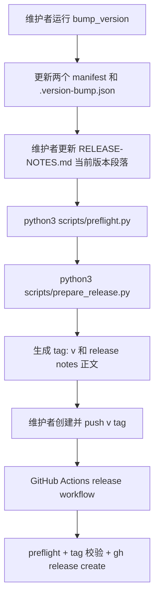

# 插件发布和版本管理技术设计

## 文档信息

| 字段 | 内容 |
| --- | --- |
| 状态 | 已批准 |
| 领域 | plugin |
| 能力 | release-management |
| 规格 | `docs/coding-plugins/features/plugin/release-management/specs/feature.md` |
| TDD Evidence | `docs/coding-plugins/features/plugin/release-management/evidence/tdd-evidence.md` |

## Design Summary

发布链路拆成三个边界清晰的步骤：`scripts/bump_version.py` 只负责同步版本，`scripts/prepare_release.py` 负责校验 release metadata 并提取当前版本 notes，`.github/workflows/release.yml` 负责在 `v*` tag push 后创建 GitHub Release。preflight 不执行网络发布，但必须确认 release 脚本、测试和 workflow 存在并保持可校验。这样 REQ-001 到 REQ-008 都可以在本地检查中发现结构缺口，真正发布动作只发生在 GitHub tag workflow。

## Key Decisions

| Decision | Rationale | Tradeoff |
| --- | --- | --- |
| 使用独立 `scripts/prepare_release.py` | 将 release metadata 提取和 GitHub workflow 解耦，覆盖 REQ-006、ERR-005、AC-003 | 多一个脚本和单测需要维护 |
| tag 名固定为 `v<version>` | GitHub Release workflow 可以稳定比对 tag 与 manifest，覆盖 REQ-007、ERR-006、AC-004 | 不支持无 `v` 前缀 tag |
| preflight 只做结构和一致性检查 | 满足 NON-002，避免本地检查触发 push 或网络发布 | GitHub Release 创建结果仍需依赖 GitHub Actions |
| release notes 只提取当前版本正文 | GitHub Release notes 和 `RELEASE-NOTES.md` 保持同源，覆盖 REQ-006 | release notes 标题格式必须为 `## <version>` 或 `## <version> - <date>` |

## Affected Components

| Component | Change | Related Spec IDs |
| --- | --- | --- |
| `scripts/bump_version.py` | 保持现有版本同步职责 | REQ-001, REQ-002, REQ-003, ERR-001, ERR-002 |
| `scripts/prepare_release.py` | 新增 release metadata 校验、tag 名生成、release notes 提取和 GitHub output 写入 | REQ-006, ERR-005, AC-003 |
| `scripts/preflight.py` | 增加 release automation 文件和 workflow 内容检查，并运行 release 准备脚本单测 | REQ-004, REQ-005, REQ-008, ERR-003, ERR-004 |
| `.github/workflows/release.yml` | 新增 `v*` tag workflow，运行 preflight、准备 notes、校验 tag、调用 `gh release create` | REQ-007, ERR-006, AC-004 |
| `RELEASE-NOTES.md` | 继续作为当前版本 GitHub Release notes 的唯一来源 | REQ-001, REQ-006, ERR-003, ERR-005 |

## Data Flow / Control Flow



## Interfaces and Contracts

`scripts/prepare_release.py` 的 CLI 契约：

```bash
python3 scripts/prepare_release.py --skip-git-checks --notes-out release-notes.md --github-output "$GITHUB_OUTPUT"
```

输出契约：

| 输出 | 含义 |
| --- | --- |
| stdout `Release ready: v<version>` | release metadata 校验通过 |
| `--notes-out` 文件 | 当前版本 release notes 正文，不包含版本标题 |
| `--github-output` | 写入 `version=<version>` 和 `tag=v<version>` |

错误契约：

| 条件 | 行为 |
| --- | --- |
| manifest、`.version-bump.json` 或 release notes 版本不一致 | 非零退出并输出 `Release preparation failed:` |
| 当前版本 release notes 缺失或为空 | 非零退出并指出 release notes section 问题 |
| 本地 git 工作区不干净且未使用 `--allow-dirty` | 非零退出，避免创建错误 tag |

## Migration / Compatibility

现有版本 bump 流程保持兼容：维护者仍然先运行 `scripts/bump_version.py`，再更新 `RELEASE-NOTES.md` 和运行 `scripts/preflight.py`。新增 release workflow 不影响普通 push 或 PR CI，只在 `v*` tag push 时触发。已有历史 release notes 不需要改写。

## Test Strategy

| Spec ID | Test Strategy |
| --- | --- |
| REQ-001, REQ-002, REQ-003, ERR-001, ERR-002 | 继续由 `scripts/test_bump_version.py` 和 `scripts/test_preflight.py` 覆盖 |
| REQ-004, REQ-005, REQ-008, ERR-003, ERR-004 | `scripts/test_preflight.py` 检查 preflight 命令列表和 release automation 文件约束 |
| REQ-006, ERR-005, AC-003 | `scripts/test_prepare_release.py` 覆盖 tag 名、release notes 提取和 metadata 校验 |
| REQ-007, ERR-006, AC-004 | `scripts/test_preflight.py` 检查 workflow 存在并包含 prepare/release 动作，人工评审 workflow tag 校验 |

TDD Evidence 记录在 `docs/coding-plugins/features/plugin/release-management/evidence/tdd-evidence.md`。

## Risks and Mitigations

| Risk | Mitigation |
| --- | --- |
| tag 已存在或工作区不干净导致错误发布 | `prepare_release.py` 默认检查 git 状态和 tag 是否已存在 |
| GitHub Actions 中 tag 已存在，无法使用本地 tag 不存在检查 | workflow 使用 `--skip-git-checks`，并用 GitHub ref 和脚本输出 tag 做一致性校验 |
| release notes 标题格式漂移 | 提取器只接受 `## <version>` 或 `## <version> - <date>`，缺失时失败 |
| preflight 变成发布动作 | preflight 只检查文件和测试，不调用 `gh`、不 push tag |
