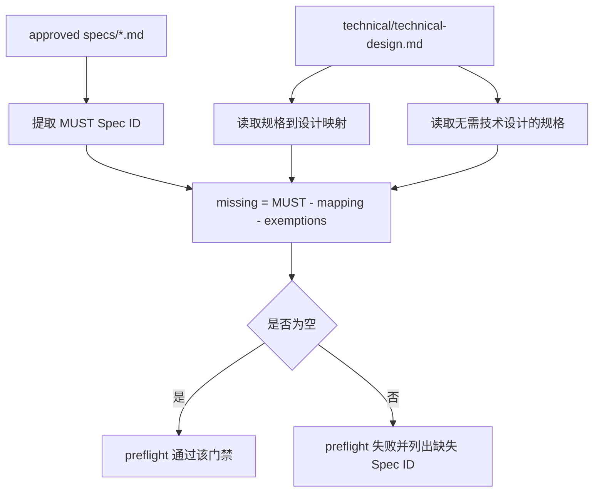

# Spec 与 Technical 质量门禁技术设计

## 文档信息

| 字段 | 内容 |
| --- | --- |
| 状态 | 已批准 |
| 领域 | plugin |
| 能力 | spec-technical-quality-gates |
| 规格 | `docs/coding-plugins/features/plugin/spec-technical-quality-gates/specs/feature.md` |
| 计划 | `docs/coding-plugins/features/plugin/spec-technical-quality-gates/plans/implementation.md` |
| TDD Evidence | `docs/coding-plugins/features/plugin/spec-technical-quality-gates/evidence/tdd-evidence.md` |

## 设计摘要

本设计在现有 technical 校验基础上增加反向覆盖门禁。preflight 从同 capability 的 approved spec 中提取 MUST Spec ID，再要求这些 ID 出现在 technical 的 `## 规格到设计映射` 或 `## 无需技术设计的规格` 中；同时 technical frontmatter 要在对应产物存在时声明 spec、plan、evidence 三向链路。

## 规格缺口审查

| 检查项 | 结论 | 依据 |
| --- | --- | --- |
| 未覆盖需求 | 无。 | 已核对 REQ-001 到 REQ-006。 |
| 验收标准不清 | 无。 | 已核对 AC-001 到 AC-003。 |
| 新增外部行为 | 无。 | 本能力只增强插件内部文档和 preflight 门禁。 |
| 处理状态 | 通过，未发现需要回写 spec 的缺口。 | 可进入计划和 TDD 实现。 |

## 规格到设计映射

| Spec ID | 技术落点 | 设计决策 | 测试策略 |
| --- | --- | --- | --- |
| REQ-001 | `skills/writing-technical-design/templates/technical-design.md` | 模板新增映射章节，确保新 technical 默认携带追踪表。 | `test_technical_template_requires_spec_design_mapping_sections` |
| REQ-002 | `skills/writing-technical-design/templates/technical-design.md` | 模板新增豁免章节，允许明确说明不需要技术设计的 Spec ID。 | `test_technical_template_requires_spec_design_mapping_sections` |
| REQ-003 | `scripts/preflight.py` | 对所有真实 technical 文档检查两个章节。 | `test_technical_design_requires_spec_design_mapping_sections` |
| REQ-004 | `scripts/preflight.py` | approved spec 的 MUST ID 必须在映射或豁免章节中出现。 | `test_technical_design_must_cover_required_spec_ids` |
| REQ-005 | `scripts/preflight.py` | technical metadata 需声明存在的 spec、plan、evidence 路径。 | `test_technical_metadata_requires_related_chain_paths` |
| REQ-006 | `skills/writing-technical-design/SKILL.md` | 技能流程和自审要求填写映射并检查 MUST 覆盖。 | `python3 scripts/preflight.py` |

## 无需技术设计的规格

| Spec ID | 原因 |
| --- | --- |
| 无 | 本 capability 的 MUST 规格均有 technical 落点。 |

## 关键决策

| 决策 | 原因 | 取舍 |
| --- | --- | --- |
| 覆盖检查只针对 approved spec 的 MUST ID | 避免 draft spec 或 SHOULD/MAY 造成过早阻塞 | SHOULD 覆盖仍依赖人工审查 |
| 覆盖来源限定为映射和豁免章节 | 防止正文偶然出现 Spec ID 被误判为已设计 | 需要批量补充现有 technical 文档 |
| technical metadata 按存在文件校验 | 如果 plan/evidence 已存在，就必须在 technical 中显式链接 | 轻量例外 feature 不受影响，因为没有 technical |

## 影响组件

| 组件 | 变更 | 相关 Spec ID |
| --- | --- | --- |
| `scripts/preflight.py` | 增加 technical 映射章节、MUST 反向覆盖和 related 链路校验 | REQ-003, REQ-004, REQ-005 |
| `scripts/test_preflight.py` | 增加 RED/GREEN 单元测试覆盖新增门禁 | REQ-001, REQ-002, REQ-003, REQ-004, REQ-005 |
| `skills/writing-technical-design/SKILL.md` | 增加规格到设计映射要求和自审项 | REQ-006 |
| `skills/writing-technical-design/templates/technical-design.md` | 增加 `规格到设计映射` 和 `无需技术设计的规格` 默认章节 | REQ-001, REQ-002 |
| `docs/coding-plugins/features/plugin/*/technical/technical-design.md` | 补充映射表、豁免表和 metadata 链路 | REQ-003, REQ-004, REQ-005 |

## 数据流 / 控制流

## 接口和契约

- `check_technical_design_required_sections(root)` 校验 technical 文档包含 `## 规格到设计映射` 和 `## 无需技术设计的规格`。
- `check_technical_design_must_spec_coverage(root)` 校验 approved spec 的 MUST Spec ID 都在映射或豁免章节中出现。
- `check_technical_design_related_metadata(root)` 校验 technical frontmatter 中对应存在产物的 related 路径。
- 轻量例外 capability 没有 technical 文档时，不进入这些 technical 门禁。

## 迁移 / 兼容性

现有 8 份 technical 文档需要一次性补充映射章节和豁免章节。`artifact-index` 和 `feature-first-docs` 当前缺少部分 MUST ID 显式覆盖，应在迁移时补齐映射或说明豁免。轻量例外 feature 继续由 README `## 轻量例外` 管理。

## 测试策略

- RED: 先在 `scripts/test_preflight.py` 写失败测试，覆盖模板缺章节、technical 缺章节、MUST ID 未覆盖、related 路径缺失。
- GREEN: 在 `scripts/preflight.py` 增加校验函数，更新 technical 模板和现有文档。
- REFACTOR: 把 section 提取逻辑复用现有 `markdown_section()`，保持错误信息能定位 feature root 和缺失 ID。
- Final: 运行 `python3 scripts/preflight.py --write-index` 和 `python3 scripts/preflight.py`。

## 风险和缓解

| 风险 | 缓解方案 |
| --- | --- |
| 映射表流于形式 | preflight 至少保证每个 MUST ID 都被显式处理；评审时继续看技术落点是否真实 |
| 大量历史 technical 需要补表 | 本批只迁移已有 8 份 technical，轻量例外不强制补文档 |
| 文本解析 Markdown 表格不完整 | 只用 section + Spec ID 提取，不依赖复杂 Markdown 解析 |
