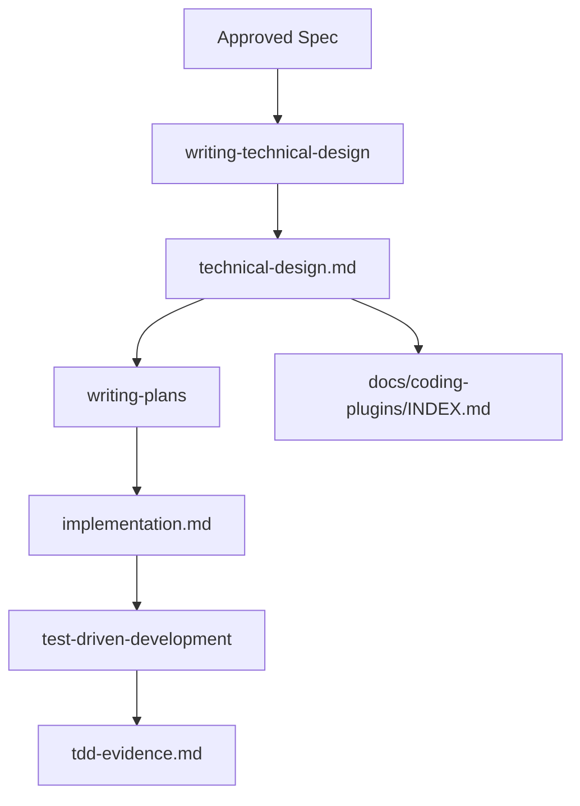

# 技术设计产物独立维护技术设计

## 文档信息

| 字段 | 内容 |
| --- | --- |
| 状态 | 已批准 |
| 领域 | plugin |
| 能力 | technical-design-artifacts |
| 规格 | `docs/coding-plugins/features/plugin/technical-design-artifacts/specs/feature.md` |
| 计划 | `docs/coding-plugins/features/plugin/technical-design-artifacts/implementation.md` |

## Design Summary

新增独立技术设计层，位于 Spec 和 Plan 之间。`writing-technical-design` 负责把批准规格转成 feature root 下的 `technical-design.md`，`writing-plans` 只引用技术设计并拆解 TDD 任务。preflight 统一校验总索引、Spec 引用、Plan 引用和 Spec ID 追踪。

## Key Decisions

| Decision | Rationale | Tradeoff |
| --- | --- | --- |
| 在 feature root 下新增 `technical-design.md`，而不是复用 `implementation.md` | 区分稳定技术方案和执行任务，避免 `implementation.md` 同时承担设计和步骤 | 需要维护新的引用和校验规则 |
| 新增 `writing-technical-design` skill | 技术设计是独立阶段，放进 `writing-plans` 会让计划 skill 继续膨胀 | 会增加一次技能选择和文档产物 |
| preflight 只强制校验真实 technical 文件和已有引用 | 避免历史 capability 必须立即回填技术设计 | 历史规格暂时可能没有 technical 链路 |
| 总索引增加 `Technical Design` 列 | 检索 capability 时能看到 Spec、Technical、Plan、Evidence 全链路 | 需要更新既有索引行 |

## Affected Components

| Component | Change | Related Spec IDs |
| --- | --- | --- |
| `skills/writing-technical-design/SKILL.md` | 新增技术设计 skill，定义职责、路径、流程和自审规则 | REQ-004, AC-002 |
| `skills/writing-technical-design/templates/technical-design.md` | 提供技术设计模板 | REQ-004 |
| `skills/using-coding-plugins/SKILL.md` | 在批准规格后路由到 `writing-technical-design`，再进入 `writing-plans` | REQ-004 |
| `skills/writing-plans/SKILL.md` | 要求计划引用 `Technical Design Source`，并只保留方案快照 | REQ-005 |
| `docs/coding-plugins/INDEX.md` | 覆盖 feature root 和真实技术设计文档 | REQ-002 |
| `docs/coding-plugins/INDEX.md` | 新增 `Technical Design` 列 | REQ-003 |
| `scripts/preflight.py` | 增加 technical 文档收集、索引、引用和 Spec ID 校验 | REQ-001, REQ-002, REQ-003, REQ-005, REQ-006 |
| `tests/behavior/test_routing.py` | 覆盖新 skill 的入口路由 | REQ-004, REQ-007 |

## Data Flow / Control Flow

## Interfaces and Contracts

- Technical design path: `docs/coding-plugins/features/plugin/technical-design-artifacts/technical-design.md`
- Plan path: `docs/coding-plugins/features/plugin/technical-design-artifacts/implementation.md`
- Evidence path: `docs/coding-plugins/features/plugin/technical-design-artifacts/evidence/tdd-evidence.md`
- Spec metadata may include `related_technical` paths.
- Plan must include `Technical Design Source:` followed by a real technical design path.
- Technical design may mention Spec IDs only if those IDs exist in the corresponding spec directory.

## Migration / Compatibility

历史 capability 不强制立即回填 technical 文档。preflight 只校验真实存在的 technical 文件，以及 Spec 和 Plan 中已经声明的 technical 引用。总索引中历史行的 `Technical` 列可暂时使用 `-`。

## Test Strategy

- REQ-001 到 REQ-006 使用 `python3 -m unittest scripts/test_preflight.py` 覆盖。
- REQ-004 和 REQ-007 使用 `python3 -m unittest tests.behavior.test_routing` 覆盖。
- AC-003 使用 `python3 scripts/preflight.py` 做完整发布前验证。
- TDD Evidence 写入 `docs/coding-plugins/features/plugin/technical-design-artifacts/evidence/tdd-evidence.md`。

## Risks and Mitigations

| Risk | Mitigation |
| --- | --- |
| 新增 technical 层导致文档链路更长 | 使用总索引和 preflight 保证检索和引用一致 |
| 技术设计变成任务清单 | 在 `writing-technical-design` 中明确任务拆分属于 `writing-plans` |
| 历史文档未回填造成发布阻塞 | preflight 不强制历史规格必须有 technical 引用 |
