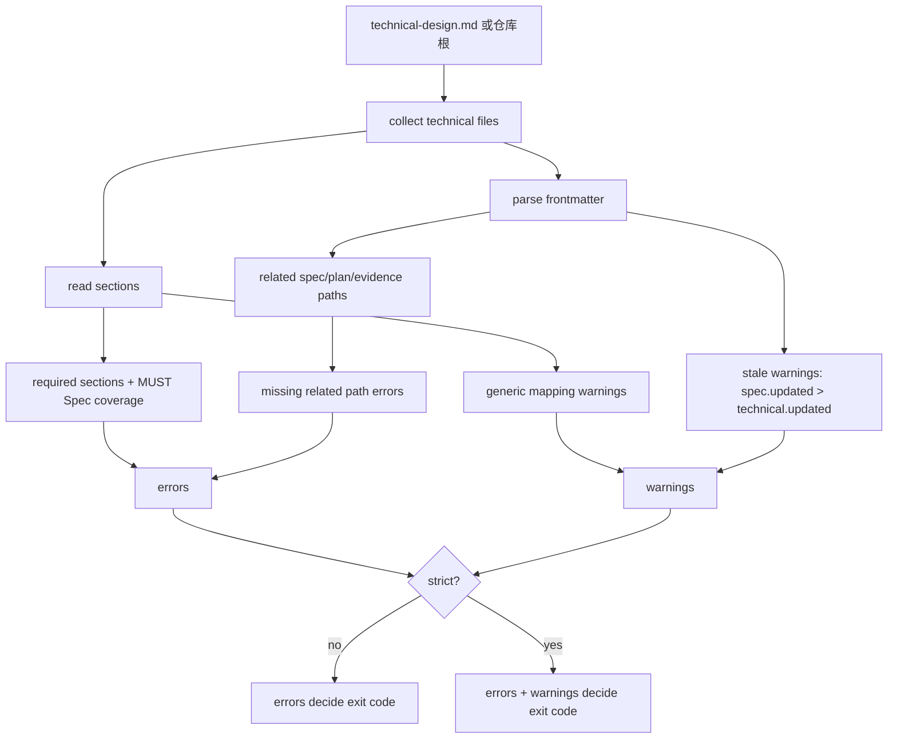

# Technical Design Validator 技术设计

## 文档信息

| 字段 | 内容 |
| --- | --- |
| 状态 | 已批准 |
| 领域 | plugin |
| 能力 | technical-design-validator |
| 规格 | `docs/coding-plugins/features/plugin/technical-design-validator/specs/feature.md` |
| 计划 | `docs/coding-plugins/features/plugin/technical-design-validator/plans/implementation.md` |
| TDD Evidence | `docs/coding-plugins/features/plugin/technical-design-validator/evidence/tdd-evidence.md` |

## 设计摘要

新增 `skills/writing-technical-design/scripts/validate_technical_design.py` 作为 technical design 的独立校验入口。validator 负责读取 feature-first 文档链路，复用 docs index 的 feature root、frontmatter 解析和文件收集能力，输出 errors 与 warnings。`scripts/preflight.py` 只以非 strict 方式复用 validator 的结构错误检查，泛化映射和 stale 先作为 warning 暴露，strict 审计由维护者显式运行。

## 规格缺口审查

| 检查项 | 结论 | 依据 |
| --- | --- | --- |
| 未覆盖需求 | 无。 | 已核对 REQ-001 到 REQ-006。 |
| 验收标准不清 | 无。 | 已核对 AC-001 到 AC-004。 |
| 新增外部行为 | 无。 | 新增的是本地 validator CLI 和 preflight 内部校验入口。 |
| 处理状态 | 通过，未发现需要回写 spec 的缺口。 | 可进入计划和 TDD 实现。 |

## 规格到设计映射

| Spec ID | 技术落点 | 设计决策 | 测试策略 |
| --- | --- | --- | --- |
| REQ-001 | `skills/writing-technical-design/scripts/validate_technical_design.py` | CLI 支持显式 technical 文件参数；无参数时扫描仓库全部 feature-first technical；`--root` 可指定仓库根。 | `test_cli_validates_repository_technical_docs` |
| REQ-002 | `validate_technical_design.py` 的结构校验函数 | 从 preflight 技术校验抽出等价规则，返回结构化 errors。 | `test_validator_rejects_missing_required_sections`、`test_validator_rejects_missing_must_spec_mapping`、`test_validator_rejects_missing_related_metadata_path` |
| REQ-003 | `validate_technical_design.py` 的 warning 规则 | 泛化映射先 warning，strict 模式升级为 error，避免默认阻断历史文档。 | `test_validator_warns_about_generic_mapping`、`test_strict_validator_rejects_generic_mapping` |
| REQ-004 | `validate_technical_design.py` 的 stale 规则 | 比较 related approved spec 和 technical 的 `updated` 字段，只有两侧都有日期时判断 stale。 | `test_validator_warns_when_spec_is_newer_than_technical`、`test_strict_validator_rejects_stale_technical` |
| REQ-005 | `scripts/preflight.py` | preflight 调用 validator 的非 strict 入口，只对 errors 失败。 | `test_preflight_runs_technical_design_validator_tests`、`python3 scripts/preflight.py` |
| REQ-006 | `skills/writing-technical-design/SKILL.md` | 技能说明新增 validator 和 strict 审计命令。 | `python3 scripts/preflight.py` |

## 无需技术设计的规格

| Spec ID | 原因 |
| --- | --- |
| 无 | 本 capability 的 MUST 规格均有 technical 落点。 |

## 关键决策

| 决策 | 原因 | 取舍 |
| --- | --- | --- |
| 独立 validator 放在 `skills/writing-technical-design/scripts/` | 与 skill 的职责边界一致，后续 Claude/Codex 都能直接复用 | preflight 需要通过路径加载或调用该脚本 |
| 普通模式 warning 不失败 | 历史 technical 已存在泛化映射，直接失败会阻断当前发布链路 | 需要后续分批迁移再切 strict |
| strict 模式把 warning 升级为 error | 给维护者和 CI 一个更高质量审计入口 | 当前 preflight 不默认启用 strict |
| stale 只比较 frontmatter 日期 | 与现有 metadata 契约一致，不依赖 Git 历史或文件 mtime | 缺少 `updated` 时无法判断 stale |

## 影响组件

| 组件 | 变更 | 相关 Spec ID |
| --- | --- | --- |
| `skills/writing-technical-design/scripts/validate_technical_design.py` | 新增 CLI、结构校验、warning/strict 规则和仓库扫描能力 | REQ-001, REQ-002, REQ-003, REQ-004 |
| `skills/writing-technical-design/scripts/test_validate_technical_design.py` | 覆盖 validator 的 RED/GREEN 单测 | REQ-001, REQ-002, REQ-003, REQ-004 |
| `scripts/preflight.py` | 接入 validator 非 strict 结果，并将 validator 单测加入验证命令列表 | REQ-005 |
| `scripts/test_preflight.py` | 覆盖 preflight 验证命令包含 validator 单测 | REQ-005 |
| `skills/writing-technical-design/SKILL.md` | 增加独立 validator 和 strict 审计说明 | REQ-006 |
| `docs/coding-plugins/features/plugin/technical-design-validator/*` | 保存规格、技术设计、计划和 TDD Evidence | AC-001, AC-004 |

## 数据流 / 控制流

## 接口和契约

- `python3 skills/writing-technical-design/scripts/validate_technical_design.py [TECHNICAL_FILE ...]` 校验指定 technical；无参数时校验仓库内全部 technical。
- `--root <path>` 指定仓库根，用于测试、非标准工作区或从其他目录调用。
- `--strict` 把泛化映射和 stale warning 升级为失败。
- `--format text|json` 支持人工输出和机器读取。
- 校验结果包含 `errors`、`warnings`、`error_count`、`warning_count` 和每个 technical 文件路径。
- `scripts/preflight.py` 使用非 strict 入口；结构错误失败，warning 不阻断默认发布。

## 迁移 / 兼容性

本批不修改历史 technical 的泛化映射，因此默认 `python3 scripts/preflight.py` 仍应通过。维护者可以单独运行 validator `--strict` 获取迁移清单。后续当历史 technical 的泛化映射清理完成后，再把 preflight 切换为 strict 或只对新增/变更 technical 启用 strict。

## 测试策略

- RED: 先写 `skills/writing-technical-design/scripts/test_validate_technical_design.py`，覆盖缺章节、缺 MUST 映射、缺 related 路径、泛化映射 warning/strict、stale warning/strict 和 CLI 仓库扫描。
- GREEN: 实现 `validate_technical_design.py`，再接入 `scripts/preflight.py` 和技能说明。
- REFACTOR: 将 shared helper 保持在 validator 内，preflight 只调用 validator 入口，减少 technical 规则继续散落。
- Final: 运行 validator 单测、preflight 单测、单文件 validator、`python3 scripts/preflight.py --write-index` 和 `python3 scripts/preflight.py`。

## 风险和缓解

| 风险 | 缓解方案 |
| --- | --- |
| 历史泛化映射 warning 过多 | 默认 preflight 不因 warning 失败，strict 只作为显式审计入口 |
| validator 和 preflight 规则漂移 | preflight 调用 validator 非 strict 入口，并把 validator 单测纳入验证命令 |
| stale 判断误报 | 只在 related approved spec 和 technical 都有 `updated` 时判断 |
| Markdown 解析不完整 | 沿用行级标题、frontmatter 和表格文本规则，避免引入外部依赖 |
