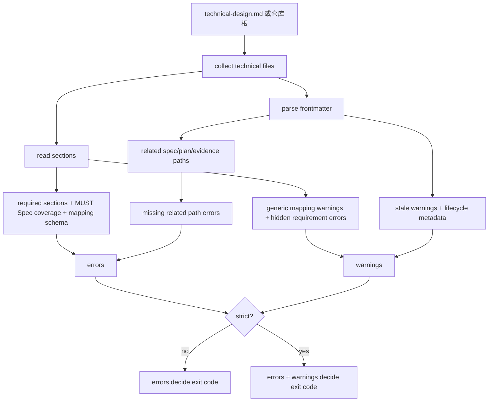

# Technical Design Validator 技术设计

## 文档信息

| 字段 | 内容 |
| --- | --- |
| 状态 | 已批准 |
| 领域 | plugin |
| 能力 | technical-design-validator |
| 规格 | `docs/coding-plugins/features/plugin/technical-design-validator/specs/feature.md` |
| 计划 | `docs/coding-plugins/features/plugin/technical-design-validator/plans/implementation.md` |
| TDD Evidence | `docs/coding-plugins/features/plugin/technical-design-validator/evidence/tdd-evidence.md` |

## 设计摘要

新增 `skills/writing-technical-design/scripts/validate_technical_design.py` 作为 technical design 的独立校验入口。validator 负责读取 feature-first 文档链路，复用 docs index 的 feature root、frontmatter 解析和文件收集能力，输出 errors 与 warnings。普通模式仍可用于作者快速审计，`scripts/preflight.py` 默认调用 strict 入口，让泛化映射、stale technical、旧映射表头、缺 TD 决策 ID、缺 lifecycle metadata 和隐藏需求在发布前失败。

## 规格缺口审查

| 检查项 | 结论 | 依据 |
| --- | --- | --- |
| 未覆盖需求 | 无。 | 已核对 REQ-001 到 REQ-011。 |
| 验收标准不清 | 无。 | 已核对 AC-001 到 AC-004。 |
| 新增外部行为 | 无。 | 新增的是本地 validator CLI 和 preflight 内部校验入口。 |
| 处理状态 | 通过，未发现需要回写 spec 的缺口。 | 可进入计划和 TDD 实现。 |

## 规格到设计映射

| Spec ID | 规格摘要 | 技术落点 | 关键决策 ID | 影响文件/符号 | 验证命令 | Evidence |
| --- | --- | --- | --- | --- | --- | --- |
| REQ-001 | 提供 `skills/writing-technical-design/scripts/validate_technical_design.py`，支持校验单个 technical 文件或仓库内全部 technical 文件，并支持 `--root` 指定仓库根用于测试或非标准工作区。 | `skills/writing-technical-design/scripts/validate_technical_design.py`：新增 CLI、结构校验、warning/strict 规则和仓库扫描能力 `skills/writing-technical-design/scripts/test_validate_technical_design.py`：覆盖 validator 的 RED/GREEN 单测 | TD-001 | `skills/writing-technical-design/scripts/validate_technical_design.py` `skills/writing-technical-design/scripts/test_validate_technical_design.py` | `test_cli_validates_repository_technical_docs` | `docs/coding-plugins/features/plugin/technical-design-validator/evidence/tdd-evidence.md` |
| REQ-002 | validator 必须复用或等价覆盖现有 technical 结构门禁：必需章节、MUST Spec ID 映射或豁免、related metadata 路径真实存在。 | `skills/writing-technical-design/scripts/validate_technical_design.py`：新增 CLI、结构校验、warning/strict 规则和仓库扫描能力 `skills/writing-technical-design/scripts/test_validate_technical_design.py`：覆盖 validator 的 RED/GREEN 单测 | TD-002 | `skills/writing-technical-design/scripts/validate_technical_design.py` `skills/writing-technical-design/scripts/test_validate_technical_design.py` | `test_validator_rejects_missing_required_sections`、`test_validator_rejects_missing_must_spec_mapping`、`test_validator_rejects_missing_related_metadata_path` | `docs/coding-plugins/features/plugin/technical-design-validator/evidence/tdd-evidence.md` |
| REQ-003 | validator 必须识别泛化映射短语，并在普通模式输出 warning，在 `--strict` 模式下返回失败。 | `skills/writing-technical-design/scripts/validate_technical_design.py`：新增 CLI、结构校验、warning/strict 规则和仓库扫描能力 `skills/writing-technical-design/scripts/test_validate_technical_design.py`：覆盖 validator 的 RED/GREEN 单测 | TD-003 | `skills/writing-technical-design/scripts/validate_technical_design.py` `skills/writing-technical-design/scripts/test_validate_technical_design.py` | `test_validator_warns_about_generic_mapping`、`test_strict_validator_rejects_generic_mapping` | `docs/coding-plugins/features/plugin/technical-design-validator/evidence/tdd-evidence.md` |
| REQ-004 | validator 必须在 related approved spec 的 `updated` 晚于 technical `updated` 时标记 stale；普通模式输出 warning，`--strict` 模式返回失败。 | `skills/writing-technical-design/scripts/validate_technical_design.py`：新增 CLI、结构校验、warning/strict 规则和仓库扫描能力 `skills/writing-technical-design/scripts/test_validate_technical_design.py`：覆盖 validator 的 RED/GREEN 单测 | TD-004 | `skills/writing-technical-design/scripts/validate_technical_design.py` `skills/writing-technical-design/scripts/test_validate_technical_design.py` | `test_validator_warns_when_spec_is_newer_than_technical`、`test_strict_validator_rejects_stale_technical` | `docs/coding-plugins/features/plugin/technical-design-validator/evidence/tdd-evidence.md` |
| REQ-005 | `scripts/preflight.py` 必须接入 validator 的 strict 校验路径，泛化映射和 stale warning 在发布前必须失败。 | `scripts/preflight.py`：调用 validator strict 结果 `scripts/test_preflight.py`：断言 strict 参数被传入 | TD-002 | `scripts/preflight.py` `scripts/test_preflight.py` | `test_preflight_runs_technical_design_validator_in_strict_mode`、`python3 scripts/preflight.py` | `docs/coding-plugins/features/plugin/technical-design-validator/evidence/tdd-evidence.md` |
| REQ-006 | `writing-technical-design` skill 必须提示作者可单独运行 validator，并说明 preflight 使用 strict 质量门禁。 | `skills/writing-technical-design/SKILL.md`：增加 strict 门禁、完整映射表、TD ID、lifecycle 和隐藏需求说明 | TD-006 | `skills/writing-technical-design/SKILL.md` | `python3 scripts/preflight.py` | `docs/coding-plugins/features/plugin/technical-design-validator/evidence/tdd-evidence.md` |
| REQ-007 | technical 的 `## 规格到设计映射` 必须使用 7 列结构：`Spec ID`、`规格摘要`、`技术落点`、`关键决策 ID`、`影响文件/符号`、`验证命令`、`Evidence`。 | `validate_technical_design.py`：校验映射表头 `technical-design.md` 模板和历史 technical 文档：迁移到 7 列结构 | TD-003 | `skills/writing-technical-design/scripts/validate_technical_design.py` `skills/writing-technical-design/templates/technical-design.md` `docs/coding-plugins/features/plugin/*/technical/technical-design.md` | `test_validator_rejects_legacy_mapping_header` | `docs/coding-plugins/features/plugin/technical-design-validator/evidence/tdd-evidence.md` |
| REQ-008 | technical 的 `## 关键决策` 必须使用 `TD-xxx` 决策 ID，映射表引用的决策 ID 必须存在。 | `validate_technical_design.py`：提取关键决策表并校验映射表引用 历史 technical 文档：迁移关键决策表 | TD-003 | `skills/writing-technical-design/scripts/validate_technical_design.py` `docs/coding-plugins/features/plugin/*/technical/technical-design.md` | `test_validator_rejects_mapping_without_existing_decision_id` | `docs/coding-plugins/features/plugin/technical-design-validator/evidence/tdd-evidence.md` |
| REQ-009 | technical frontmatter 必须维护 `lifecycle_status`、`implemented_commits`、`validated_by`，且 lifecycle status 必须属于允许集合。 | `validate_technical_design.py`：校验 lifecycle metadata 模板和历史 technical 文档：补齐字段 | TD-005 | `skills/writing-technical-design/scripts/validate_technical_design.py` `skills/writing-technical-design/templates/technical-design.md` `docs/coding-plugins/features/plugin/*/technical/technical-design.md` | `test_validator_rejects_missing_lifecycle_metadata` | `docs/coding-plugins/features/plugin/technical-design-validator/evidence/tdd-evidence.md` |
| REQ-010 | technical 中出现必须、不得、禁止、MUST、SHOULD 类新增约束时，必须引用 Spec ID 或标记为“设计约束”。 | `validate_technical_design.py`：扫描 hidden requirement 历史 technical 文档：给内部约束补“设计约束”标记 | TD-006 | `skills/writing-technical-design/scripts/validate_technical_design.py` `docs/coding-plugins/features/plugin/*/technical/technical-design.md` | `test_validator_rejects_hidden_requirement_without_spec_reference` | `docs/coding-plugins/features/plugin/technical-design-validator/evidence/tdd-evidence.md` |
| REQ-011 | README 轻量例外必须包含 `Spec ID -> Evidence` 表，覆盖 approved spec 的所有 MUST Spec ID 并指向真实 evidence 文件。 | `scripts/preflight.py`：校验轻量例外追踪表 轻量 README：补齐 Spec ID 到 Evidence 映射 | TD-007 | `scripts/preflight.py` `scripts/test_preflight.py` `docs/coding-plugins/features/plugin/*/README.md` | `test_feature_document_chain_requires_plan_or_lightweight_exception` | `docs/coding-plugins/features/plugin/technical-design-validator/evidence/tdd-evidence.md` |

## 无需技术设计的规格

| Spec ID | 原因 |
| --- | --- |
| 无 | 本 capability 的 MUST 规格均有 technical 落点。 |

## 关键决策

| 决策 ID | 决策 | 原因 | 取舍 |
| --- | --- | --- | --- |
| TD-001 | 独立 validator 放在 `skills/writing-technical-design/scripts/` | 与 skill 的职责边界一致，后续 Claude/Codex 都能直接复用 | preflight 需要通过路径加载或调用该脚本 |
| TD-002 | preflight 默认使用 strict validator | 历史泛化映射已完成迁移，发布前应拦截 warning | 新增 technical 必须更早补齐质量字段 |
| TD-003 | 映射表绑定 TD 决策 ID | 让 Spec ID 可以追到具体技术决策，而不是只追到章节 | 历史 technical 需要批量迁移 |
| TD-004 | stale 只比较 frontmatter 日期 | 与现有 metadata 契约一致，不依赖 Git 历史或文件 mtime | 缺少 `updated` 时无法判断 stale |
| TD-005 | lifecycle metadata 放在 frontmatter | 机器校验和索引读取稳定，不需要解析正文 | 人工阅读需要同步 `## 文档信息` 摘要 |
| TD-006 | hidden requirement 允许“设计约束”标记 | 技术实现内部限制不必都回写 spec，但必须显式标注边界 | 评审时仍需判断是否应该回到 spec |
| TD-007 | 轻量例外保留但必须有证据表 | 不强制所有小 feature 补 technical/plan，同时保留可追踪证据 | README 多维护一张短表 |

## 影响组件

| 组件 | 变更 | 相关 Spec ID |
| --- | --- | --- |
| `skills/writing-technical-design/scripts/validate_technical_design.py` | 新增 CLI、结构校验、warning/strict、7 列映射、TD ID、lifecycle、hidden requirement 和仓库扫描能力 | REQ-001, REQ-002, REQ-003, REQ-004, REQ-007, REQ-008, REQ-009, REQ-010 |
| `skills/writing-technical-design/scripts/test_validate_technical_design.py` | 覆盖 validator 的 RED/GREEN 单测 | REQ-001, REQ-002, REQ-003, REQ-004, REQ-007, REQ-008, REQ-009, REQ-010 |
| `scripts/preflight.py` | 接入 validator strict 结果，并校验轻量例外 Spec ID 到 Evidence 表 | REQ-005, REQ-011 |
| `scripts/test_preflight.py` | 覆盖 strict 调用和轻量例外追踪表 | REQ-005, REQ-011 |
| `skills/writing-technical-design/SKILL.md` 和模板 | 增加独立 validator、strict 门禁、完整映射表、TD ID、lifecycle 和隐藏需求说明 | REQ-006, REQ-007, REQ-008, REQ-009, REQ-010 |
| `docs/coding-plugins/features/plugin/*/technical/technical-design.md` | 迁移历史 technical 映射表、关键决策、lifecycle metadata 和设计约束标记 | REQ-007, REQ-008, REQ-009, REQ-010, AC-005 |
| `docs/coding-plugins/features/plugin/*/README.md` | 轻量例外 README 补齐 Spec ID 到 Evidence 表 | REQ-011 |

## 数据流 / 控制流

## 接口和契约

- `python3 skills/writing-technical-design/scripts/validate_technical_design.py [TECHNICAL_FILE ...]` 校验指定 technical；无参数时校验仓库内全部 technical。
- `--root <path>` 指定仓库根，用于测试、非标准工作区或从其他目录调用。
- `--strict` 把泛化映射和 stale warning 升级为失败；preflight 默认使用 strict。
- `--format text|json` 支持人工输出和机器读取。
- 校验结果包含 `errors`、`warnings`、`error_count`、`warning_count` 和每个 technical 文件路径。
- `scripts/preflight.py` 使用 strict 入口；结构错误、泛化映射、stale、旧映射表头、缺 lifecycle metadata、缺 TD ID 和隐藏需求都会阻断默认发布。
- `scripts/preflight.py` 对 README 轻量例外额外校验 `Spec ID -> Evidence` 表，确保没有 technical/plan 的 feature 仍可追踪到证据。

## 迁移 / 兼容性

本批一次性迁移历史 technical 的泛化映射、旧 4 列表头、缺 TD 决策 ID 和 lifecycle metadata，因此默认 `python3 scripts/preflight.py` 可以直接启用 strict validator。轻量例外 feature 不强制补 technical/plan，但 README 必须补 `Spec ID -> Evidence` 表以覆盖 REQ-011。

## 测试策略

- RED: 先写 `skills/writing-technical-design/scripts/test_validate_technical_design.py` 和 `scripts/test_preflight.py`，覆盖缺章节、缺 MUST 映射、缺 related 路径、泛化映射 warning/strict、stale warning/strict、旧映射表头、缺 TD ID、缺 lifecycle metadata、隐藏需求、preflight strict 调用和轻量例外追踪表。
- GREEN: 实现 `validate_technical_design.py`，再接入 `scripts/preflight.py`、技能说明、模板和历史文档迁移。
- REFACTOR: 将 shared helper 保持在 validator 内，preflight 只调用 validator 入口，减少 technical 规则继续散落。
- Final: 运行 validator 单测、preflight 单测、单文件 validator、`python3 scripts/preflight.py --write-index` 和 `python3 scripts/preflight.py`。

## 风险和缓解

| 风险 | 缓解方案 |
| --- | --- |
| 历史泛化映射 warning 过多 | 一次性迁移历史 technical，并让 preflight strict 防止回退 |
| validator 和 preflight 规则漂移 | preflight 调用 validator strict 入口，并把 validator 单测纳入验证命令 |
| stale 判断误报 | 只在 related approved spec 和 technical 都有 `updated` 时判断 |
| Markdown 解析不完整 | 沿用行级标题、frontmatter 和表格文本规则，避免引入外部依赖 |
| hidden requirement 误判内部实现限制 | 允许显式标注“设计约束”，评审时再判断是否需要回写 spec |
