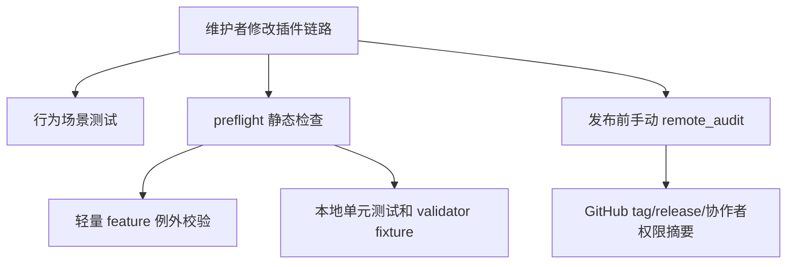

# 插件工作链路硬化技术设计

## 文档信息

| 字段 | 内容 |
| --- | --- |
| 状态 | 已批准 |
| 领域 | plugin |
| 能力 | workflow-hardening |
| 规格 | `docs/coding-plugins/features/plugin/workflow-hardening/specs/maintenance.md` |
| TDD Evidence | `docs/coding-plugins/features/plugin/workflow-hardening/evidence/tdd-evidence.md` |

## 设计摘要

本轮硬化不改变插件主流程，而是增加可验证的护栏。行为测试从“包含技能名”扩展到场景顺序契约；preflight 增加 approved feature 的轻量例外校验；远程 GitHub 状态通过显式 `scripts/remote_audit.py` 手动审计；Claude Code 增加启动入口提示；SDD/TDD validator 用真实 fixture 样例防止误报和漏报。

## 规格缺口审查

| 检查项 | 结论 |
| --- | --- |
| 未覆盖需求 | 无。 |
| 验收标准不清 | 无。 |
| 新增外部行为 | 无。 |
| 处理状态 | 通过，未发现需要回写 spec 的缺口。 |

## 规格到设计映射

| Spec ID | 技术落点 | 设计决策 | 测试策略 |
| --- | --- | --- | --- |
| NFR-001 | 见本设计的 `影响组件`、`接口和契约` 与 `测试策略` 章节 | 按本 technical 的关键决策落地该规格 | 见 `## 测试策略` 和对应计划追踪 |
| NFR-002 | 见本设计的 `影响组件`、`接口和契约` 与 `测试策略` 章节 | 按本 technical 的关键决策落地该规格 | 见 `## 测试策略` 和对应计划追踪 |
| NFR-003 | 见本设计的 `影响组件`、`接口和契约` 与 `测试策略` 章节 | 按本 technical 的关键决策落地该规格 | 见 `## 测试策略` 和对应计划追踪 |
| NFR-004 | 见本设计的 `影响组件`、`接口和契约` 与 `测试策略` 章节 | 按本 technical 的关键决策落地该规格 | 见 `## 测试策略` 和对应计划追踪 |
| NFR-005 | 见本设计的 `影响组件`、`接口和契约` 与 `测试策略` 章节 | 按本 technical 的关键决策落地该规格 | 见 `## 测试策略` 和对应计划追踪 |

## 无需技术设计的规格

| Spec ID | 原因 |
| --- | --- |
| 无 | 本 capability 的 MUST 规格均有 technical 落点。 |

## 关键决策

| 决策 | 原因 | 取舍 |
| --- | --- | --- |
| 行为测试使用文档和入口文本的场景顺序断言 | 插件行为主要由技能文档驱动，没有运行时路由函数 | 仍不能替代真实代理会话测试 |
| 轻量 feature 使用 README 例外说明而不是强制补全技术计划 | 避免把历史小型 feature 膨胀成重复文档 | 需要 preflight 校验例外格式 |
| 远程审计脚本不进入默认 preflight | GitHub API 需要认证和网络，默认门禁应可离线运行 | 发布前需要维护者显式执行 |
| Claude 使用可复制启动提示 | Claude 当前没有 Codex SessionStart 等价 hook | 仍依赖用户在会话开始时使用提示 |
| validator fixture 放在各 skill 的 `fixtures/` 目录 | 样例和校验器同目录维护，便于扩展 | 增加少量测试文件 |

## 影响组件

| 组件 | 变更 | 相关 Spec ID |
| --- | --- | --- |
| `tests/behavior/test_routing.py` | 增加场景顺序和 Claude 启动提示测试 | NFR-001, NFR-004, ERR-001, ERR-004 |
| `docs/workflow-chain.md` | 增加场景链路说明，供行为测试校验 | NFR-001 |
| `docs/claude-code-usage.md` | 增加 Claude Code 启动提示 | NFR-004 |
| `scripts/preflight.py` | 增加轻量 feature 例外校验，并运行 remote audit 单测 | NFR-002, NFR-003, ERR-002 |
| `scripts/remote_audit.py` | 新增远程 release/tag/push 权限审计脚本 | NFR-003, ERR-003, OBS-001 |
| `scripts/test_remote_audit.py` | 覆盖远程审计的纯函数和命令计划 | NFR-003, ERR-003 |
| `skills/*/fixtures/` | 增加 validator 好/坏样例 | NFR-005, ERR-005 |

## 数据流 / 控制流



## 接口和契约

`scripts/remote_audit.py` CLI：

```bash
python3 scripts/remote_audit.py --owner Vincen-dev --repo coding-plugins --tag v0.6.28 --expected-pusher Vincen-dev
```

轻量 feature 例外契约：

```text
## 轻量例外

- **Reason:** 该 feature 已由规格和 TDD Evidence 完成，技术方案和计划只会重复 evidence 中的任务。
- **Verification:** python3 scripts/preflight.py
```

Claude Code 启动提示契约：

```text
/coding-plugins:using-coding-plugins
```

## 迁移 / 兼容性

默认 preflight 仍只依赖本地文件和标准库，不访问网络。历史 approved feature 可以选择补 technical/plan，也可以在 README 中声明轻量例外。Codex 和 Claude 安装路径保持不变。

## 测试策略

| Spec ID | Test Strategy |
| --- | --- |
| NFR-001, ERR-001 | `tests/behavior/test_routing.py` 校验新需求、bug、提交、收尾、插件维护和并行任务的技能顺序 |
| NFR-002, ERR-002 | `scripts/test_preflight.py` 构造缺 technical/plan 且无轻量例外的 feature root，确认 preflight 失败 |
| NFR-003, ERR-003, OBS-001 | `scripts/test_remote_audit.py` 用本地 JSON fixture 校验 collaborator、release、tag 审计规则 |
| NFR-004, ERR-004 | `tests/behavior/test_routing.py` 校验 Claude 启动提示文档 |
| NFR-005, ERR-005 | validator 单测读取 fixture，确认好样例通过、坏样例失败 |

TDD Evidence 记录在 `docs/coding-plugins/features/plugin/workflow-hardening/evidence/tdd-evidence.md`。

## 风险和缓解

| 风险 | 缓解方案 |
| --- | --- |
| 行为测试仍不能证明真实 LLM 路由 | 使用场景顺序契约覆盖文档和入口，后续可追加真实会话 transcript 测试 |
| 轻量例外被滥用 | preflight 要求 README 明确 Reason 和 Verification |
| 远程审计脚本误入 CI 造成网络失败 | 只运行 `scripts/test_remote_audit.py`，不在 preflight 中调用远程 API |
| Claude 启动提示和 README 漂移 | 行为测试同时检查 Claude 使用文档和工具映射参考 |
