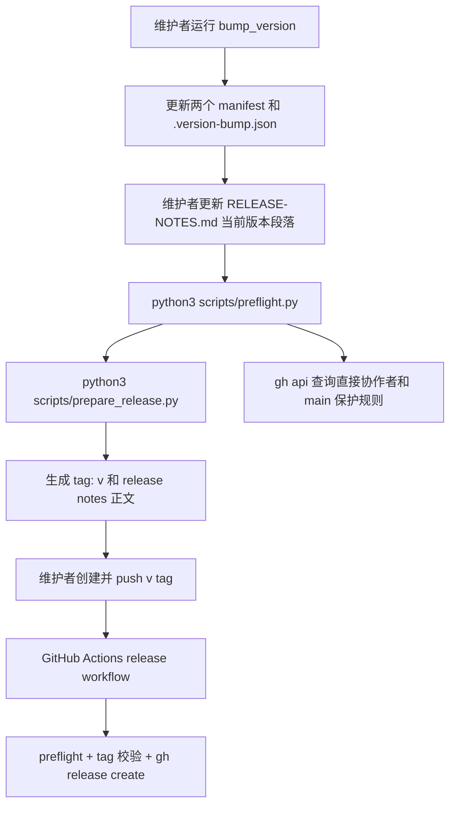

# 插件发布和版本管理技术设计

## 文档信息

| 字段 | 内容 |
| --- | --- |
| 状态 | 已批准 |
| Feature | release-management |
| 需求文档 | `docs/coding-plugins/features/release-management/requirements/release-management-PRD.md` |
| TDD 证据 | `docs/coding-plugins/features/release-management/evidences/release-management-TED.md` |

## 设计摘要

发布链路拆成四个边界清晰的步骤：`scripts/bump_version.py` 只负责同步版本，`scripts/prepare_release.py` 负责校验 release metadata 并提取当前版本 notes，`.github/workflows/release.yml` 负责在 `v*` tag push 后创建 GitHub Release，维护者在本地负责创建并推送当前版本 tag。preflight 不执行网络发布，但必须确认 release 脚本、测试和 workflow 存在并保持可校验。发布治理还要求远程仓库直接协作者中只有 `Vincen-dev` 具备 push/admin 权限，公开用户通过 fork 或 PR 协作。（设计约束）

## 规格缺口审查

| 检查项 | 结论 |
| --- | --- |
| 未覆盖需求 | 无。 |
| 验收标准不清 | 无。 |
| 新增外部行为 | 无。 |
| 处理状态 | 通过，未发现需要回写 spec 的缺口。 |

## 规格到设计映射

| 规格 ID | 规格摘要 | 技术落点 | 关键决策 ID | 影响文件/符号 | 验证命令 | 证据 |
| --- | --- | --- | --- | --- | --- | --- |
| REQ-001 | 仓库必须包含 `RELEASE-NOTES.md`，并记录当前 manifest 版本。 | `scripts/bump_version.py`：保持现有版本同步职责<br>`RELEASE-NOTES.md`：继续作为当前版本 GitHub Release notes 的唯一来源 | TD-001 | `scripts/bump_version.py`<br>`RELEASE-NOTES.md` | 单元测试 `test_release_management_check_rejects_missing_release_notes_version`。 | `docs/coding-plugins/features/release-management/evidences/release-management-TED.md` |
| REQ-002 | 仓库必须包含 `.version-bump.json`，且其中版本必须和两个 manifest 版本一致。 | `scripts/bump_version.py`：保持现有版本同步职责 | TD-002 | `scripts/bump_version.py` | 单元测试 `test_release_management_check_rejects_mismatched_config_version`。 | `docs/coding-plugins/features/release-management/evidences/release-management-TED.md` |
| REQ-003 | `scripts/bump_version.py` 必须校验 semver，并能同步更新 Codex manifest、Claude manifest 和 `.version-bump.json`。 | `scripts/bump_version.py`：保持现有版本同步职责 | TD-003 | `scripts/bump_version.py` | 单元测试 `scripts/test_bump_version.py`。 | `docs/coding-plugins/features/release-management/evidences/release-management-TED.md` |
| REQ-004 | preflight 必须运行版本脚本单测。 | `scripts/preflight.py`：增加 release automation 文件和 workflow 内容检查，并运行 release 准备脚本单测 | TD-004 | `scripts/preflight.py` | 单元测试 `test_build_commands_include_core_validation_steps`。 | `docs/coding-plugins/features/release-management/evidences/release-management-TED.md` |
| REQ-005 | preflight 必须校验 release notes、版本配置和 manifest 版本一致性。 | `scripts/preflight.py`：增加 release automation 文件和 workflow 内容检查，并运行 release 准备脚本单测 | TD-005 | `scripts/preflight.py` | 单元测试 `test_release_management_check_rejects_missing_release_notes_version`。 | `docs/coding-plugins/features/release-management/evidences/release-management-TED.md` |
| REQ-006 | `scripts/prepare_release.py` 必须读取当前 manifest 版本，生成 `v` 前缀 tag 名，例如 `v0.6.22`，并提取当前版本 release notes 正文。 | `scripts/prepare_release.py`：新增 release metadata 校验、tag 名生成、release notes 提取和 GitHub output 写入<br>`RELEASE-NOTES.md`：继续作为当前版本 GitHub Release notes 的唯一来源 | TD-005 | `scripts/prepare_release.py`<br>`RELEASE-NOTES.md` | 单元测试 `scripts/test_prepare_release.py`。 | `docs/coding-plugins/features/release-management/evidences/release-management-TED.md` |
| REQ-007 | GitHub Actions 必须在 `v*` tag push 时运行 preflight、校验 tag 和 manifest 版本一致，并用当前版本 release notes 创建 GitHub Release。 | `.github/workflows/release.yml`：新增 `v*` tag workflow，运行 preflight、准备 notes、校验 tag、调用 `gh release create` | TD-005 | `.github/workflows/release.yml` | 单元测试 `test_release_management_check_rejects_missing_release_automation` 和人工评审 `.github/workflows/release.yml`。 | `docs/coding-plugins/features/release-management/evidences/release-management-TED.md` |
| REQ-008 | preflight 必须拒绝缺少 release 准备脚本、release 脚本单测或 GitHub Release workflow 的仓库状态。 | `scripts/preflight.py`：增加 release automation 文件和 workflow 内容检查，并运行 release 准备脚本单测 | TD-005 | `scripts/preflight.py` | 单元测试 `test_release_management_check_rejects_missing_release_automation`。 | `docs/coding-plugins/features/release-management/evidences/release-management-TED.md` |
| REQ-009 | 当前 manifest 版本发布时必须创建并推送对应 `v` 前缀 tag，让 GitHub Release workflow 创建发布产物；本轮版本为 `v0.6.27`。 | `docs/coding-plugins/features/release-management/technicals/release-management-TDD.md` 中的影响组件追踪 | TD-005 | `git ls-remote --tags origin v0.6.27`、`gh release view v0.6.27` | `git tag --list v0.6.27`、`git ls-remote --tags origin v0.6.27` 和 `gh release view v0.6.27`。 | `docs/coding-plugins/features/release-management/evidences/release-management-TED.md` |
| REQ-010 | 远程仓库直接协作者中，只有 `Vincen-dev` 具备 push/admin 权限；其他公开用户只能 fork 或提 PR。 | GitHub repository settings：直接协作者权限只保留 `Vincen-dev`，main 保护规则可要求 PR 且允许维护者 bypass | TD-005 | GitHub repository settings | `gh api repos/Vincen-dev/coding-plugins/collaborators?affiliation=direct` 和 main branch protection 查询。 | `docs/coding-plugins/features/release-management/evidences/release-management-TED.md` |

## 无需技术设计的规格

| 规格 ID | 原因 |
| --- | --- |
| 无 | 本 feature 的 MUST 规格均有 technical 落点。 |

## 关键决策

| 决策 ID | 决策 | 原因 | 取舍 |
| --- | --- | --- | --- |
| TD-001 | 使用独立 `scripts/prepare_release.py` | 将 release metadata 提取和 GitHub workflow 解耦，覆盖 REQ-006、ERR-005、AC-003 | 多一个脚本和单测需要维护 |
| TD-002 | tag 名固定为 `v<version>` | GitHub Release workflow 可以稳定比对 tag 与 manifest，覆盖 REQ-007、ERR-006、AC-004 | 不支持无 `v` 前缀 tag |
| TD-003 | preflight 只做结构和一致性检查 | 满足 NON-002，避免本地检查触发 push 或网络发布 | GitHub Release 创建结果仍需依赖 GitHub Actions |
| TD-004 | release notes 只提取当前版本正文 | GitHub Release notes 和 `RELEASE-NOTES.md` 保持同源，覆盖 REQ-006 | release notes 标题格式必须为 `## <version>` 或 `## <version> - <date>` |
| TD-005 | 只允许 `Vincen-dev` 直接 push | public 仓库仍可被 fork，直接写权限只授予维护者 | 仓库所有者仍可绕过 PR 规则直接 push，需要用审计记录区分预期行为 |

## 影响组件

| 组件 | 变更 | 相关规格 ID |
| --- | --- | --- |
| `scripts/bump_version.py` | 保持现有版本同步职责 | REQ-001, REQ-002, REQ-003, ERR-001, ERR-002 |
| `scripts/prepare_release.py` | 新增 release metadata 校验、tag 名生成、release notes 提取和 GitHub output 写入 | REQ-006, ERR-005, AC-003 |
| `scripts/preflight.py` | 增加 release automation 文件和 workflow 内容检查，并运行 release 准备脚本单测 | REQ-004, REQ-005, REQ-008, ERR-003, ERR-004 |
| `.github/workflows/release.yml` | 新增 `v*` tag workflow，运行 preflight、准备 notes、校验 tag、调用 `gh release create` | REQ-007, ERR-006, AC-004 |
| `RELEASE-NOTES.md` | 继续作为当前版本 GitHub Release notes 的唯一来源 | REQ-001, REQ-006, ERR-003, ERR-005 |
| GitHub repository settings | 直接协作者权限只保留 `Vincen-dev`，main 保护规则可要求 PR 且允许维护者 bypass | REQ-010, AC-006 |

## 数据流 / 控制流



## 接口和契约

`scripts/prepare_release.py` 的 CLI 契约：

```bash
python3 scripts/prepare_release.py --skip-git-checks --notes-out release-notes.md --github-output "$GITHUB_OUTPUT"
```

输出契约：

| 输出 | 含义 |
| --- | --- |
| stdout `Release ready: v<version>` | release metadata 校验通过 |
| `--notes-out` 文件 | 当前版本 release notes 正文，不包含版本标题 |
| `--github-output` | 写入 `version=<version>` 和 `tag=v<version>` |

错误契约：

| 条件 | 行为 |
| --- | --- |
| manifest、`.version-bump.json` 或 release notes 版本不一致 | 非零退出并输出 `Release preparation failed:` |
| 当前版本 release notes 缺失或为空 | 非零退出并指出 release notes section 问题 |
| 本地 git 工作区不干净且未使用 `--allow-dirty` | 非零退出，避免创建错误 tag |
| 其他直接协作者具备 push 权限 | 远程权限检查失败并要求移除该协作者或降低权限 |

## 迁移 / 兼容性

现有版本 bump 流程保持兼容：维护者仍然先运行 `scripts/bump_version.py`，再更新 `RELEASE-NOTES.md` 和运行 `scripts/preflight.py`。新增 release workflow 不影响普通 push 或 PR CI，只在 `v*` tag push 时触发。已有历史 release notes 不需要改写。

## 测试策略

| 规格 ID | 测试策略 |
| --- | --- |
| REQ-001, REQ-002, REQ-003, ERR-001, ERR-002 | 继续由 `scripts/test_bump_version.py` 和 `scripts/test_preflight.py` 覆盖 |
| REQ-004, REQ-005, REQ-008, ERR-003, ERR-004 | `scripts/test_preflight.py` 检查 preflight 命令列表和 release automation 文件约束 |
| REQ-006, ERR-005, AC-003 | `scripts/test_prepare_release.py` 覆盖 tag 名、release notes 提取和 metadata 校验 |
| REQ-007, ERR-006, AC-004 | `scripts/test_preflight.py` 检查 workflow 存在并包含 prepare/release 动作，人工评审 workflow tag 校验 |
| REQ-009, AC-005 | `git ls-remote --tags origin v<version>` 和 `gh release view v<version>` |
| REQ-010, AC-006 | `gh api` 查询直接协作者和 main branch protection |

TDD 证据 记录在 `docs/coding-plugins/features/release-management/evidences/release-management-TED.md`。

## 风险和缓解

| 风险 | 缓解方案 |
| --- | --- |
| tag 已存在或工作区不干净导致错误发布 | `prepare_release.py` 默认检查 git 状态和 tag 是否已存在 |
| GitHub Actions 中 tag 已存在，无法使用本地 tag 不存在检查 | workflow 使用 `--skip-git-checks`，并用 GitHub ref 和脚本输出 tag 做一致性校验 |
| release notes 标题格式漂移 | 提取器只接受 `## <version>` 或 `## <version> - <date>`，缺失时失败 |
| preflight 变成发布动作 | preflight 只检查文件和测试，不调用 `gh`、不 push tag |
| 误以为 public 仓库所有人都能 push | 文档和验证只以直接协作者列表为准；public 用户没有写权限时不能直接 push |