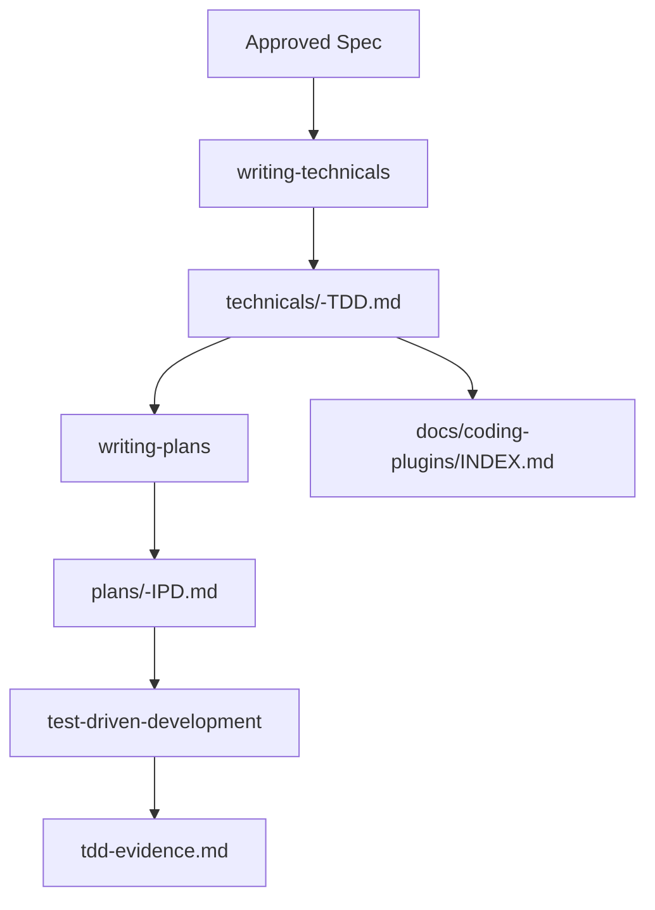

# 技术设计产物独立维护技术设计

## 文档信息

| 字段 | 内容 |
| --- | --- |
| 状态 | 已批准 |
| Feature | technical-design-artifacts |
| 需求文档 | `docs/coding-plugins/features/technical-design-artifacts/requirements/technical-design-artifacts-PRD.md` |
| 计划 | `docs/coding-plugins/features/technical-design-artifacts/plans/technical-design-artifacts-IPD.md` |

## 设计摘要

新增独立技术设计层，位于 Spec 和 Plan 之间。`writing-technicals` 负责把批准规格转成 feature root 的 `technicals/<feature-name>-TDD.md`，`writing-plans` 只引用技术设计并拆解 TDD 任务到 `plans/<feature-name>-IPD.md`。preflight 统一校验总索引、Spec 引用、Plan 引用、Spec ID 追踪、规格缺口审查和 technical 模板中文结构。

## 规格缺口审查

| 检查项 | 结论 |
| --- | --- |
| 未覆盖需求 | 无。 |
| 验收标准不清 | 无。 |
| 新增外部行为 | 无。 |
| 处理状态 | 通过，未发现需要回写 spec 的缺口。 |

## 规格到设计映射

| 规格 ID | 规格摘要 | 技术落点 | 关键决策 ID | 影响文件/符号 | 验证命令 | 证据 |
| --- | --- | --- | --- | --- | --- | --- |
| REQ-001 | 技术设计文档默认保存到 `docs/coding-plugins/features/technical-design-artifacts/technicals/technical-design-artifacts-TDD.md` 这类 feature 分层路径。 | `scripts/preflight.py`：增加 technical 文档收集、索引、引用、Spec ID、规格缺口审查和模板中文结构校验 | TD-001 | `scripts/preflight.py` | 单元测试 `test_collect_technical_design_files_uses_feature_first_technical_subdir`。 | `docs/coding-plugins/features/technical-design-artifacts/evidences/technical-design-artifacts-TED.md` |
| REQ-002 | `docs/coding-plugins/INDEX.md` 必须覆盖所有真实技术设计文档。 | `docs/coding-plugins/INDEX.md`：覆盖 feature root 和真实技术设计文档 `scripts/preflight.py`：增加 technical 文档收集、索引、引用、Spec ID、规格缺口审查和模板中文结构校验 | TD-002 | `docs/coding-plugins/INDEX.md` `scripts/preflight.py` | 单元测试 `test_artifact_index_requires_technical_paths`。 | `docs/coding-plugins/features/technical-design-artifacts/evidences/technical-design-artifacts-TED.md` |
| REQ-003 | 总索引 `docs/coding-plugins/INDEX.md` 必须包含 `技术设计` 列，并覆盖真实技术设计文档。 | `docs/coding-plugins/INDEX.md`：新增 `技术设计` 列 `scripts/preflight.py`：增加 technical 文档收集、索引、引用、Spec ID、规格缺口审查和模板中文结构校验 | TD-003 | `docs/coding-plugins/INDEX.md` `scripts/preflight.py` | 单元测试 `test_artifact_index_requires_technical_paths`。 | `docs/coding-plugins/features/technical-design-artifacts/evidences/technical-design-artifacts-TED.md` |
| REQ-004 | 新增 `writing-technicals` skill，负责把已批准规格转成独立技术设计。 | `skills/writing-technicals/SKILL.md`：新增技术设计 skill，定义职责、路径、流程和自审规则 `skills/writing-technicals/templates/technical-design-document.md`：提供中文标题 technical 模板和规格缺口审查表 `skills/using-coding-plugins/SKILL.md`：在批准规格后路由到 `writing-technicals`，再进入 `writing-plans` `tests/behavior/test_routing.py`：覆盖新 skill 的入口路由 | TD-004 | `skills/writing-technicals/SKILL.md` `skills/writing-technicals/templates/technical-design-document.md` `skills/using-coding-plugins/SKILL.md` `tests/behavior/test_routing.py` | 行为测试 `test_using_entry_routes_development_intents_to_required_skills`。 | `docs/coding-plugins/features/technical-design-artifacts/evidences/technical-design-artifacts-TED.md` |
| REQ-005 | `writing-plans` 必须引用 `技术设计来源`，计划只保留方案快照和任务拆分。 | `skills/writing-plans/SKILL.md`：要求计划引用 `技术设计来源`，并只保留方案快照 `scripts/preflight.py`：增加 technical 文档收集、索引、引用、Spec ID、规格缺口审查和模板中文结构校验 | TD-005 | `skills/writing-plans/SKILL.md` `scripts/preflight.py` | 单元测试 `test_plan_technical_design_source_check_rejects_missing_source`。 | `docs/coding-plugins/features/technical-design-artifacts/evidences/technical-design-artifacts-TED.md` |
| REQ-006 | preflight 必须校验技术设计路径、metadata、Spec ID 和引用路径。 | `scripts/preflight.py`：增加 technical 文档收集、索引、引用、Spec ID、规格缺口审查和模板中文结构校验 | TD-006 | `scripts/preflight.py` | 单元测试 `scripts/test_preflight.py`。 | `docs/coding-plugins/features/technical-design-artifacts/evidences/technical-design-artifacts-TED.md` |
| REQ-007 | Claude Code 显式技能请求清单必须包含 `/coding-plugins:writing-technicals`。 | `tests/behavior/test_routing.py`：覆盖新 skill 的入口路由 | TD-006 | `tests/behavior/test_routing.py` | 行为测试 `test_claude_reference_documents_explicit_namespace_for_each_skill`。 | `docs/coding-plugins/features/technical-design-artifacts/evidences/technical-design-artifacts-TED.md` |
| REQ-008 | `writing-technicals` 必须声明规格缺口门禁：发现需求、验收、外部行为、错误边界或兼容要求不清时，停止技术设计并回到 spec 更新。 | `skills/writing-technicals/SKILL.md`：增加规格缺口门禁，发现需求或验收不清时回到 `spec-driven-development` `scripts/preflight.py`：增加 technical 文档收集、索引、引用、Spec ID、规格缺口审查和模板中文结构校验 `scripts/test_preflight.py`：覆盖缺口审查和 technical 模板中文结构回归 | TD-006 | `skills/writing-technicals/SKILL.md` `scripts/preflight.py` `scripts/test_preflight.py` | 单元测试 `test_technical_design_gap_review_requires_section`、`test_technical_design_gap_review_rejects_unresolved_gap`，并由 `python3 scripts/preflight.py` 覆盖真实文档。 | `docs/coding-plugins/features/technical-design-artifacts/evidences/technical-design-artifacts-TED.md` |
| REQ-009 | technical 模板的正文标题和表头必须使用中文，避免新技术设计继续生成英文章节结构。 | `skills/writing-technicals/templates/technical-design-document.md`：提供中文标题 technical 模板和规格缺口审查表 `scripts/preflight.py`：增加 technical 文档收集、索引、引用、Spec ID、规格缺口审查和模板中文结构校验 `scripts/test_preflight.py`：覆盖缺口审查和 technical 模板中文结构回归 | TD-006 | `skills/writing-technicals/templates/technical-design-document.md` `scripts/preflight.py` `scripts/test_preflight.py` | 单元测试 `test_technical_template_check_rejects_english_headings`。 | `docs/coding-plugins/features/technical-design-artifacts/evidences/technical-design-artifacts-TED.md` |
| REQ-010 | 每份真实 technical 文档必须包含 `## 规格缺口审查`，并明确未覆盖需求、验收标准、外部行为和处理状态。 | `skills/writing-technicals/templates/technical-design-document.md`：提供中文标题 technical 模板和规格缺口审查表 `scripts/preflight.py`：增加 technical 文档收集、索引、引用、Spec ID、规格缺口审查和模板中文结构校验 `scripts/test_preflight.py`：覆盖缺口审查和 technical 模板中文结构回归 | TD-006 | `skills/writing-technicals/templates/technical-design-document.md` `scripts/preflight.py` `scripts/test_preflight.py` | 单元测试 `test_technical_design_gap_review_requires_section` 和 `python3 scripts/preflight.py`。 | `docs/coding-plugins/features/technical-design-artifacts/evidences/technical-design-artifacts-TED.md` |

## 无需技术设计的规格

| 规格 ID | 原因 |
| --- | --- |
| 无 | 本 feature 的 MUST 规格均有 technical 落点。 |

## 关键决策

| 决策 ID | 决策 | 原因 | 取舍 |
| --- | --- | --- | --- |
| TD-001 | 在 feature root 的 `technical/` 子目录下新增 `technicals/<feature-name>-TDD.md`，而不是复用 `plans/<feature-name>-IPD.md` | 区分稳定技术方案和执行任务，避免 `plans/<feature-name>-IPD.md` 同时承担设计和步骤 | 需要维护新的引用和校验规则 |
| TD-002 | 新增 `writing-technicals` skill | 技术设计是独立阶段，放进 `writing-plans` 会让计划 skill 继续膨胀 | 会增加一次技能选择和文档产物 |
| TD-003 | 在 technical 中增加 `## 规格缺口审查` | 防止技术方案顺手新增需求或掩盖验收不清；缺口必须回写 spec 后再继续设计 | 现有 technical 文档需要补充一段固定审查表 |
| TD-004 | technical 模板标题和表头统一中文 | 插件面向中文工作流，模板会直接影响后续产物语言 | 英文工程术语保留在 Spec ID、命令和路径中 |
| TD-005 | preflight 只强制校验真实 technical 文件和已有引用 | 避免历史 feature 必须立即回填技术设计 | 历史规格暂时可能没有 technical 链路 |
| TD-006 | 总索引增加 `技术设计` 列 | 检索 feature 时能看到 Spec、Technical、Plan、证据 全链路 | 需要更新既有索引行 |

## 影响组件

| 组件 | 变更 | 相关规格 ID |
| --- | --- | --- |
| `skills/writing-technicals/SKILL.md` | 新增技术设计 skill，定义职责、路径、流程和自审规则 | REQ-004, AC-002 |
| `skills/writing-technicals/SKILL.md` | 增加规格缺口门禁，发现需求或验收不清时回到 `spec-driven-development` | REQ-008, AC-004 |
| `skills/writing-technicals/templates/technical-design-document.md` | 提供中文标题 technical 模板和规格缺口审查表 | REQ-004, REQ-009, REQ-010 |
| `skills/using-coding-plugins/SKILL.md` | 在批准规格后路由到 `writing-technicals`，再进入 `writing-plans` | REQ-004 |
| `skills/writing-plans/SKILL.md` | 要求计划引用 `技术设计来源`，并只保留方案快照 | REQ-005 |
| `docs/coding-plugins/INDEX.md` | 覆盖 feature root 和真实技术设计文档 | REQ-002 |
| `docs/coding-plugins/INDEX.md` | 新增 `技术设计` 列 | REQ-003 |
| `scripts/preflight.py` | 增加 technical 文档收集、索引、引用、Spec ID、规格缺口审查和模板中文结构校验 | REQ-001, REQ-002, REQ-003, REQ-005, REQ-006, REQ-008, REQ-009, REQ-010 |
| `tests/behavior/test_routing.py` | 覆盖新 skill 的入口路由 | REQ-004, REQ-007 |
| `scripts/test_preflight.py` | 覆盖缺口审查和 technical 模板中文结构回归 | REQ-008, REQ-009, REQ-010, ERR-006, ERR-007, ERR-008 |

## 数据流 / 控制流

## 接口和契约

- Technical design path: `docs/coding-plugins/features/technical-design-artifacts/technicals/technical-design-artifacts-TDD.md`
- Plan path: `docs/coding-plugins/features/technical-design-artifacts/plans/technical-design-artifacts-IPD.md`
- 证据 path: `docs/coding-plugins/features/technical-design-artifacts/evidences/technical-design-artifacts-TED.md`
- Spec metadata may include `related_technical` paths.
- Plan must include `技术设计来源:` followed by a real technical design path.
- Technical design may mention Spec IDs only if those IDs exist in the corresponding spec directory.
- Technical design must include `## 规格缺口审查` and cover `未覆盖需求`、`验收标准不清`、`新增外部行为` and `处理状态`.
- If the gap review contains unresolved terms such as `未处理`、`待处理`、`需澄清`、`不清楚` or `待确认`, preflight fails and implementation must return to spec first.
- The default technical template must use Chinese section headings and table headers.## 迁移 / 兼容性

历史 feature 不强制立即回填 technical 文档。preflight 只校验真实存在的 technical 文件，以及 Spec 和 Plan 中已经声明的 technical 引用。总索引中历史行的 `Technical` 列可暂时使用 `-`。

## 测试策略

- REQ-001 到 REQ-006 使用 `python3 -m unittest scripts/test_preflight.py` 覆盖。
- REQ-008 到 REQ-010 和 ERR-006 到 ERR-008 使用 `python3 -m unittest scripts/test_preflight.py` 覆盖。
- REQ-004 和 REQ-007 使用 `python3 -m unittest tests.behavior.test_routing` 覆盖。
- AC-003 使用 `python3 scripts/preflight.py` 做完整发布前验证。
- TDD 证据 写入 `docs/coding-plugins/features/technical-design-artifacts/evidences/technical-design-artifacts-TED.md`。

## 风险和缓解

| 风险 | 缓解方案 |
| --- | --- |
| 新增 technical 层导致文档链路更长 | 使用总索引和 preflight 保证检索和引用一致 |
| 技术设计变成任务清单 | 在 `writing-technicals` 中明确任务拆分属于 `writing-plans` |
| 技术设计变成隐藏需求入口 | 用 `## 规格缺口审查` 和 preflight 阻止未处理缺口进入 plan |
| 后续模板重新出现英文章节 | 用 `check_technical_templates_are_chinese` 在 preflight 中拦截 |
| 历史文档未回填造成发布阻塞 | preflight 不强制历史规格必须有 technical 引用 |（设计约束）