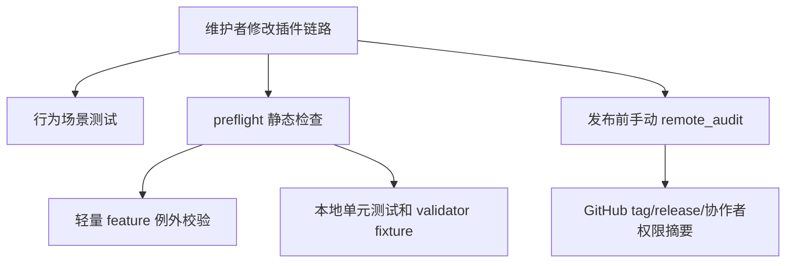

# 插件工作链路硬化技术设计

## 文档信息

| 字段 | 内容 |
| --- | --- |
| 状态 | 已批准 |
| Feature | workflow-hardening |
| 需求文档 | `docs/coding-plugins/features/workflow-hardening/requirements/workflow-hardening-PRD.md` |
| TDD 证据 | `docs/coding-plugins/features/workflow-hardening/evidences/workflow-hardening-TED.md` |

## 设计摘要

本轮硬化不改变插件主流程，而是增加可验证的护栏。行为测试从“包含技能名”扩展到场景顺序契约；preflight 增加 approved feature 的轻量例外校验；远程 GitHub 状态通过显式 `scripts/remote_audit.py` 手动审计；Claude Code 增加启动入口提示；SDD/TDD validator 用真实 fixture 样例防止误报和漏报。

## 规格缺口审查

| 检查项 | 结论 |
| --- | --- |
| 未覆盖需求 | 无。 |
| 验收标准不清 | 无。 |
| 新增外部行为 | 无。 |
| 处理状态 | 通过，未发现需要回写 spec 的缺口。 |

## 规格到设计映射

| 规格 ID | 规格摘要 | 技术落点 | 关键决策 ID | 影响文件/符号 | 验证命令 | 证据 |
| --- | --- | --- | --- | --- | --- | --- |
| NFR-001 | 行为测试必须覆盖新需求、bug、直接提交、完成收尾、插件维护和并行任务的技能顺序，不只检查技能名存在。 | `tests/behavior/test_routing.py`：增加场景顺序和 Claude 启动提示测试<br>`docs/workflow-chain.md`：增加场景链路说明，供行为测试校验 | TD-001 | `tests/behavior/test_routing.py`<br>`docs/workflow-chain.md` | `python3 -m unittest tests.behavior.test_routing`。 | `docs/coding-plugins/features/workflow-hardening/evidences/workflow-hardening-TED.md` |
| NFR-002 | approved feature 如果没有 technical/plan，必须在 README 中声明轻量例外原因，preflight 必须校验该例外。 | `scripts/preflight.py`：增加轻量 feature 例外校验，并运行 remote audit 单测 | TD-002 | `scripts/preflight.py` | `python3 -m unittest scripts/test_preflight.py`。 | `docs/coding-plugins/features/workflow-hardening/evidences/workflow-hardening-TED.md` |
| NFR-003 | 仓库必须提供手动远程审计脚本，验证目标 tag 的 release 状态和直接 push 协作者只包含维护者。 | `scripts/preflight.py`：增加轻量 feature 例外校验，并运行 remote audit 单测<br>`scripts/remote_audit.py`：新增远程 release/tag/push 权限审计脚本<br>`scripts/test_remote_audit.py`：覆盖远程审计的纯函数和命令计划 | TD-003 | `scripts/preflight.py`<br>`scripts/remote_audit.py`<br>`scripts/test_remote_audit.py` | `python3 -m unittest scripts/test_remote_audit.py`。 | `docs/coding-plugins/features/workflow-hardening/evidences/workflow-hardening-TED.md` |
| NFR-004 | Claude Code 文档必须提供可复制的会话启动入口提示，明确先调用 `/coding-plugins:using-coding-plugins`。 | `tests/behavior/test_routing.py`：增加场景顺序和 Claude 启动提示测试<br>`docs/claude-code-usage.md`：增加 Claude Code 启动提示 | TD-004 | `tests/behavior/test_routing.py`<br>`docs/claude-code-usage.md` | `python3 -m unittest tests.behavior.test_routing`。 | `docs/coding-plugins/features/workflow-hardening/evidences/workflow-hardening-TED.md` |
| NFR-005 | SDD 和 TDD validator 单测必须包含真实 fixture 样例，覆盖通过样例和失败样例。 | `skills/*/fixtures/`：增加 validator 好/坏样例 | TD-005 | `skills/*/fixtures/` | `python3 -m unittest skills/spec-driven-development/scripts/test_validate_spec.py skills/test-driven-development/scripts/test_validate_tdd_evidence.py`。 | `docs/coding-plugins/features/workflow-hardening/evidences/workflow-hardening-TED.md` |

## 无需技术设计的规格

| 规格 ID | 原因 |
| --- | --- |
| 无 | 本 feature 的 MUST 规格均有 technical 落点。 |

## 关键决策

| 决策 ID | 决策 | 原因 | 取舍 |
| --- | --- | --- | --- |
| TD-001 | 行为测试使用文档和入口文本的场景顺序断言 | 插件行为主要由技能文档驱动，没有运行时路由函数 | 仍不能替代真实代理会话测试 |
| TD-002 | 轻量 feature 使用 README 例外说明而不是强制补全技术计划 | 避免把历史小型 feature 膨胀成重复文档 | 需要 preflight 校验例外格式 |
| TD-003 | 远程审计脚本不进入默认 preflight | GitHub API 需要认证和网络，默认门禁应可离线运行 | 发布前需要维护者显式执行 |
| TD-004 | Claude 使用可复制启动提示 | Claude 当前没有 Codex SessionStart 等价 hook | 仍依赖用户在会话开始时使用提示 |
| TD-005 | validator fixture 放在各 skill 的 `fixtures/` 目录 | 样例和校验器同目录维护，便于扩展 | 增加少量测试文件 |

## 影响组件

| 组件 | 变更 | 相关规格 ID |
| --- | --- | --- |
| `tests/behavior/test_routing.py` | 增加场景顺序和 Claude 启动提示测试 | NFR-001, NFR-004, ERR-001, ERR-004 |
| `docs/workflow-chain.md` | 增加场景链路说明，供行为测试校验 | NFR-001 |
| `docs/claude-code-usage.md` | 增加 Claude Code 启动提示 | NFR-004 |
| `scripts/preflight.py` | 增加轻量 feature 例外校验，并运行 remote audit 单测 | NFR-002, NFR-003, ERR-002 |
| `scripts/remote_audit.py` | 新增远程 release/tag/push 权限审计脚本 | NFR-003, ERR-003, OBS-001 |
| `scripts/test_remote_audit.py` | 覆盖远程审计的纯函数和命令计划 | NFR-003, ERR-003 |
| `skills/*/fixtures/` | 增加 validator 好/坏样例 | NFR-005, ERR-005 |

## 数据流 / 控制流



## 接口和契约

`scripts/remote_audit.py` CLI：

```bash
python3 scripts/remote_audit.py --owner Vincen-dev --repo coding-plugins --tag v0.6.28 --expected-pusher Vincen-dev
```

轻量 feature 例外契约：

```text## 轻量例外

- **原因:** 该 feature 已由规格和 TDD 证据 完成，技术方案和计划只会重复 evidence 中的任务。
- **Verification:** python3 scripts/preflight.py
```

Claude Code 启动提示契约：

```text
/coding-plugins:using-coding-plugins
```

## 迁移 / 兼容性

默认 preflight 仍只依赖本地文件和标准库，不访问网络。历史 approved feature 可以选择补 technical/plan，也可以在 README 中声明轻量例外。Codex 和 Claude 安装路径保持不变。

## 测试策略

| 规格 ID | 测试策略 |
| --- | --- |
| NFR-001, ERR-001 | `tests/behavior/test_routing.py` 校验新需求、bug、提交、收尾、插件维护和并行任务的技能顺序 |
| NFR-002, ERR-002 | `scripts/test_preflight.py` 构造缺 technical/plan 且无轻量例外的 feature root，确认 preflight 失败 |
| NFR-003, ERR-003, OBS-001 | `scripts/test_remote_audit.py` 用本地 JSON fixture 校验 collaborator、release、tag 审计规则 |
| NFR-004, ERR-004 | `tests/behavior/test_routing.py` 校验 Claude 启动提示文档 |
| NFR-005, ERR-005 | validator 单测读取 fixture，确认好样例通过、坏样例失败 |

TDD 证据 记录在 `docs/coding-plugins/features/workflow-hardening/evidences/workflow-hardening-TED.md`。

## 风险和缓解

| 风险 | 缓解方案 |
| --- | --- |
| 行为测试仍不能证明真实 LLM 路由 | 使用场景顺序契约覆盖文档和入口，后续可追加真实会话 transcript 测试 |
| 轻量例外被滥用 | preflight 要求 README 明确 原因和验证方式 |
| 远程审计脚本误入 CI 造成网络失败 | 只运行 `scripts/test_remote_audit.py`，不在 preflight 中调用远程 API |
| Claude 启动提示和 README 漂移 | 行为测试同时检查 Claude 使用文档和工具映射参考 |