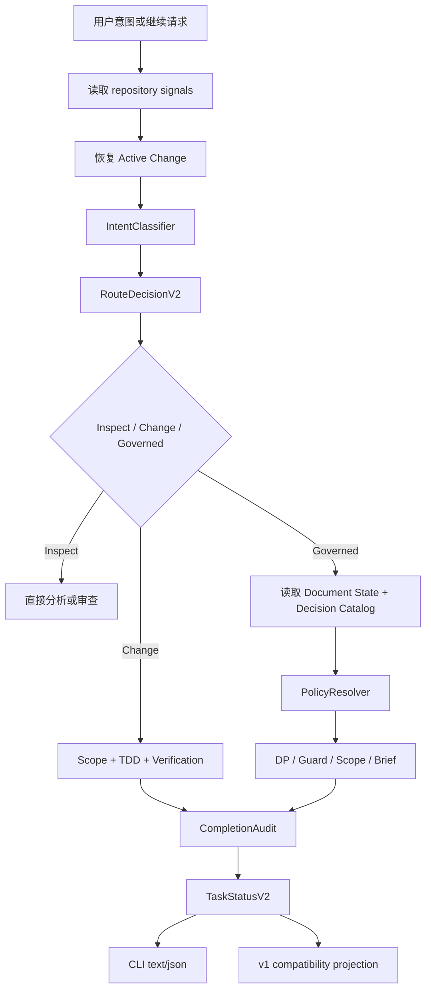

# Coding Plugins 工作流简化与工程策略绑定技术方案

## 阅读摘要

- **本文结论:** 以一个 `WorkflowRuntime` 聚合路由、活动变更、决策点、门禁、当前任务和完成审计，所有用户可见结果都从同一个 `RouteDecision` 投影。新建 `governed-v2` 决策目录实现 DP-1 范围批准、DP-2 技术批准、DP-3 执行批准；现有文档和批准记录继续按 `governed-v1` 兼容读取。工程规范通过可复现的 Policy 解析为批准约束，Skill 只承担应用这些约束的方法，并把 required Policy 继续追踪到 TVD、TED 和 VED。
- **当前状态:** 已通过现有 v1 DP-2 技术方案批准，进入 TVD 测试设计；本次变更自身仍按 v1 决策点完成引导，不能用尚未实现的 v2 语义批准自己。
- **先读重点:** 先看规格缺口审查、规格到设计映射、TD-001 至 TD-010、统一运行时控制流、Policy/Skill 技术批准包和迁移矩阵。
- **下游同步:** TSD 经当前 v1 DP-2 批准后创建 TVD；TVD 将按本文测试映射覆盖业务规格与 `TC-POL-*` 工程政策用例，再继续当前 v1 DP-3、DP-4。

## 文档信息

- 状态：已批准。
- 生命周期：approved。
- Feature：workflow-runtime。
- Doc ID：workflow-simplification。
- 文档类型：TSD / 技术方案文档。
- 已实现提交：[]。
- 验证方式：frontmatter `validated_by` 中的严格 TSD 校验命令。
- 引导约束：该变更创建于 v2 上线前，因此自身使用 `governed-v1`；v2 三批准点只约束迁移后新建或显式升级的文档链。

## 方案摘要

方案采用渐进式收敛，不另造一套与现有 workflow 模块并行的运行时。新增 `WorkflowRuntime` 作为唯一编排核心，复用现有 document state、guard、brief、scope check、artifact mode 和 decision state，并逐步把 `task status` 改为兼容投影器。运行时先生成不可矛盾的 `RouteDecisionV2`，再统一输出 Inspect、Change 或 Governed Change、唯一下一动作、稳定 reason code、活动任务上下文和 formal completion 资格。

Governed Change 使用带版本的决策目录和内容 hash；Standard Change 只沉淀一份 `change.md`；Quick Change 不产生流程文档。工程 Policy 来自仓库内 `coding-plugins.policies.yaml` 或版本锁定的插件能力，required Policy 必须在 TSD 中响应、在 TVD 中验证，并继续覆盖到 TED 与 VED。第一阶段不实现任意工作流 DSL、长期 specs delta/archive，也不删除现有细粒度命令。（REQ-004、REQ-007 设计约束）

## 规格缺口审查

- 未覆盖需求：无；REQ-001 至 REQ-010、MIG-001、OBS-001 均有明确模块和测试落点。
- 验收标准不清：无；“三条流程”“三批准点”“formal completion”“可复现 Policy 来源”均已在 PRD 定义可判定行为。
- 新增外部行为：无；本文只选择实现结构、状态版本和兼容顺序，不扩展 PRD 范围。
- 错误边界 / 兼容要求：已明确。v1 决策 ID 不改义，未知 scope 不降级为零，local/ignored evidence 不升级为正式证据，旧 JSON 通过 schema version 兼容。
- 处理状态：通过，未发现需要回写 PRD 的缺口。

## 规格到设计映射

| 规格 ID | 规格摘要 | 技术落点 | 关键决策 ID | 影响文件/符号 | 验证命令 | 证据 |
| --- | --- | --- | --- | --- | --- | --- |
| REQ-001 | 三条用户可见工作流 | `intent-classifier.ts::classifyIntent`、`route-decision.ts::decideRoute` | TD-001、TD-002 | `src/lib/workflow/intent-classifier.ts`、`src/lib/workflow/route-decision.ts` | `node --test tests/ts/workflow-runtime-routing.test.mjs` | VED Requirement Evidence |
| REQ-002 | 唯一路由决策契约 | `workflow-runtime.ts::evaluate` 先生成一个 v2 决策，再做 v1 投影 | TD-001、TD-003 | `src/lib/workflow/workflow-runtime.ts`、`src/lib/workflow/task-status.ts` | `node --test tests/ts/workflow-runtime-contract.test.mjs` | VED Contract Evidence |
| REQ-003 | Active Change 与范围漂移 | `active-change.ts`、`scope-drift.ts` | TD-004 | `src/lib/workflow/active-change.ts`、`src/lib/workflow/scope-drift.ts` | `node --test tests/ts/workflow-runtime-active-change.test.mjs` | VED State Evidence |
| REQ-004 | 分层文档沉淀 | Quick 无文档、Standard 单 `change.md`、Governed 完整链 | TD-005 | `src/lib/documents/change-document.ts`、`templates/change-document.md` | `node --test tests/ts/workflow-runtime-artifacts.test.mjs` | VED Fixture Evidence |
| REQ-005 | 三批准点治理链 | 版本化 decision catalog 与批准 hash | TD-006 | `src/lib/decision-points.ts`、`src/lib/workflow/decision-state.ts` | `node --test tests/ts/workflow-runtime-decisions.test.mjs` | VED Decision Evidence |
| REQ-006 | 工程 Policy 与 Skill 解析 | `policy-resolver.ts::resolvePolicyBundle` | TD-007 | `src/lib/workflow/policy-resolver.ts`、`coding-plugins.policies.yaml` | `node --test tests/ts/workflow-runtime-policy-resolver.test.mjs` | VED Policy Resolution Evidence |
| REQ-007 | 技术批准包 | `technical-approval.ts::auditTechnicalBundle` | TD-007、TD-008 | `src/lib/workflow/technical-approval.ts`、TSD/TVD validators | `node --test tests/ts/workflow-runtime-technical-approval.test.mjs` | VED Technical Approval Evidence |
| REQ-008 | Policy 到执行和证据追踪 | Policy coverage graph 与 task-scoped brief | TD-008 | `src/lib/workflow/policy-coverage.ts`、`src/lib/workflow/workflow-brief.ts` | `node --test tests/ts/workflow-runtime-policy-coverage.test.mjs` | VED Policy Evidence |
| REQ-009 | Evidence 与完成语义 | `completion-state.ts::auditCompletion` 与 artifact eligibility | TD-009 | `src/lib/workflow/completion-state.ts`、evidence validators | `node --test tests/ts/workflow-runtime-completion.test.mjs` | VED Completion Evidence |
| REQ-010 | 单一主入口与紧凑契约 | `coding-plugins task status` 聚合 facade | TD-003 | `src/cli/task.ts`、`src/cli/command-registry.ts` | `node --test tests/ts/workflow-runtime-cli.test.mjs` | VED CLI Evidence |
| MIG-001 | v1 工作流兼容迁移 | catalog、state 和 JSON 双版本读取 | TD-006、TD-010 | `src/lib/workflow/task-status.ts`、`src/lib/workflow/decision-state.ts` | `node --test tests/ts/productization-cli.test.mjs` | VED Compatibility Evidence |
| OBS-001 | 可解释路由与门禁诊断 | reason code registry 与统一 diagnostics | TD-001、TD-003 | `src/lib/workflow/diagnostics.ts` | `node --test tests/ts/workflow-runtime-diagnostics.test.mjs` | VED Diagnostics Evidence |

## 无需技术方案的规格

- 无：所有 MUST 和 SHOULD 规格都改变运行时、状态、文档契约或诊断行为，均已给出具体技术落点。

## 关键决策

| 决策 ID | 决策 | 原因 | 取舍 |
| --- | --- | --- | --- |
| TD-001 | 所有状态与下一动作只从一个 `RouteDecisionV2` 派生 | 消除 mode、state、next skill 和 allowed action 分别计算造成的矛盾 | 需要兼容投影旧字段，并重写一部分现有 snapshot |
| TD-002 | 路由使用确定性有序规则，未知 scope 保留为 `unknown` | 用户意图和仓库信号可以审计；未知不应伪装成零规模 | 不引入概率模型，边界输入可能返回 `uncertain` 并要求补充上下文 |
| TD-003 | 保留 `task` 为唯一公开 facade，细粒度命令降为 debug/compatibility | 减少 Agent 串联多个命令和 fallback 路径 | 兼容期命令数量不会立即减少，只减少公开推荐入口 |
| TD-004 | Active Change 使用可重建的本地缓存，正式文档仍是事实来源 | 支持“继续”和长会话恢复，又不把机器状态当正式证据 | 缓存丢失时需要扫描文档并处理多候选冲突 |
| TD-005 | 文档按 Quick、Standard、Governed 分层 | 把文档成本与风险匹配 | Standard Change 新增独立 schema 和 validator |
| TD-006 | 新增 `governed-v2` 决策目录，不修改 v1 DP ID 的历史语义 | 旧 DP-2/TSD、DP-3/TVD、DP-4/TED 与新三批准点含义不同 | 迁移期需维护两个 catalog，但避免审批记录被错误复用 |
| TD-007 | Policy 与 Skill 分离，批准绑定 resolved required constraints 和 hash | Skill 名称不是可审查的规范；个人路径也不可团队复现 | 项目需要维护少量 Policy registry 元数据 |
| TD-008 | DP-2 联合审计 TSD、TVD、Policy、Skill 与 waiver | 技术设计和测试设计需要共同证明 required Policy 可执行、可验证 | v2 下 TSD/TVD 必须同时达到 review-ready 才能批准 |
| TD-009 | completion 使用多维状态和 artifact eligibility，不再用单一 passed | 区分代码完成、验证完成、流程完成、提交和发布 | 输出契约增加字段，但可通过 v1 projection 保留旧消费者 |
| TD-010 | 分阶段发布 v2 contract，先 opt-in 再切默认 | 降低 CLI、hook、文档 fixture 和第三方 JSON 消费方风险 | 兼容期要运行双版本回归测试 |

## 备选方案

- 方案 A：原地重命名现有五种 workflow mode 和 DP-1 至 DP-7。实现改动看似较少，但会让历史 decision record、文档状态和 JSON 字段在相同 ID 下产生不同含义，因此拒绝。
- 方案 B：新增一个完全独立的 v2 CLI 与全套状态模块。隔离性强，但新旧逻辑会并行漂移，无法达到“单一决策源”，因此拒绝。
- 方案 C：保留现有模块为能力提供者，新增 `WorkflowRuntime` 聚合并逐步把旧入口变成投影器。迁移成本可控，能逐项验证兼容性，选择该方案。
- Policy 备选：直接把 Skill 路径写入 TSD。该方案不能证明规范版本、来源和实际约束，且个人绝对路径不可复现，因此拒绝。
- 取舍结论：采用 TD-001、TD-003、TD-006、TD-007 和 TD-010 的渐进式兼容方案。

## 实现方案

- 实现模式：code，同时更新 Markdown templates、feature fixture 和 hook 输出契约。
- 关联决策：TD-001 至 TD-010。
- 实现点：唯一运行时、活动变更恢复、版本化决策目录、Policy/Skill resolver、技术批准审计、Policy coverage、完成审计、Standard Change schema、CLI/hook 兼容投影。
- 不写入本文的内容：需求重新定义、具体测试用例步骤、实现任务拆分和实际测试输出；这些分别属于 PRD、TVD、TED、VED。

### 模块分层

```text
Intent + repository signals + active change + documents
                         |
                         v
                 WorkflowRuntime.evaluate
                         |
        +----------------+----------------+
        |                |                |
 IntentClassifier  ActiveChangeStore  Document/DP readers
        |                |                |
        +----------------+----------------+
                         |
                  RouteDecisionV2
                         |
        +----------------+----------------+
        |                |                |
  Guard/Scope       Policy/Approval   CompletionAudit
        |                |                |
        +----------------+----------------+
                         |
              TaskStatusV2 + v1 projection
```

### 路由核心

新增 `IntentClassification`：

```ts
type UserFlow = "inspect" | "change" | "governed-change";
type IntentKind = "inspect" | "change" | "continue" | "approve" | "complete";
type ScopeKnowledge = "known" | "unknown";
type RiskLevel = "low" | "medium" | "high";

interface IntentClassification {
  intentKind: IntentKind;
  requestedAction: string;
  scopeKnowledge: ScopeKnowledge;
  riskSignals: string[];
  confidence: "certain" | "uncertain";
}
```

有序规则先识别明确只读动词，再识别明确执行动词和 continuation；“分析怎么实现”保持 Inspect，“开始实现”“帮我修改”“继续”进入变更或恢复。路由再结合 public API、schema、migration、security、release、跨仓库、多 feature 和高回滚成本信号决定 Change 或 Governed Change。文件数、任务数、feature 数未提供时均为 `unknown`，不得填充 `0`。（REQ-001、REQ-002 设计约束）

### 唯一决策契约

```ts
interface RouteDecisionV2 {
  schemaVersion: "2.0";
  flow: UserFlow;
  profile?: "maintenance" | "release" | "security";
  state: string;
  scope: {
    knowledge: ScopeKnowledge;
    relation: "within-scope" | "expanded" | "new-change" | "uncertain";
  };
  next: {
    action: string;
    skill?: string;
    command?: { name: "task"; args: string[] };
  };
  allowedActions: string[];
  blockedActions: string[];
  diagnostics: Array<{
    code: string;
    severity: "info" | "warning" | "error";
    message: string;
    remediation?: string;
  }>;
  activeChange?: { id: string; feature?: string; docId?: string; taskId?: string };
  completion?: CompletionSummary;
}
```

`WorkflowRuntime.evaluate` 必须先完成输入归一化和冲突检查，再返回一个 decision。`TaskStatusV1` 仅由该 decision 映射，不能再次调用独立路由器覆写 next skill。无法无损投影时返回稳定的 `COMPAT_PROJECTION_UNAVAILABLE`，而不是生成矛盾字段。（REQ-002、MIG-001 设计约束）

### Active Change 与范围漂移

本地缓存路径为 `.coding-plugins/runtime-state.json`，纳入现有 local state ignore 规则，不作为 formal artifact。记录结构：

```ts
interface ActiveChangeRecord {
  schemaVersion: 1;
  id: string;
  flow: UserFlow;
  feature?: string;
  docId?: string;
  intentFingerprint: string;
  scope: { plannedFiles?: string[]; specIds?: string[]; summary: string };
  currentTaskId?: string;
  state: "drafting" | "approval-pending" | "ready" | "executing" |
    "needs-rescope" | "verifying" | "complete" | "archived";
  artifactRef?: string;
  updatedAt: string;
}
```

恢复顺序为：显式 `--change-id`；本地 active cache；唯一未完成 `change.md`；唯一 active governed feature/doc chain。发现多个候选时返回 `ACTIVE_CHANGE_AMBIGUOUS`，不自动选择。范围分类由已批准 acceptance、planned files、Spec IDs 和风险信号共同决定；新增独立目标或已完成链后的新优化返回 `new-change`，高风险扩大返回 `expanded` 并进入 `needs-rescope`。

### 文档分层

- Quick Change：不创建流程文档；运行时只保留本地 activity cache，最终证据来自测试、diff 和 completion report。
- Standard Change：`docs/coding-plugins/changes/<change-id>/change.md`，固定包含 Intent、Acceptance、Scope、Tasks、Decisions、Evidence、Completion；schema 不允许升级为 PRD/TSD/TVD/TED 的重复集合。
- Governed Change：沿用 `docs/coding-plugins/features/<feature>/...` 完整链。
- Long-term specs：仅预留 `spec_refs`/`delta_refs` 字段，第一阶段不创建 archive 引擎。

### 决策目录与批准 hash

`DecisionCatalog` 增加 `catalogVersion`。未声明 `workflow_schema` 的现有文档默认为 `governed-v1`；新建 governed 文档默认 `governed-v2`。禁止按插件当前版本猜测旧文档语义。（REQ-005、MIG-001 设计约束）

| Catalog | DP-1 | DP-2 | DP-3 | DP-4 及以后 |
| --- | --- | --- | --- | --- |
| governed-v1 | PRD | TSD | TVD | TED、执行、完成、提交等现有语义 |
| governed-v2 | 范围包 | TSD+TVD+Policy+Skill 技术包 | TED+顺序+回滚+门禁执行包 | 不使用；完成与提交由 action gate 表达 |

`DecisionRecordV2` 在现有状态上增加：

```ts
interface DecisionRecordV2 {
  feature: string;
  docId: string;
  decisionPoint: "DP-1" | "DP-2" | "DP-3";
  catalogVersion: "governed-v2";
  status: "approved" | "rejected" | "stale";
  artifactHashes: Record<string, string>;
  approvedBundleHash: string;
  requiredPolicyHash?: string;
  staleReason?: string;
  reason: string;
  decidedAt: string;
}
```

DP-1 hash 覆盖 PRD；DP-2 hash 覆盖 approved PRD、review-ready TSD、review-ready TVD、resolved required Policies、required portable Skill 版本和已批准 waiver；DP-3 hash 覆盖有效 DP-2、TED、任务顺序、执行环境、回滚操作和验证门禁。`dp audit` 每次重新计算 bundle hash，内容变化立即返回 `stale`。recommended/informative Policy 和 advisory Skill 不进入批准 hash。

### Policy 与 Skill 解析

仓库根目录使用 `coding-plugins.policies.yaml` 作为机器可读 registry；长说明可放在 `docs/coding-plugins/policies/`，registry 通过 repo-relative path 和 content hash 引用。核心结构为：

```ts
type PolicyLevel = "required" | "recommended" | "informative";

interface PolicyDefinition {
  id: string;
  version: string;
  level: PolicyLevel;
  source: { kind: "repository" | "versioned-plugin"; ref: string };
  appliesWhen: { repositoryKinds?: string[]; paths?: string[]; riskSignals?: string[] };
  verification: Array<{ kind: "test" | "command" | "review"; ref: string }>;
}

interface SkillBinding {
  name: string;
  source: "project" | "versioned-plugin" | "personal";
  version?: string;
  appliesPolicyIds: string[];
  requiredForExecution: boolean;
  portable: boolean;
}

interface ResolvedPolicyBundle {
  profile: string;
  required: PolicyDefinition[];
  recommended: PolicyDefinition[];
  informative: PolicyDefinition[];
  skillBindings: SkillBinding[];
  conflicts: string[];
  missingSources: string[];
  requiredPolicyHash: string;
}
```

Resolver 输入依次为项目 registry、仓库技术信号、PRD risk/compatibility、planned files、工程 profile 和用户显式 Skills。Policy 决定“必须满足什么”；Skill 只声明“如何应用哪些 Policy”。个人绝对路径 Skill 可以出现在 advisory plan，但 `portable=false`，不能单独满足 required Policy；要进入 formal approval，规范内容必须先沉淀到仓库 Policy 或版本锁定插件来源。（REQ-006 设计约束）

对 Flutter/Dart 项目，项目 registry 可定义 `POL-FLUTTER-*`，并把 `flutter-dart-development-standards` 绑定为 execution Skill。DP-2 批准的是 `POL-FLUTTER-*` 的可复现内容和设计/测试响应，不批准用户机器上的路径字符串。

### 技术批准包与 Policy coverage

TSD 模板新增 Engineering Profile、Policy-to-Design Mapping、Skill Usage Plan、Conflicts/Waivers、Policy Verification Gates。TVD 模板新增 `TC-POL-*`，且每个 required Policy 至少有一个自动测试、静态命令或明确人工审查。`auditTechnicalBundle` 在 `dp audit/approve DP-2` 内调用，不新增普通用户需要记忆的顶层命令。

批准前构建 coverage graph：

```text
Required Policy -> TSD design response -> TVD TC-POL -> TED task
                                                   |
                                                   v
                                           VED Policy Evidence
```

任一 required Policy 缺少节点、存在冲突、来源不可复现或 waiver 未批准时，DP-2/执行/completion 分别返回稳定阻断码。TED 每个 task 显式列出 Spec IDs、Test IDs、Policy IDs、required Skills 和 verification；`workflow brief` 只展开当前 task 的集合，避免每回合重复加载全部 Skills。

### Evidence 与完成状态

新增 `CompletionSummary`：

```ts
interface CompletionSummary {
  implementation: "pending" | "complete";
  verification: "pending" | "passed" | "failed";
  workflow: "pending" | "complete" | "blocked";
  commit: "not-requested" | "pending" | "complete";
  publish: "not-applicable" | "pending" | "complete";
  validFor: Array<"local-review" | "task-completion" | "formal-completion">;
  formalCompletionAllowed: boolean;
  blockers: string[];
}
```

Evidence validator 默认使用当前 repository root，并显式解析 artifact mode。`ignored` 或 `local` VED 即使内容有效，也只能返回 `validFor: ["local-review"]` 和 `formalCompletionAllowed: false`。正式 completion audit 同时检查 TED tasks、测试结果、required Policy coverage、scope drift、source hash、决策有效性和 artifact mode。通过后 workflow state 进入 `complete`；commit 和 publish 仍是独立维度。

### CLI 与 Session Hook

公开入口保持：

```text
coding-plugins task status [--intent <text>] [--feature <name>] [--doc-id <id>]
                           [--change-id <id>] [--contract-version 1|2]
                           [--planned-file <path> ...]
coding-plugins task approve --id DP-1|DP-2|DP-3 ...
coding-plugins task complete ...
```

内部可以继续调用 `dp`、`workflow-state`、`workflow-guard`、`workflow-brief` 和 `scope-check`，但文档、Skills 和 SessionStart 只推荐 `task` facade。next command 始终以 `{name,args}` 返回，不拼接 `node ./bin/coding-plugins.js`；hook 使用自身已解析的 CLI reference。`start` 在兼容期转发 `task status`，旧顶层命令保留 debug 标记和迁移提示。

## 影响组件

- `src/lib/workflow/workflow-runtime.ts::evaluate`：新增唯一编排入口，覆盖 REQ-001、REQ-002、REQ-010、OBS-001。
- `src/lib/workflow/intent-classifier.ts::classifyIntent`：把只读分析、实现、继续、批准、完成分离，覆盖 REQ-001。
- `src/lib/workflow/route-decision.ts::decideRoute`：生成单一 v2 contract，覆盖 REQ-001、REQ-002。
- `src/lib/workflow/task-status.ts`：改为 v1 compatibility projector，不再独立决定 next skill，覆盖 REQ-002、MIG-001。
- `src/lib/workflow/active-change.ts`、`scope-drift.ts`：恢复 change 和检测范围关系，覆盖 REQ-003。
- `src/lib/workflow/policy-resolver.ts`、`technical-approval.ts`、`policy-coverage.ts`：解析工程约束并贯穿批准和证据，覆盖 REQ-006 至 REQ-008。
- `src/lib/workflow/decision-state.ts`、`src/lib/decision-points.ts`：支持 catalog version、bundle hash 和 stale，覆盖 REQ-005、MIG-001。
- `src/lib/workflow/completion-state.ts`：产生多维完成状态和 formal eligibility，覆盖 REQ-009。
- `src/lib/documents/change-document.ts` 与模板：验证 Standard Change 单文档，覆盖 REQ-004。
- `src/lib/workflow/workflow-brief.ts`：从 TED 当前 task 提取 Policy/Skill，覆盖 REQ-008。
- `src/cli/task.ts`、`src/cli/command-registry.ts`：统一 facade 和 contract version，覆盖 REQ-010。
- `hooks/session-start-codex` 与关联 Skills：改为消费 task facade，停止生成业务仓库本地 bin fallback，覆盖 REQ-010、MIG-001。

## 数据流 / 控制流



关键控制约束：`RouteDecisionV2` 生成失败时不继续组合其他模块结果；冲突以 diagnostics 阻断。DP approve 必须先执行对应 bundle audit；complete 必须先执行 completion audit。缓存写入失败可以降级为无缓存运行，但 formal docs、decision records 或 evidence 写入失败不得假装成功。（REQ-002、REQ-005、REQ-009 设计约束）

## 接口和契约

- `WorkflowRuntimeInput`：包含 intent、root、显式 feature/doc/change、可选 planned files/counts、contract version；所有未知数值使用 `undefined`，禁止转换为零。（REQ-002 设计约束）
- `WorkflowRuntimeResult`：仅包含一个 `decision` 和可选 compatibility projection；外部消费者以 `schemaVersion` 分派。
- `ReasonCode`：集中注册，至少包含 `ROUTE_SCOPE_UNKNOWN`、`ROUTE_CONFLICT`、`ACTIVE_CHANGE_AMBIGUOUS`、`SCOPE_EXPANDED`、`DECISION_STALE`、`POLICY_SOURCE_NON_PORTABLE`、`POLICY_COVERAGE_MISSING`、`EVIDENCE_NOT_FORMAL`、`COMPLETION_BLOCKED`、`COMPAT_PROJECTION_UNAVAILABLE`。
- `workflow_schema`：Governed 文档链声明 `governed-v1` 或 `governed-v2`；缺省只为兼容解析成 v1，scaffold 新文档时显式写 v2。
- `coding-plugins.policies.yaml`：schema version、profiles、policies、skill bindings；所有 repository ref 必须为 repo-relative path，所有 versioned-plugin ref 必须含版本。（REQ-006 设计约束）
- `change.md`：Standard Change 的唯一正式流程文档，不能作为 Governed Change 的 DP evidence。
- 设计约束：Hash 使用稳定序列化和 SHA-256；排除 `updated`、展示顺序等非语义字段，纳入 required policy/version/source 和批准 artifact 正文。

## 工程 Profile 与 Policy-to-Design Mapping

本变更自身的工程 profile 为 `typescript-cli-plugin`。在项目 Policy registry 正式实现前，以下约束由现有仓库测试、TypeScript 配置和 Coding Plugins Skills 承担；TVD 必须把这些约束转成 `TC-POL-*`。这属于 bootstrap mapping，不把个人绝对 Skill 路径提升为 formal Policy。（REQ-007 设计约束）

| Policy ID | 等级 | 可复现来源 | 设计响应 | 验证门禁 |
| --- | --- | --- | --- | --- |
| POL-ARCH-001 | required | 仓库现有 `tests/ts/src-architecture.test.mjs` | 新核心模块放在 `src/lib/workflow`，CLI 只做参数和输出适配 | architecture test |
| POL-COMPAT-001 | required | PRD MIG-001 与现有 `tests/ts/productization-cli.test.mjs` | 使用 catalog/contract 双版本，不改写 v1 DP 语义 | compatibility test |
| POL-TDD-001 | required | `skills/test-driven-development/SKILL.md` | 所有源码阶段按 RED-GREEN-REFACTOR，TED 必须记录具体 RED/GREEN 命令（REQ-008 设计约束） | TDD evidence + targeted tests |
| POL-VERIFY-001 | required | `skills/verification-before-completion/SKILL.md` | completion 结论必须来自新运行的验证输出（REQ-009 设计约束） | full test/preflight evidence |
| POL-DOC-001 | required | document metadata 与各文档 validator | 所有正式文档保持 frontmatter、related_docs、INDEX 和 source hash 一致 | strict validators + preflight |

## Skill 使用计划、冲突与例外

| Skill | 用途 | 适用阶段 | 绑定 Policy | Required for execution |
| --- | --- | --- | --- | --- |
| `using-coding-plugins` | 统一选择流程和门禁 | 全阶段 | POL-DOC-001 | 是 |
| `writing-requirements` | 维护已批准 PRD | 范围变更时 | POL-DOC-001 | 否 |
| `writing-technicals` | 创建和校验本 TSD | 技术设计 | POL-DOC-001、POL-COMPAT-001 | 是 |
| `writing-test-cases` | 创建 TVD 与 `TC-POL-*` | 测试设计 | POL-TDD-001、POL-DOC-001 | 是 |
| `writing-plans` | 创建绑定 Spec/Test/Policy/Skill 的 TED | 执行设计 | 全部 required Policies | 是 |
| `test-driven-development` | 实现前先观察失败测试 | 源码实现 | POL-TDD-001 | 是 |
| `verification-before-completion` | 完成前读取验证输出 | 交付验证 | POL-VERIFY-001 | 是 |

- 冲突：现有 v1 DP-2 仅批准 TSD，而目标 v2 DP-2 联合批准 TSD/TVD。处理方式是用 v1 引导本变更、用 `governed-v2` 约束未来变更，不对同一个 record 混用语义。
- 例外：本变更技术批准时尚不存在 `coding-plugins.policies.yaml`，因此使用上表 bootstrap mapping；这些 Policy 来源均为仓库文件或已版本化插件内 Skill，不依赖个人绝对路径。
- 未批准 waiver：无。实现阶段若需要跳过 required verification，必须回到技术批准或当前 v1 对应决策点，不得在 VED 中事后补写理由。（REQ-007 设计约束）

## 非功能设计

- 性能：一次 `task status` 最多扫描目标 feature 与 changes 索引；全仓 feature discovery 只在显式 feature/doc 和 active cache 都缺失时执行。Policy hash 以文件 mtime/content hash 缓存，缓存仅优化性能，不改变结果。
- 安全 / 隐私：intent fingerprint 只保存规范化 hash，不把完整用户输入写入 runtime state。所有 repo-relative path 经 root containment 校验，禁止 Policy ref 逃逸仓库。CLI JSON 不输出个人 Skill 绝对路径。（REQ-003、REQ-006 设计约束）
- 可靠性 / 可观测性：所有阻断都返回稳定 code、message 和 remediation；text 与 JSON 共享同一 diagnostics 数据。损坏缓存隔离并重建，损坏 formal artifact 直接阻断。
- 可维护性：分类、状态恢复、Policy、批准、完成各自为纯模块；`WorkflowRuntime` 只编排。旧模块在兼容测试覆盖后逐步内聚，避免永久双实现。

## 迁移 / 兼容性

迁移分四个阶段：

1. 基础契约：引入 v2 类型、唯一 runtime、reason codes 和 v1 projection；默认 JSON 仍为 v1，显式 `--contract-version 2` opt-in。
2. 状态与治理：引入 Active Change、Standard Change、`governed-v2` catalog、Policy resolver 和技术批准审计；既有未声明 schema 的文档保持 v1。
3. Evidence 与 facade：completion audit、task-scoped brief、hook 改用 `task` facade；细粒度命令保留兼容转发。
4. 默认切换：一轮 minor release 中发出迁移诊断，下一 major 把 SessionStart 和默认 JSON 切到 v2；v1 projection 的删除另开 maintenance change。

兼容矩阵：

| 输入 | 读取语义 | 输出 |
| --- | --- | --- |
| 旧文档，无 `workflow_schema` | governed-v1 | v1 默认；v2 请求带 compatibility diagnostics |
| 新文档，`governed-v2` | 三批准点 | v2；v1 仅在可无损时投影 |
| 旧 `.coding-plugins-decisions.json` | decision state schema v1 | 保留原 DP ID 含义 |
| 新 decision record v2 | catalog + bundle hash | 可检测 stale，不降级成 v1 approval |
| local/ignored VED | local review | 永不自动迁移为 formal evidence |

## 上线 / 回滚

- 上线方式：按迁移四阶段分别提交；每阶段均保持 `npm test` 和现有正式 fixture 通过。默认 contract 切换必须单独发布并在 migration guide 标明。（MIG-001 设计约束）
- 回滚方式：切回 v1 默认和旧 hook 路由；保留 v2 文件但停止写入。由于 v2 decision records 使用独立 catalog/version，不需要改写历史记录。runtime cache 可安全删除并由文档重建。
- 回滚验证：运行 `node --test tests/ts/productization-cli.test.mjs tests/ts/workflow-state.test.mjs`、完整 `npm test`、strict document validators 和 `npm run preflight`；确认旧 CLI、正式 fixture 和 v1 decision record 未改变语义。

## 测试策略

所有源码行为按 TDD 实施。TED 中每个 task 必须先运行对应单文件测试并记录失败原因，再做最小实现、运行 GREEN，最后运行受影响回归；实际输出进入 VED。

- REQ-001：`workflow-runtime-routing.test.mjs` 使用四个真实会话意图 fixture，断言 Inspect/Change/Governed、继续恢复和唯一下一动作。
- REQ-002：`workflow-runtime-contract.test.mjs` 断言 schema、unknown scope、确定性和不存在自相矛盾字段。
- REQ-003：`workflow-runtime-active-change.test.mjs` 覆盖缓存恢复、文档重建、多候选、within-scope、expanded、new-change。
- REQ-004：`workflow-runtime-artifacts.test.mjs` 覆盖 Quick 零文档、Standard 单文档、Governed 完整链，以及各模式 formal eligibility。
- REQ-005：`workflow-runtime-decisions.test.mjs` 覆盖 v1/v2 catalog、批准顺序、bundle hash、required change stale、DP-3 stale。
- REQ-006：`workflow-runtime-policy-resolver.test.mjs` 覆盖等级、路径匹配、冲突、缺失来源、个人 Skill 非 portable 和稳定 hash。
- REQ-007：`workflow-runtime-technical-approval.test.mjs` 覆盖 TSD/TVD review-ready、Policy design/test coverage 和 waiver 阻断。
- REQ-008：`workflow-runtime-policy-coverage.test.mjs` 覆盖 Policy 到 TSD/TVD/TED/VED 全链，以及 task-scoped must-read。
- REQ-009：`workflow-runtime-completion.test.mjs` 覆盖 ignored/local evidence、source hash、scope、DP、多维完成态和 complete 终态。
- REQ-010：`workflow-runtime-cli.test.mjs` 覆盖一次 status 聚合、结构化 next command、旧命令转发和业务仓库无本地 bin。
- MIG-001：扩展 `productization-cli.test.mjs` 和正式 fixture，确保 v1 默认与显式 v2 行为可检测、无静默升级。
- OBS-001：`workflow-runtime-diagnostics.test.mjs` 对 text/JSON 的 code、severity、remediation 做等价断言。
- Policy：TVD 创建 `TC-POL-ARCH-001`、`TC-POL-COMPAT-001`、`TC-POL-TDD-001`、`TC-POL-VERIFY-001`、`TC-POL-DOC-001`。
- RED/GREEN 命令：单任务使用 `node --test <target-test>`；阶段回归使用 `npm test`；文档/发布门禁使用 `npm run preflight`。不允许用先前输出替代本次验证。

## 风险和缓解

- 旧入口和新 runtime 形成双逻辑：所有旧入口必须只投影 `WorkflowRuntime`，迁移测试禁止两处独立路由。（REQ-002、MIG-001 设计约束）
- 决策点编号冲突：catalog version 是 record 解释的必需字段；缺省只解析为 v1，绝不按当前插件版本猜测。
- Policy registry 变成新的文档负担：只有 required Policy 参与阻断和批准 hash；recommended/informative 只做提示。
- 个人 Skill 无法团队复现：个人路径永远 advisory；正式约束必须沉淀为 repo-relative Policy 或版本锁定插件来源。（REQ-006 设计约束）
- 文档扫描在大仓库变慢：优先显式参数和 local cache，索引扫描设置边界并输出歧义诊断。
- formal evidence 再次误报：validator 总是输出 `validFor` 和 `formalCompletionAllowed`，completion audit 不接受单独的 `passed`。
- v2 自举悖论：本变更按当前 v1 DP 顺序推进，VED 记录引导事实；v2 上线后只作用于新建或显式升级链。
- 回滚 / 降级：触发条件为现有 fixture 语义变化、v1 JSON 不可投影或 hook 无法定位 CLI；立即恢复 v1 默认与旧 hook，保留独立 v2 artifacts 供修复，不反向改写审批记录。
