# Coding Plugins Workflow Chain

本文记录 `coding-plugins` 当前的完整工作链路、各 skill 的职责边界、关键门禁和已知注意点。它是面向维护者和使用者的流程说明，不替代各 skill 内部的执行规则。

## 总览

`coding-plugins` 是一套编码代理方法论插件，支持 Codex 和 Claude Code。它的目标不是提供单个 API 工具，而是约束代理按稳定工程流程推进软件开发：

1. 先判断任务类型。
2. 新需求先进入 SDD，确定需要沉淀哪些落地文档。
3. 用 `writing-requirements` 编写可追踪、可测试、可评审的需求文档。
4. 已批准需求文档再写 TDD 技术设计和 TID 技术实现；TDD 定义工程方案、关键决策和技术落点，TID 定义模块级实现拆解、接口签名、数据结构、迁移步骤和实现顺序约束。
5. 基于需求文档、TDD/TID 补充测试用例文档。
6. 基于测试用例、TDD/TID 写计划，并建立 Spec ID -> 测试 -> 任务 追踪。
7. 读取文档时先用 `document-metadata` 读取 frontmatter metadata，再读正文；关系源、索引边界和 README 规则见 `docs/coding-plugins/document-contract.md`。
8. 按计划隔离执行。
9. 实现阶段遵守 TDD，测试必须来自需求文档、测试用例、bug 复现或明确验收标准，并留下 TDD 证据。
10. 每个任务通过规格符合性和代码质量评审。
11. 完成前必须验证规格覆盖和测试证据。
12. 每次完成验证后必须进入 `git-commit`，按逻辑分批提交。
13. 提交必须使用中文 Conventional Commit，在 footer 添加本人 `Authored-by` 署名，且禁止 AI 作者。
14. 提交完成后做分支收尾和集成选择。

## 阶段划分

当前插件流程按阶段维护。阶段不是强制全部执行，而是根据入口路由选择需要经过的部分。

| 阶段 | 名称 | 主要技能 | 产物或结果 |
| --- | --- | --- | --- |
| 0 | 平台加载 | `.agents/plugins/marketplace.json`, `.codex-plugin/plugin.json`, `.claude-plugin/plugin.json`, `hooks/hooks-codex.json` | Codex marketplace、Codex SessionStart hook、Codex / Claude Code 识别插件和 skills |
| 1 | 入口路由 | `using-coding-plugins` | 判断直接意图和开发任务类型 |
| 2 | 直接意图处理 | `requesting-code-review`, `receiving-code-review`, `verification-before-completion`, `git-commit`, `finishing-a-development-branch`, `writing-skills`, `using-git-worktrees`, `dispatching-parallel-agents` | 直接完成查询、评审、验证、提交、收尾、隔离或维护任务 |
| 3 | SDD 文档编排 | `spec-driven-development` | 确认 README、需求文档、技术设计、技术实现、测试用例、计划、证据和 INDEX 的落地链路；新 feature 可创建文档骨架 |
| 4 | 需求文档 | `writing-requirements` | `docs/coding-plugins/features/<feature-name>/requirements/<doc-id>-PRD.md`, Spec ID, Traceability Matrix |
| 5 | 技术文档 | `writing-technicals` | `docs/coding-plugins/features/<feature-name>/technicals/<doc-id>-TDD.md`, `docs/coding-plugins/features/<feature-name>/technicals/<doc-id>-TID.md`, 规格到设计映射, 模块级实现和测试策略 |
| 6 | 测试用例 | `writing-test-cases` | `docs/coding-plugins/features/<feature-name>/test-cases/<doc-id>-TCD.md`, Spec ID -> 测试用例 |
| 7 | 实现计划 | `writing-plans` | `docs/coding-plugins/features/<feature-name>/plans/<doc-id>-IPD.md`, 技术设计来源, 技术实现来源, 测试用例来源, Spec ID -> 测试 -> 任务 追踪 |
| 8 | 文档契约 | `document-metadata`, `docs/coding-plugins/document-contract.md`, `scripts/preflight.py` | metadata-first 读取顺序、README 边界、related metadata、生成式索引 |
| 9 | 隔离工作区 | `using-git-worktrees` | 独立 worktree 或确认在当前工作区执行 |
| 10 | 执行调度 | `subagent-driven-development`, `executing-plans`, `dispatching-parallel-agents` | 子任务执行、批次执行或并行任务结果 |
| 11 | TDD 实现 | `test-driven-development` | RED -> GREEN -> REFACTOR，`docs/coding-plugins/features/<feature-name>/evidences/<doc-id>-TED.md` |
| 12 | 系统化调试 | `systematic-debugging` | 复现路径、根因、可测试修复入口 |
| 13 | 评审门禁 | `spec-reviewer`, `code-quality-reviewer`, `requesting-code-review`, `receiving-code-review` | 规格符合性评审、代码质量评审、反馈处理 |
| 14 | 完成前验证 | `verification-before-completion` | 测试、构建、规格覆盖或人工验收证据 |
| 15 | 提交 | `git-commit` | 完成后必经提交，中文 Conventional Commit，`Authored-by` footer，无 AI 作者 |
| 16 | 分支收尾 | `finishing-a-development-branch` | merge、PR、保留或丢弃选择，必要时清理 worktree |
| 17 | 插件维护 | `writing-skills` | skill、prompt、脚本、manifest 或文档更新，并通过插件校验 |

## 主链路（完整总览）

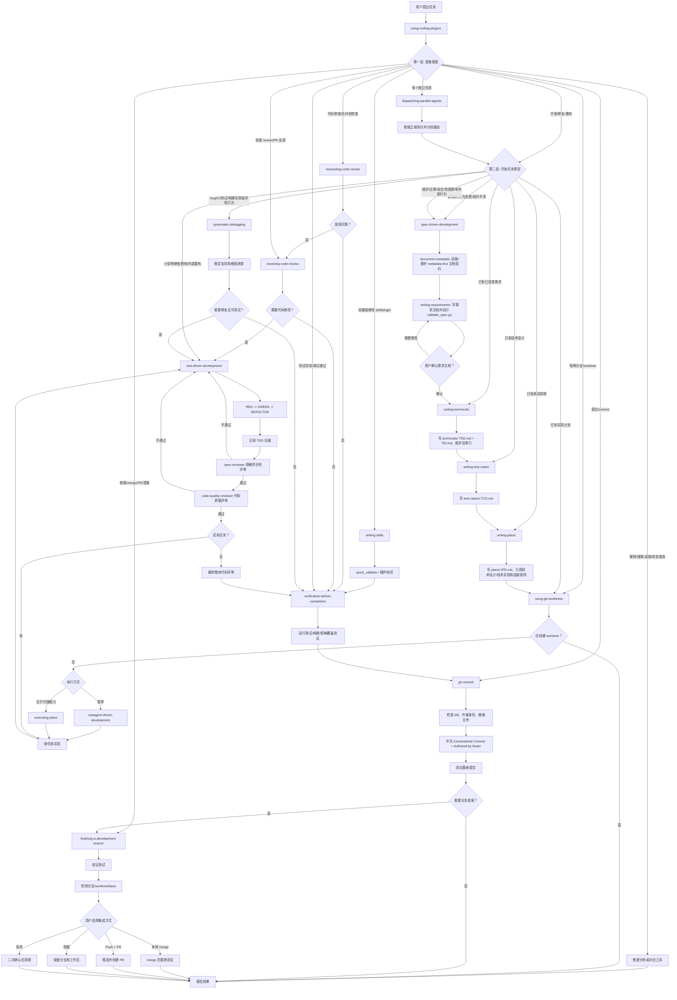

## 入口路由

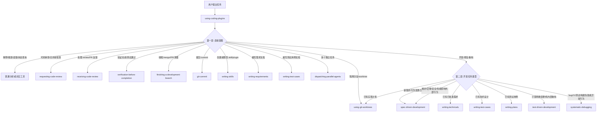

## 场景流程图

### 新需求或契约不清

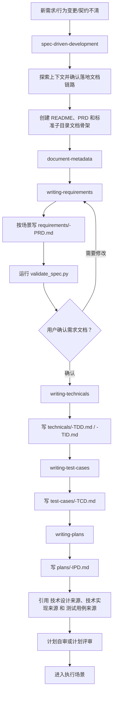

### 已有计划执行

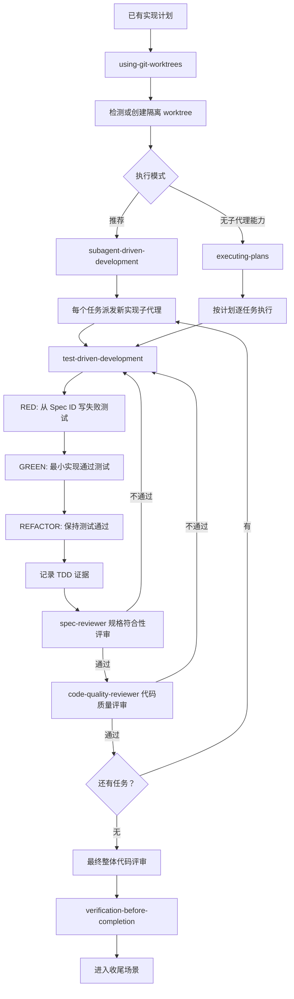

### Bug、CI 或测试失败

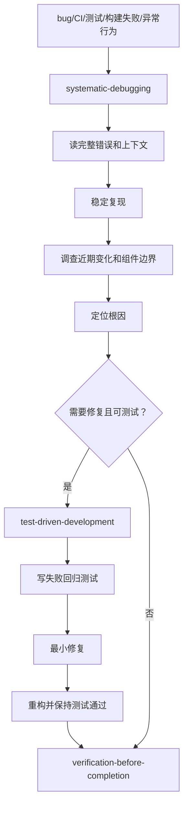

### 代码评审或处理反馈

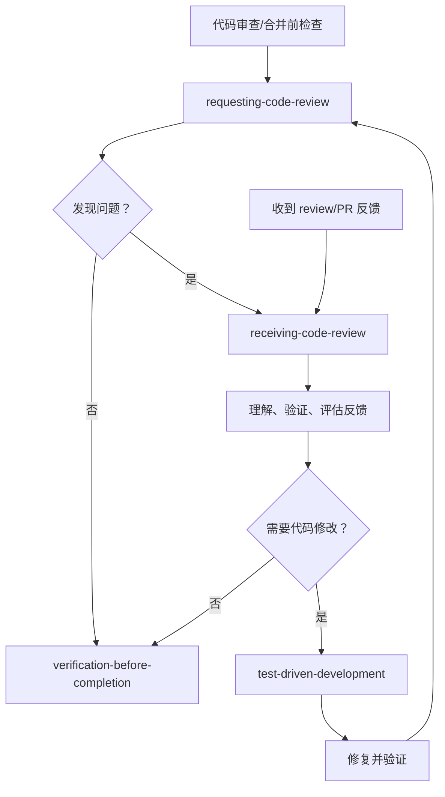

### 提交与分支收尾

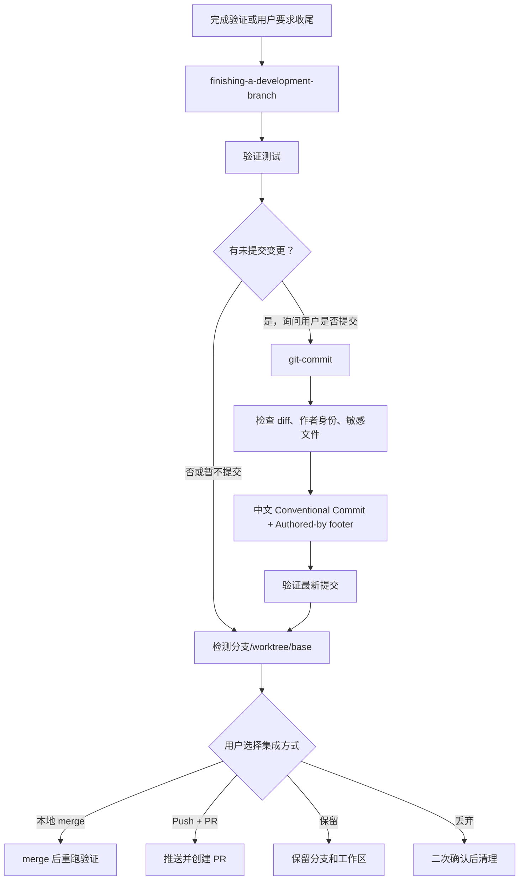

### 直接提交

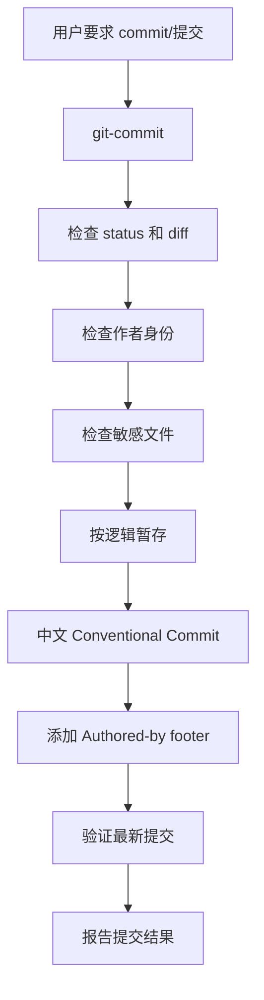

### Skill 或插件维护

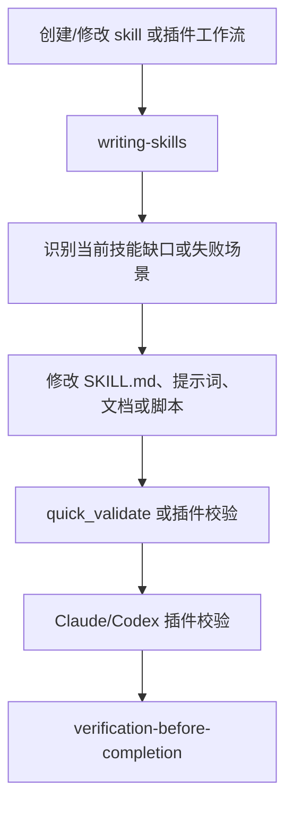

### 发布和版本提升

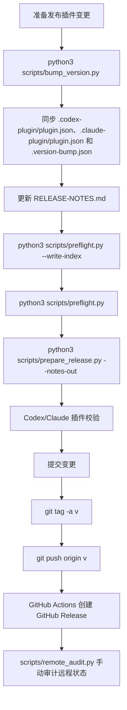

### 并行任务

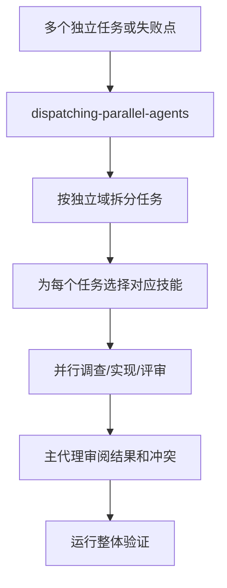

## 场景链路契约

本节是行为级测试的机器可读契约，记录不同场景下必须保持的技能顺序。修改入口路由、场景流程或技能命名时，需要同步更新这里和 `tests/behavior/test_routing.py`。

### 新需求

`spec-driven-development` -> `document-metadata` -> `writing-requirements` -> `writing-technicals` -> `writing-test-cases` -> `writing-plans` -> `using-git-worktrees` -> `test-driven-development` -> `verification-before-completion` -> `git-commit`

### Bug 修复

`systematic-debugging` -> `test-driven-development` -> `verification-before-completion`

### 直接提交

`git-commit` -> 检查 diff -> `Authored-by` -> 验证最新提交

### 完成收尾

`verification-before-completion` -> `git-commit` -> `finishing-a-development-branch`

### 插件维护

`writing-skills` -> `test-driven-development` -> `quick_validate` -> `verification-before-completion`

### 并行任务

`dispatching-parallel-agents` -> 为每个任务选择对应技能 -> 运行整体验证

## Skill 职责

### 入口层

`using-coding-plugins` 是中文主入口。它负责根据任务类型路由到具体 skill，并建立“先选技能、再行动”的执行习惯。

### 平台层

Codex 侧使用 `.agents/plugins/marketplace.json` 作为 marketplace 入口，使用 `.codex-plugin/plugin.json` 和 `skills/*/agents/openai.yaml` 展示插件与技能元数据。本仓库是单插件布局，marketplace 中的 source path 指向仓库根目录 `.`；本机个人 marketplace 则使用 `/Users/vincen/.agents/plugins/marketplace.json` 指向 `/Users/vincen/plugins/coding-plugins`。`.codex-plugin/plugin.json` 还通过 `hooks/hooks-codex.json` 注册 SessionStart hook，在 `startup`、`resume` 和 `clear` 时运行 `hooks/run-hook.cmd session-start-codex`，向 Codex 注入 `coding-plugins:using-coding-plugins` 入口规则。技能中出现其他平台工具名时，按 `skills/using-coding-plugins/references/codex-tools.md` 转换到当前 Codex 能力。

Claude Code 侧使用 `.claude-plugin/plugin.json` 识别插件。技能以 `/coding-plugins:<skill-name>` 命名空间出现，例如 `/coding-plugins:using-coding-plugins` 和 `/coding-plugins:git-commit`。Claude 工具名可直接使用；平台注意事项见 [docs/claude-code-usage.md](claude-code-usage.md)。

### SDD 编排层

`spec-driven-development` 处理新需求、功能构想、行为变更、接口契约、schema、状态机和验收标准。它不再直接承担所有需求正文写作，而是负责判断当前 feature 需要沉淀哪些文档，并编排后续 skill 顺序。

它必须确认的落地文档包括：

- Feature README：人工总览和 tags。
- 需求文档：`writing-requirements` 负责。
- 技术设计和技术实现：`writing-technicals` 负责。
- 测试用例：`writing-test-cases` 负责。
- 实现计划：`writing-plans` 负责。
- TDD 证据：`test-driven-development` 负责。
- 全局索引：`docs/coding-plugins/INDEX.md`。

硬门禁：PRD 确认前不得进入 TDD/TID；TDD/TID 和 TCD 确认前不得进入 IPD；不得写代码、搭脚手架或调用实现技能。

### 需求文档层

`writing-requirements` 负责把功能、接口、schema、状态机、验收或维护约束写成 PRD 需求文档。它只定义“要什么”和“如何验收”，不写技术设计、技术实现、测试用例步骤或实现任务。

默认需求文档路径：

```text
docs/coding-plugins/features/<feature-name>/requirements/<doc-id>-PRD.md
```

默认 `doc_id = <feature-name>`；同一 feature 模块下存在多个独立需求、流程、契约或维护主题时，使用更具体的 `doc_id`，例如 `routing-login-PRD.md` 和 `routing-register-PRD.md`。时间、状态、标签和相关代码写入需求文档 metadata；新增、移动或删除 feature 文档后运行 `python3 scripts/preflight.py --write-index` 重新生成 `docs/coding-plugins/INDEX.md`，文件名不使用日期前缀。

该阶段输出应包括：

- 项目上下文。
- 用户目标、非目标和成功标准。
- PRD 章节类型选择：feature、API contract、schema、state machine、acceptance criteria、maintenance。
- 需求点拆分：先用 `## 需求总览` 表列出每个需求点，再用 `## 标题（REQ-001）` 章节展开价值、描述、行为规则、输入输出、关联契约、错误边界、验收标准和验证方式。
- 无新增需求时，只有维护、基线、回归、迁移或可观测性风险需要维护需求文档。
- 路径和索引：`requirements/<doc-id>-PRD.md`，并通过 `python3 scripts/preflight.py --write-index` 更新 `INDEX.md`。
- 稳定 Spec ID：`REQ/API/SCHEMA/STATE/ERR/AC/NFR/MIG/OBS/NON`。
- 外部契约示例：请求/响应、schema 样例、状态迁移或错误样例。
- Traceability Matrix 初稿只记录验证方式和验证证据，不写计划任务编号或测试步骤。
- `validate_spec.py` 自动校验结果；需要机器读取时使用 `--format json`。
- 需求文档自审结果。
- 用户确认。

### 技术文档层

`writing-technicals` 把批准需求文档转成独立工程方案。TDD 技术设计负责关键决策、影响组件、数据流、接口落地、兼容策略、测试策略和风险缓解；TID 技术实现负责模块级实现拆解、接口签名、数据结构、迁移步骤和实现顺序约束。两者都不负责逐步任务清单，也不能补写或重定义需求。方案 B 下，approved PRD 的正式链路必须同时沉淀 TDD 和 TID；没有代码实现时，TID 也要记录“不新增代码实现”的范围边界。

技术文档阶段必须先在 TDD 中完成 `## 规格缺口审查`。如果发现未覆盖需求、验收标准不清、新增外部行为、错误边界或兼容要求不清，停止 technical，回到 `spec-driven-development` 更新 spec、重新校验并取得确认，再继续 technical。preflight 会校验 TDD 文档包含规格缺口审查，并拦截未处理、待处理、需澄清、不清楚或待确认的缺口。

技术设计还必须完成 `## 规格到设计映射` 和 `## 无需技术设计的规格`。同一 `doc_id` 链路下 approved spec 中的每个 MUST Spec ID，都要出现在映射表里；映射表使用 7 列：`规格 ID`、`规格摘要`、`技术落点`、`关键决策 ID`、`影响文件/符号`、`验证命令`、`证据`。确实无需技术设计的，必须在豁免表中写明原因。preflight 会从同一 `doc_id` 的 approved spec 反向提取 MUST ID，拦截 technical 未覆盖或未豁免的规格。

技术设计的关键决策必须使用 `TD-001`、`TD-002` 这类稳定 ID。映射表中的 `关键决策 ID` 必须能在 `## 关键决策` 表中找到，避免规格到技术落点之间只留下泛化描述。

默认技术设计路径：

```text
docs/coding-plugins/features/<feature-name>/technicals/<doc-id>-TDD.md
```

默认技术实现路径：

```text
docs/coding-plugins/features/<feature-name>/technicals/<doc-id>-TID.md
```

技术文档路径的 `<doc-id>` 应和同一文档链路的 PRD 路径一致。保存或移动技术文档后运行 `python3 scripts/preflight.py --write-index`，让 `docs/coding-plugins/INDEX.md` 同步反映最新文件树。technical 模板正文标题和表头默认使用中文，Spec ID、命令、路径和代码标识可保留英文。

当同一 `doc_id` 已存在 PRD、TID、TCD、IPD 或 TED 时，TDD frontmatter 应维护 `related_specs`、`related_technical`、`related_test_cases`、`related_plans` 和 `related_evidence`。TID frontmatter 应反向链接 TDD，并链接同一 `doc_id` 的 PRD、TCD、IPD 和 TED。这些路径用于把需求契约、技术设计、技术实现、测试用例、实现计划和验证证据连成可检索链路。

文档变更必须沿 metadata 关系向下游同步：`PRD -> TDD -> TID -> TCD -> IPD -> TED`。如果上游文档的 `updated` 晚于下游，说明下游还没有完成同步评审；preflight 会失败。下游正文确实无需变更时，也要更新下游 `updated`，表示已确认不受影响。

technical frontmatter 还必须维护 `lifecycle_status`、`implemented_commits` 和 `validated_by`。`lifecycle_status` 只允许 `draft`、`approved`、`implemented`、`stale`、`superseded`；如果 related approved spec 的 `updated` 晚于 technical 的 `updated`，strict validator 会判定 technical stale。

technical 可单独运行 validator：

```text
python3 skills/writing-technicals/scripts/validate_technicals.py docs/coding-plugins/features/<feature-name>/technicals/<doc-id>-TDD.md
```

普通模式只让结构错误失败；`--strict` 会把泛化映射、stale technical、缺 lifecycle metadata、缺 TD 决策 ID、隐藏需求和旧映射表头都升级为失败。preflight 默认调用 strict validator，因此发布前不能留下 warning。

没有 technical/plan 的轻量 feature 必须在 README 的 `## 轻量例外` 中写明 `原因`、`验证方式`，并补充 `规格 ID -> 证据` 表。该表必须覆盖 approved spec 的所有 MUST Spec ID，并指向真实存在的 evidence 文件。

### 测试用例层

`writing-test-cases` 把批准需求文档、TDD 技术设计和 TID 技术实现转成测试用例文档。它负责 Spec ID 到测试用例的映射、测试层级、前置条件、步骤、断言、测试数据和证据目标。

默认测试用例路径：

```text
docs/coding-plugins/features/<feature-name>/test-cases/<doc-id>-TCD.md
```

测试用例文档不记录实际 RED/GREEN/REFACTOR 输出；实际执行证据仍由 `test-driven-development` 写入 `evidences/<doc-id>-TED.md`。

### 计划层

`writing-plans` 把 TDD/TID 和测试用例转成可执行计划。计划要求引用 `技术设计来源`、存在 TID 时引用 `技术实现来源`，并引用测试用例来源，明确精确文件路径、完整代码片段、测试命令、预期输出和 Spec ID -> 测试 -> 任务 追踪矩阵。

默认计划路径：

```text
docs/coding-plugins/features/<feature-name>/plans/<doc-id>-IPD.md
```

计划路径的 `<doc-id>` 应和需求、技术设计、技术实现、测试用例路径一致，例如 `features/routing/requirements/routing-login-PRD.md` 对应 `features/routing/technicals/routing-login-TDD.md`、`features/routing/technicals/routing-login-TID.md`、`features/routing/test-cases/routing-login-TCD.md` 和 `features/routing/plans/routing-login-IPD.md`。

计划文档应说明推荐执行方式：

- `subagent-driven-development`：推荐，适合有子代理能力的环境。
- `executing-plans`：降级方案，适合无子代理能力或需要当前会话内执行。

### 隔离层

`using-git-worktrees` 负责确认或创建隔离工作区。标准顺序应是：

```text
spec-driven-development -> writing-requirements -> writing-technicals -> writing-test-cases -> writing-plans -> using-git-worktrees -> subagent-driven-development/executing-plans
```

它会先检测当前是否已经处于 linked worktree，再优先使用平台原生 worktree 能力，最后才回退到 `git worktree`。

### 执行层

`subagent-driven-development` 是推荐执行路径。它要求：

- 每个任务派发一个新的实现子代理。
- 子代理不能自己读取完整计划，主代理应提供完整任务文本和必要上下文。
- 每个任务后先做规格符合性评审。
- 规格通过后再做代码质量评审。
- 两个评审都通过后才进入下个任务。
- 所有任务完成后做最终整体代码评审。

`executing-plans` 是当前会话执行路径。它要求先审阅计划，有关键问题时停止并询问；没有问题时按任务逐步执行，并在全部任务完成后进入分支收尾。

### 测试与调试层

`test-driven-development` 适用于功能、bugfix、重构和行为变更。测试必须来自已批准需求文档、测试用例文档、bug 复现或明确验收标准。铁律是：

```text
没有先失败的测试，就不能写生产代码。
```

TDD 阶段的交付证据不是“我遵守了 TDD”，而是写入固定路径的标准化 `TDD 证据`：

```text
docs/coding-plugins/features/<feature-name>/evidences/<doc-id>-TED.md
```

`<doc-id>` 应和需求、技术、测试用例、计划路径保持一致。

- `规格/缺陷/验收`：测试来源，优先引用需求文档和测试用例文档。
- `RED 测试` / `RED 命令` / `RED 失败`：先失败证据。
- `GREEN 变更` / `GREEN 命令`：最小实现和通过证据。
- `REFACTOR 命令` / `最终验证`：重构后和最终验证证据。

纯重构没有新增行为时，使用现有测试基线或 characterization test 作为行为保护证据。无法自动测试时，必须在同一 active evidence 文件中记录用户同意的 `TDD 例外记录` 和替代验证。证据报告可用 `skills/test-driven-development/scripts/validate_tdd_evidence.py` 检查，`scripts/preflight.py` 会自动严格校验 `docs/coding-plugins/features/**/evidences/**-TED.md`。历史证据归档到 `evidences/archive/*.md`，只校验 historical metadata，不进入主索引。

TDD 证据可以声明 `测试类型`：`behavior`、`contract`、`architecture`、`source-scan` 或 `config`。源码扫描只能作为架构、配置或静态边界证据；如果它试图证明用户行为，strict validator 会失败。

`systematic-debugging` 适用于 bug、测试失败、构建失败、性能问题和异常行为。铁律是：

```text
没有根因调查，就不能修复。
```

调试链路中，如修复需要写测试，应转入 `test-driven-development`。

### 评审层

`requesting-code-review` 提供通用代码评审模板，适用于任务完成后、重要功能完成后和合并前。

`receiving-code-review` 约束评审反馈的处理方式：先理解和验证，再决定采纳、反驳或澄清。外部评审是建议，不是命令。

`subagent-driven-development` 内置两个专门评审模板：

- `spec-reviewer-prompt.md`：检查实现是否符合任务规格。
- `code-quality-reviewer-prompt.md`：检查实现是否构建良好、测试充分、可维护。

### 提交层

`git-commit` 负责创建提交。它参考 Conventional Commits 的类型体系，但要求提交说明使用中文：

```text
docs: 记录插件工作链路
feat(commit): 增加中文提交工作流
```

硬性规则：

- `type` 和可选 `scope` 使用 Conventional Commit 英文规范。
- description、body、footer 的说明文字必须中文。
- footer 必须包含用户本人 `Authored-by` 署名：`Authored-by: <user.name> <user.email>`。
- 禁止 AI 作者、AI co-author 或 AI 生成声明。
- 提交 author/committer 必须是用户自己的 Git 身份。
- 不擅自修改全局 git config。
- 不使用 `--no-verify`、强推或其他破坏性操作，除非用户明确要求。

### 验证与收尾层

`verification-before-completion` 要求完成声明必须有新鲜验证证据。没有在当前上下文运行验证命令，就不能声称测试通过、构建成功或 bug 已修复。有 SDD 规格时，还必须核对 Traceability Matrix 是否覆盖所有 MUST 规格。

`finishing-a-development-branch` 负责：

1. 验证测试。
2. 检查是否有未提交变更。
3. 如有未提交变更，进入 `git-commit` 按逻辑分批提交；只有用户明确要求不提交时才跳过。
4. 检测普通仓库、worktree 或 detached HEAD。
5. 判断 base branch。
6. 给出 merge、PR、保留、丢弃选项。
7. 按用户选择执行。
8. 对本流程创建的 worktree 做清理。

## 文档和产物路径

统一检索入口：

```text
docs/coding-plugins/INDEX.md
```

查找某个功能时，先按 `Feature` 或 `标签` 查总索引，再进入对应需求文档、技术设计、技术实现、测试用例、计划或 TDD 证据文件。新增、移动或删除相关产物时必须运行 `python3 scripts/preflight.py --write-index` 重新生成总索引；`scripts/preflight.py` 会校验索引文本和真实 feature-first 文件树完全一致。

默认路径：

```text
.agents/plugins/marketplace.json
.version-bump.json
RELEASE-NOTES.md
docs/coding-plugins/INDEX.md
docs/coding-plugins/features/
hooks/
hooks/hooks-codex.json
scripts/bump_version.py
python3 scripts/preflight.py
python3 scripts/preflight.py --write-index
```

需求文档模板、SDD 校验脚本和参考：

```text
skills/spec-driven-development/scripts/
skills/writing-requirements/templates/
skills/spec-driven-development/references/
```

用户、仓库或团队已有约定时，优先使用已有约定。

## 降级路径

如果没有子代理能力：

```text
writing-plans -> executing-plans -> requesting-code-review -> verification-before-completion -> git-commit -> finishing-a-development-branch
```

如果不能创建 worktree：

```text
using-git-worktrees 检测失败 -> 说明原因 -> 在当前目录执行基线测试 -> 用户确认后继续
```

如果无法运行自动化测试：

```text
说明阻塞原因 -> 使用最接近的手工验证、脚本、日志或截图 -> 在最终回复中标注风险
```

如果用户要求提交：

```text
用户要求提交或完成阶段选择提交 -> git-commit -> 检查 diff/status/作者身份/敏感文件 -> 中文提交并添加 Authored-by 署名 footer -> 验证最新提交
```

## 当前注意点

当前流程以 SDD + TDD 为主线，在跨 Codex/Claude Code 环境中有几个点需要维护者特别注意：

1. **完成后默认提交。** 完成验证后必须进入 `git-commit`，按逻辑分批提交；只有用户明确要求不提交或仓库流程阻塞时才跳过。
2. **worktree 顺序应明确。** 推荐维护为统一顺序：先需求文档，再技术设计/技术实现，再测试用例，再计划，再创建或确认隔离工作区，再执行。
3. **提交身份必须保持用户本人。** 如果 Git 配置缺失或疑似 AI/机器人身份，必须停止并询问用户；提交 footer 中的 `Authored-by` 署名也必须和 Git Author 一致。
4. **Claude Code 使用命名空间技能。** 手动调用时使用 `/coding-plugins:<skill-name>`；修改 manifest、hooks、agents 或其他插件组件后运行 `/reload-plugins`。
5. **marketplace 路径有两种布局。** 仓库内 marketplace 面向单插件分发，source path 是 `.`；个人 marketplace 面向本机安装，source path 是 `./plugins/coding-plugins`。
6. **Codex hook 修改必须跑 hook 测试。** 修改 `.codex-plugin/plugin.json`、`hooks/` 或入口链路后运行 `bash tests/hooks/test-session-start.sh`，并通过 `python3 scripts/preflight.py` 验证。

## 推荐后续改进

1. 继续补充更多真实项目规格样例，用于回归测试 SDD 校验器的误报和漏报。
2. 继续补充 TDD 证据 成功与失败样例，用于回归测试 TDD 校验器。
