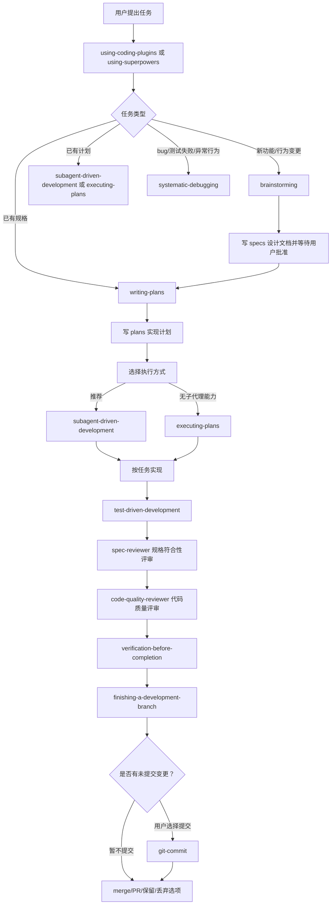

# Coding Plugins Workflow Chain

本文记录 `coding-plugins` 当前的完整工作链路、各 skill 的职责边界、关键门禁和已知注意点。它是面向维护者和使用者的流程说明，不替代各 skill 内部的执行规则。

## 总览

`coding-plugins` 是一套编码代理方法论插件。它的目标不是提供单个 API 工具，而是约束代理按稳定工程流程推进软件开发：

1. 先判断任务类型。
2. 新需求先澄清和设计。
3. 已批准设计再写计划。
4. 按计划隔离执行。
5. 实现阶段遵守 TDD。
6. 每个任务通过规格符合性和代码质量评审。
7. 完成前必须验证。
8. 如有未提交变更，在完成阶段提示是否提交。
9. 提交必须使用中文 Conventional Commit，且禁止 AI 作者。
10. 最后做分支收尾和集成选择。

## 主链路



## Skill 职责

### 入口层

`using-coding-plugins` 是中文主入口。它负责根据任务类型路由到具体 skill，并建立“先选技能、再行动”的执行习惯。

`using-superpowers` 是兼容入口。它保留原 Superpowers 的入口命名，规则与中文入口一致，便于从原版流程迁移。

### 需求层

`brainstorming` 处理新需求、功能构想和行为变更。它有硬门禁：设计获批前不得写代码、搭脚手架或调用实现技能。

默认规格路径：

```text
docs/coding-plugins/specs/YYYY-MM-DD-<topic>-design.md
```

该阶段输出应包括：

- 项目上下文。
- 用户目标和成功标准。
- 2 到 3 个方案及取舍。
- 选定设计。
- 架构、组件、数据流、错误处理和测试策略。
- 规格自审结果。
- 用户确认。

### 计划层

`writing-plans` 把规格转成可执行计划。计划要求精确文件路径、完整代码片段、测试命令和预期输出。

默认计划路径：

```text
docs/coding-plugins/plans/YYYY-MM-DD-<feature-name>.md
```

计划文档应说明推荐执行方式：

- `subagent-driven-development`：推荐，适合有子代理能力的环境。
- `executing-plans`：降级方案，适合无子代理能力或需要当前会话内执行。

### 隔离层

`using-git-worktrees` 负责确认或创建隔离工作区。标准顺序应是：

```text
brainstorming -> writing-plans -> using-git-worktrees -> subagent-driven-development/executing-plans
```

它会先检测当前是否已经处于 linked worktree，再优先使用平台原生 worktree 能力，最后才回退到 `git worktree`。

### 执行层

`subagent-driven-development` 是推荐执行路径。它要求：

- 每个任务派发一个新的实现子代理。
- 子代理不能自己读取完整计划，主代理应提供完整任务文本和必要上下文。
- 每个任务后先做规格符合性评审。
- 规格通过后再做代码质量评审。
- 两个评审都通过后才进入下个任务。
- 所有任务完成后做最终整体代码评审。

`executing-plans` 是当前会话执行路径。它要求先审阅计划，有关键问题时停止并询问；没有问题时按任务逐步执行，并在全部任务完成后进入分支收尾。

### 测试与调试层

`test-driven-development` 适用于功能、bugfix、重构和行为变更。铁律是：

```text
没有先失败的测试，就不能写生产代码。
```

`systematic-debugging` 适用于 bug、测试失败、构建失败、性能问题和异常行为。铁律是：

```text
没有根因调查，就不能修复。
```

调试链路中，如修复需要写测试，应转入 `test-driven-development`。

### 评审层

`requesting-code-review` 提供通用代码评审模板，适用于任务完成后、重要功能完成后和合并前。

`receiving-code-review` 约束评审反馈的处理方式：先理解和验证，再决定采纳、反驳或澄清。外部评审是建议，不是命令。

`subagent-driven-development` 内置两个专门评审模板：

- `spec-reviewer-prompt.md`：检查实现是否符合任务规格。
- `code-quality-reviewer-prompt.md`：检查实现是否构建良好、测试充分、可维护。

### 提交层

`git-commit` 负责创建提交。它参考 Conventional Commits 的类型体系，但要求提交说明使用中文：

```text
docs: 记录插件工作链路
feat(commit): 增加中文提交工作流
```

硬性规则：

- `type` 和可选 `scope` 使用 Conventional Commit 英文规范。
- description、body、footer 的说明文字必须中文。
- 禁止 AI 作者、AI co-author 或 AI 生成声明。
- 提交 author/committer 必须是用户自己的 Git 身份。
- 不擅自修改全局 git config。
- 不使用 `--no-verify`、强推或其他破坏性操作，除非用户明确要求。

### 验证与收尾层

`verification-before-completion` 要求完成声明必须有新鲜验证证据。没有在当前上下文运行验证命令，就不能声称测试通过、构建成功或 bug 已修复。

`finishing-a-development-branch` 负责：

1. 验证测试。
2. 检查是否有未提交变更。
3. 如有未提交变更，提示用户是否使用 `git-commit` 创建提交。
4. 检测普通仓库、worktree 或 detached HEAD。
5. 判断 base branch。
6. 给出 merge、PR、保留、丢弃选项。
7. 按用户选择执行。
8. 对本流程创建的 worktree 做清理。

## 文档和产物路径

默认路径：

```text
docs/coding-plugins/specs/
docs/coding-plugins/plans/
```

视觉伴侣持久会话目录：

```text
.coding-plugins/brainstorm/
```

用户、仓库或团队已有约定时，优先使用已有约定。

## 降级路径

如果没有子代理能力：

```text
writing-plans -> executing-plans -> requesting-code-review -> verification-before-completion -> finishing-a-development-branch
```

如果不能创建 worktree：

```text
using-git-worktrees 检测失败 -> 说明原因 -> 在当前目录执行基线测试 -> 用户确认后继续
```

如果无法运行自动化测试：

```text
说明阻塞原因 -> 使用最接近的手工验证、脚本、日志或截图 -> 在最终回复中标注风险
```

如果用户要求提交：

```text
用户要求提交或完成阶段选择提交 -> git-commit -> 检查 diff/status/作者身份/敏感文件 -> 中文提交 -> 验证最新提交
```

## 当前注意点

当前流程继承了原 Superpowers 的强纪律，但在 Codex 环境中有两个点需要维护者特别注意：

1. **提交动作需要用户或仓库流程允许。** 完成阶段只提示是否提交；用户同意后才进入 `git-commit`。
2. **worktree 顺序应明确。** README 中描述为设计批准后使用 worktree；`writing-plans` 中描述为执行阶段使用 worktree。推荐维护为统一顺序：先设计，再计划，再创建或确认隔离工作区，再执行。
3. **提交身份必须保持用户本人。** 如果 Git 配置缺失或疑似 AI/机器人身份，必须停止并询问用户。

## 推荐后续改进

1. 在 `brainstorming`、`writing-plans` 和 README 中统一标准顺序。
2. 明确 `using-superpowers` 是兼容入口，避免和 `using-coding-plugins` 形成重复主入口。
3. 若准备作为个人 marketplace 插件安装，再补 marketplace 注册和安装说明。
